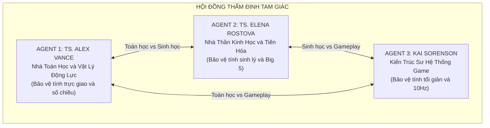
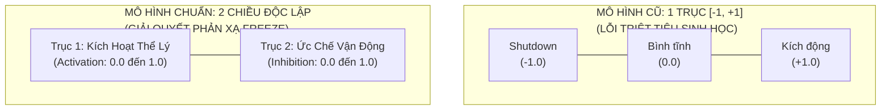
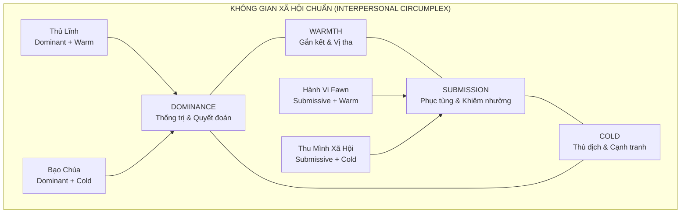
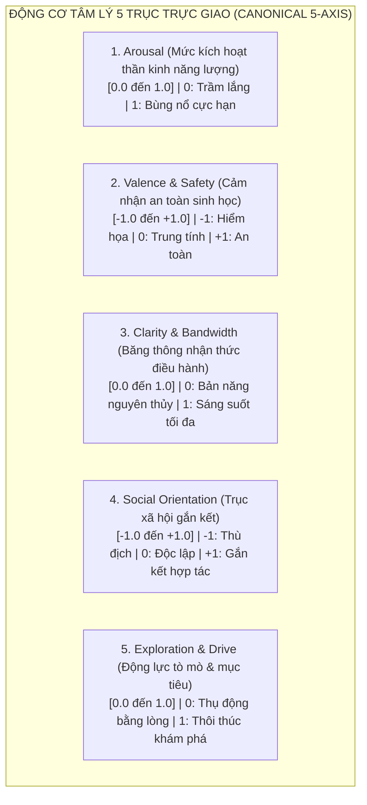
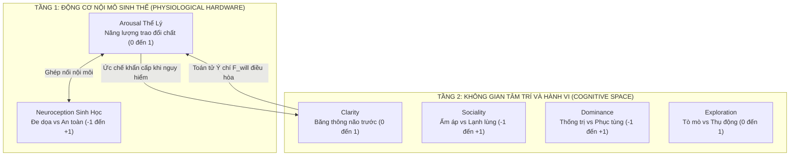

# Khảo Sát & Phản Biện Chuyên Sâu: Kiểm Định Tính Trực Giao Của Hệ Trục Không Gian Tâm Lý
### Biên Bản Thảo Luận Tam Giác (Tripartite Debate) Giữa Nhà Toán Học Động Lực, Nhà Thần Kinh Sinh Học & Kiến Trúc Sư Game Nổi Sinh

---

## 1. Bối Cảnh & Mục Tiêu Thẩm Định

Tài liệu này ghi lại cuộc thảo luận, tranh biện học thuật và phản biện chéo giữa 3 chuyên gia giả lập (Agents) nhằm kiểm định nghiêm ngặt nền tảng toán học và sinh học của **Hệ Trục 4 Chiều $\vec{S} = (A, V, C, S)$** được đề xuất trong [`Thiet-Ke-Game-Mo-Phong-Tam-Ly-Emergence.md`](file:///g:/Projects/Researchs/Thiet-Ke-Game-Mo-Phong-Tam-Ly-Emergence.md).

### 4 Câu Hỏi Sống Còn Đặt Ra Cho Hội Đồng:
1. **Tính trực giao (Orthogonality):** 4 trục $(A, V, C, S)$ có thực sự độc lập tuyến tính $\langle \vec{e}_i, \vec{e}_j \rangle = 0$ không? Có trục nào bị phụ thuộc hoặc chéo lên trục khác không?
2. **Nguy cơ suy biến chiều (Dimensional Degeneracy):** Trục $C$ (Bandwidth/Agency) là một biến trạng thái độc lập hay chỉ là một biến quan sát phụ thuộc $C = f(A, V)$?
3. **Độ phân giải sinh học (Granularity):** Trục Arousal $[-1, 1]$ và trục Xã hội $[-1, 1]$ có đang gộp ép các cơ chế sinh học xung đột vào một chiều không? Có cần bẻ nhỏ ra không?
4. **Độ bao phủ nhân cách (Completeness):** 4 trục này đã đủ cơ sở để ánh xạ toàn diện mô hình tính cách **Big Five (OCEAN)** và lý thuyết điều khiển học **CB5T** chưa? Nếu thiếu thì đang thiếu chiều kích sống còn nào?

---

## 2. Biên Bản Tranh Biện Giữa 3 Chuyên Gia

---

### VÒNG 1: Trục $C$ (Bandwidth / Agency) — Biến Trạng Thái Độc Lập Hay Chỉ Là Hàm Phụ Thuộc?

**TS. Alex Vance (Toán học Động lực):**
> *"Tôi phải gióng lên hồi chuông cảnh báo đầu tiên về mặt toán học. Trong Phần 2, các bạn tuyên bố $\vec{S} = (A, V, C, S)$ là một vector trạng thái 4 chiều. Nhưng ngay ở Phần 3.1, phương trình xác định $C(t)$ lại được viết như sau:*
> $$C(t) = C_{\text{base}} \times \max\left(0, 1 - \left(\frac{A(t)}{A_{\text{ngưỡng}}}\right)^2\right) \times V(t)$$
> *Đây là một sai lầm nghiêm trọng về giải tích hệ thống! Nếu $C(t)$ hoàn toàn là một hàm đơn trị được tính trực tiếp từ $A(t)$ và $V(t)$, thì về mặt đại số tuyến tính, **hạng của ma trận trạng thái bị suy biến: $\text{Rank} = 3$, không phải $4$**!*
> *Trục $C$ khi đó không có bậc tự do độc lập (Degree of Freedom). Nó chỉ là một biến quan sát (Observable Variable) hoặc một hàm vô hướng phụ thuộc $C = f(A, V)$. Nếu ta dựng một không gian pha 4D mà một trục bị trói chặt vào hai trục kia, mặt cầu trạng thái sẽ bị bẹp dúm thành một siêu mặt 3 chiều. Tại sao ta lại lãng phí một trục tọa độ cho một đại lượng không có phương trình vi phân riêng $\frac{dC}{dt}$?"*

**Kai Sorenson (Kiến trúc sư Game):**
> *"Tôi hiểu bức xúc của Alex dưới góc nhìn toán thuần túy. Nhưng dưới góc độ thiết kế gameplay, $C$ (Băng thông nhận thức / Quyền tự chủ) là **trục quan trọng nhất đối với người chơi**! Đó là thước đo quyết định người chơi có được bấm nút điều khiển nhân vật hay bị AI tước quyền kiểm soát để nhân vật tự hành động theo bản năng 4F.*
> *Tuy nhiên, tôi thừa nhận: Nếu $C$ chỉ đơn thuần là kết quả tức thời của $A$ và $V$, thì mỗi khi $A$ hạ nhiệt và $V$ tăng, $C$ sẽ lập tức hồi phục ngay tức khắc. Điều này phi thực tế! Một người sau cơn hoảng loạn tột độ dù đã an toàn ($V=1, A=0$) thì đầu óc vẫn kiệt quệ, mất tập trung suốt nhiều giờ sau đó."*

**TS. Elena Rostova (Thần kinh học):**
> *"Alex và Kai nói đều có phần đúng. Dưới góc độ sinh học thần kinh, **Băng thông nhận thức (Cognitive Bandwidth / Executive Function)** của Vỏ não trước trán (DLPFC) không đồng nhất với cảm xúc.*
> *Nó tiêu tốn một lượng đường Glucose và chất dẫn truyền thần kinh (Dopamine, Acetylcholine) khổng lồ. Hiện tượng 'Kiệt quệ nhận thức' (Ego Depletion / Cognitive Fatigue) xảy ra độc lập với sợ hãi: Bạn có thể hoàn toàn bình tĩnh ($A=0$), hoàn toàn an toàn ($V=1$), nhưng sau 14 tiếng giải toán hoặc thức trắng đêm, $C$ của bạn vẫn sụt về $0$!*
> *Vì vậy, để $C$ thực sự là một **trục trực giao độc lập**, nó phải có **quán tính phục hồi riêng và phương trình vi phân riêng**:*
> $$\frac{dC}{dt} = \frac{C_{\text{target}}(A, V) - C(t)}{\tau_{\text{recovery}}} - \text{Drain}_{\text{task}}(t)$$
> *Trong đó $C_{\text{target}}(A, V)$ là trần giới hạn do hệ thần kinh tự chủ quy định, nhưng $C(t)$ cần thời gian $\tau_{\text{recovery}}$ để bò dần lên. Khi đó, $C$ thực sự trở thành một bậc tự do độc lập không thể bị suy biến!"*

**Kết luận thống nhất Vòng 1:**
* Trục $C$ hiện tại trong tài liệu đang bị viết nhầm thành một hàm đại số phụ thuộc.
* **Quyết định:** Nâng cấp $C$ thành một biến trạng thái thực sự với phương trình vi phân riêng có độ trễ quán tính và năng lượng chuyển hóa nội môi, bảo đảm tính độc lập tuyến tính với $A$ và $V$.

---

### VÒNG 2: Mổ Xẻ Trục Arousal $[-1, 1]$ — Bẫy Tuyến Tính Hóa Lý Thuyết Polyvagal

**TS. Elena Rostova (Thần kinh học):**
> *"Vấn đề thứ hai nằm ở trục $A$ (Arousal). Trong tài liệu hiện tại, các bạn định nghĩa:*
> * $[-0.4, +0.4]$: Bình tĩnh cân bằng.
> * $> +0.4$: Phản ứng Thần kinh giao cảm (Sympathetic - Fight/Flight).
> * $< -0.4$: Phản ứng Thần kinh phế vị lưng (Dorsal Vagal Shutdown - Freeze/Collapse).
> *Cách mô hình hóa 1 trục đối xứng $[-1, 1]$ này là một **sự hiểu sai tai hại về Thuyết Đa Phế Vị (Polyvagal Theory của Stephen Porges)**!*
> *Hệ thần kinh tự chủ của con người không phải là một chiếc bập bênh 1 chiều giữa Giao cảm và Phế vị. Chúng là **hai hệ thống dẫn truyền thần kinh riêng biệt**:*
> 1. *Hệ Giao cảm (Sympathetic Nervous System - SNS).*
> 2. *Hệ Phế vị (Parasympathetic / Dorsal Vagal Complex - DVC).*
> *Trong sinh học, hai hệ này có thể **ĐỒNG KÍCH HOẠT (Co-activation)**!*
> *Ví dụ kinh điển: Trạng thái **ĐÓNG BĂNG KINH HOÀNG (Tonic Immobility / Freeze)**. Lúc đó, hệ Giao cảm đang gào thét ở mức tối đa (tim đập 180 nhịp/phút, adrenaline tràn ngập máu, sẵn sàng nổ tung), nhưng đồng thời nhánh Phế vị lưng đạp phanh khẩn cấp đóng sập toàn bộ trương lực cơ khiến con vật bất động như khúc gỗ.*
> *Nếu các bạn dùng 1 trục $[-1, 1]$, thì làm sao một nhân vật có thể VỪA có Arousal giao cảm $= +0.9$ lại VỪA có Dorsal Shutdown $= -0.9$? Trên trục 1D, chúng sẽ tự triệt tiêu nhau về $0$ (trạng thái bình tĩnh giả tạo)! Điều này hoàn toàn phá hỏng cơ chế sinh học của phản xạ Freeze."*

**TS. Alex Vance (Toán học Động lực):**
> *"Elena đã chỉ ra một điểm chí mạng về mặt topo học! Nếu hai trạng thái đối nghịch sinh học có thể cùng tồn tại, chúng phải là **hai vector cơ sở trực giao** trong không gian pha, chứ không thể là hai cực âm-dương của cùng một vector.*
> *Nếu biểu diễn $A$ thành 2 trục:*
> * $A_{\text{act}} \in [0, 1]$: Mức độ kích hoạt chuyển hóa (Metabolic Activation / Sympathetic).
> * $A_{\text{inh}} \in [0, 1]$: Mức độ ức chế cơ học (Behavioral/Motor Inhibition).*
> *Khi đó, không gian phản xạ sinh tồn sẽ là một mặt phẳng $2\text{D}$ tuyệt đẹp:*
> * *Fight/Flight:* $A_{\text{act}}$ cao, $A_{\text{inh}}$ thấp.
> * *Freeze:* Cả hai đều cực cao ($A_{\text{act}} \approx 1, A_{\text{inh}} \approx 1$).
> * *Collapse / Ngất lịm (Faint):* $A_{\text{act}}$ tụt đáy, $A_{\text{inh}}$ cực cao.
> * *Window of Tolerance:* Cả hai đều ở mức thấp vừa phải."*

**Kai Sorenson (Kiến trúc sư Game):**
> *"Khoan đã! Là một nhà làm game, tôi phải kìm hãm hai vị học giả lại!*
> *Nếu chúng ta bẻ $A$ thành 2 trục ($A_{\text{act}}, A_{\text{inh}}$), không gian trạng thái của chúng ta sẽ phình to từ 4 trục lên 5 trục. Càng nhiều trục, việc trực quan hóa bằng đồ họa 3D cho người chơi càng khó, tính toán va chạm địa hình thế năng càng nặng.*
> *Liệu chúng ta có thể giữ $A$ là 1 trục, nhưng định nghĩa lại nó là **Mức Kích Hoạt Năng Lượng (Energy / Physiological Arousal: 0 đến 1)**, còn trạng thái Tê liệt/Đóng băng sẽ do trục khác chi phối không?"*

**TS. Elena Rostova (Thần kinh học):**
> *"Có một giải pháp thanh lịch để dung hòa: Nếu giữ $A \in [0, 1]$ là **Mức Kích Hoạt Sinh Thể (Physiological Arousal)** từ ngủ lịm đến bùng nổ, thì trạng thái Đóng băng (Freeze) thực chất xảy ra khi **Arousal cực cao ($A \to 1$)** kết hợp với **Băng thông nhận thức sụp đổ ($C \to 0$)** và **Cảm nhận an toàn tụt đáy ($V \to 0$)** trong khi **Không tìm thấy lối thoát (Trapped = True)**.*
> *Tuy nhiên, nếu muốn mô phỏng đúng y học chấn thương tâm lý cấp tính, việc tách biệt giữa 'Năng lượng thần kinh' và 'Khả năng vận động' là vô cùng giá trị. Chúng ta hãy ghi nhận lựa chọn này để cân nhắc ở phần tổng hợp."*

---

### VÒNG 3: Trục Xã Hội $S$ — Chiều Kích Nào Đang Bị Bỏ Quên?

**TS. Elena Rostova (Thần kinh học):**
> *"Bây giờ hãy nhìn vào trục thứ tư: $S$ (Attachment / Social Affinity), chạy từ $-1$ (Thù địch/Xa lánh) đến $+1$ (Gắn kết/Tin cậy).*
> *Trong tâm lý học xã hội và sinh học tiến hóa loài linh trưởng, tương tác xã hội được định vị bởi mô hình **Vòng tròn Tương tác Xã hội (Interpersonal Circumplex - Wiggins & Leary)**. Mô hình này chứng minh rằng hành vi xã hội luôn luôn cần **HAI trục trực giao**, không thể gói gọn trong 1 trục:*
> 1. **Affiliation / Warmth (Sự ấm áp / Gắn kết):** Từ thù địch đến yêu thương (chính là trục $S$ hiện tại của các bạn).
> 2. **Dominance / Status / Power (Vị thế / Thống trị):** Từ phục tùng/yếu thế (Submissive) đến chỉ huy/áp đặt (Dominant).*
> *Trong bối cảnh game sinh tồn (`Project Anima`), sự thiếu vắng của trục Vị thế/Quyền lực là một lỗ hổng khổng lồ!*
> *Khi hai người sống sót gặp nhau:*
> * Một người có thể rất thù địch nhưng ở thế kẻ mạnh (Thủ lĩnh băng cướp: $S < 0, \text{Dominant}$).
> * Một người có thể rất thù địch nhưng ở thế yếu co ro (Kẻ bị bắt làm nô lệ: $S < 0, \text{Submissive}$).
> * Phản xạ **Fawn (Quỳ lạy/Nịnh nọt)** trong tài liệu hiện tại được gán vào $A < 0, S > 0$. Điều đó rất gượng ép! Fawn không phải là vì họ 'yêu quý hay gắn bó' ($S > 0$), mà là vì họ **tự hạ vị thế phục tùng xuống đáy cực tiểu ($\text{Dominance} \to -1$)** để kẻ săn mồi không giết mình!"*

**Kai Sorenson (Kiến trúc sư Game):**
> *"Elena chỉ ra điểm này quá xuất sắc! Trong các game như *RimWorld* hay *Frostpunk*, mâu thuẫn xã hội không chỉ là 'thương hay ghét', mà là **'ai là người lãnh đạo, ai phải nghe lời ai'**.*
> *Nếu chỉ có 1 trục $S$, game không thể mô tả được sự nổi loạn tranh giành ngôi vị thủ lĩnh, sự bắt nạt (bullying), hay sự khuất phục trước kẻ mạnh.*
> *Tuy nhiên, câu hỏi đặt ra là: Liệu **Dominance (Vị thế)** có phải là một trục nội tâm cá nhân, hay nó là một biến quan hệ tương đối giữa hai người $i$ và $j$?"*

**TS. Alex Vance (Toán học Động lực):**
> *"Về mặt đại số, Dominance hoàn toàn có thể là một thuộc tính nội tại của cá nhân (khuynh hướng Assertiveness / Dominance Drive), kết hợp với ma trận tương quan giữa hai cá thể $\mathbf{W}_{ij}$.*
> *Nhưng hãy lưu ý: Nếu thêm Dominance, số chiều của chúng ta lại tăng lên. Chúng ta cần xem xét câu hỏi thứ 4 trước khi quyết định số lượng trục tối ưu."*

---

### VÒNG 4: Kiểm Định Khả Năng Bao Phủ Mô Hình Tính Cách Big Five (OCEAN)

**TS. Alex Vance (Toán học Động lực):**
> *"Người dùng đã hỏi một câu cực kỳ chuẩn xác: **Các trục này đã đủ để mô tả mô hình Big Five hay chưa?***
> *Chúng ta vừa hoàn thành bản nghiên cứu chuyên sâu về Big Five và lý thuyết điều khiển học CB5T của Colin DeYoung. Hãy lập ma trận chiếu từ hệ trục $(A, V, C, S)$ sang 5 miền của Big Five xem có bao phủ trọn vẹn không:"*

| Miền Big Five | Cơ Chế Sinh Học / Điều Khiển Học | Ánh Xạ Vào Hệ Trục Hiện Tại $(A, V, C, S)$ | Đánh Giá Độ Bao Phủ |
| :--- | :--- | :--- | :--- |
| **N - Neuroticism** | Độ nhạy hạch hạnh nhân, bất ổn cảm xúc, dễ hoảng loạn. | Ánh xạ hoàn hảo vào góc **$A$ cao, $V$ thấp** (Biên độ dao động của $A$ và độ dốc của $V$). | **Đầy đủ (100%)** |
| **A - Agreeableness** | Lòng thấu cảm, gắn kết bầy đàn, hợp tác xã hội. | Ánh xạ trực tiếp vào trục **$S$ (Attachment / Warmth)**. | **Tương đối (80%)** — Thiếu chiều Politely Submissive. |
| **C - Conscientiousness** | Kiểm soát xung động, chức năng điều hành DLPFC, ngăn nắp. | Ánh xạ một phần vào trục **$C$ (Bandwidth)**. | **Khiếm khuyết (50%)** — Trục $C$ hiện tại chỉ là *sức chứa nhận thức nhất thời*, không phản ánh được *khát vọng mục tiêu* hay *tính ngăn nắp*. |
| **E - Extraversion** | Hệ Dopamine phần thưởng, năng lượng bầy đàn, quyết đoán. | Phân mảnh: Năng lượng bầy đàn nằm ở $S$, hưng phấn nằm ở $A > 0$. | **Khiếm khuyết (50%)** — Thiếu hoàn toàn chiều kích **Động cơ săn tìm phần thưởng (Reward Seeking)** và **Thống trị (Assertiveness)**. |
| **O - Openness to Experience** | **Động cơ khám phá, tò mò trí tuệ, thẩm mỹ, tư duy trừu tượng.** | **HOÀN TOÀN KHÔNG CÓ TRỤC NÀO PHẢN ÁNH!** | **THIẾU HOÀN TOÀN (0%)** |

**TS. Elena Rostova (Thần kinh học):**
> *"Nhìn vào bảng trên, chúng ta thấy một **LỖ ĐEN KHỔNG LỒ**:*
> * **Openness to Experience (Cởi mở / Hiếu kỳ / Trí tuệ)** hoàn toàn không có chỗ đứng trong hệ trục 4 chiều hiện tại!
> * Trong lý thuyết điều khiển học CB5T của Colin DeYoung, tâm trí con người có 2 siêu động lực tiến hóa:
>   1. **Stability (Ổn định - Serotonin):** Bảo vệ nội môi khỏi đe dọa sinh tử (được mô tả rất tốt bởi $V, C, S$ và kiềm chế $A$).
>   2. **Plasticity (Mềm dẻo - Dopamine):** **Khám phá cái mới, tìm kiếm thông tin, giải mã bí ẩn của môi trường.**
> *Một sinh vật nếu chỉ có $(A, V, C, S)$ thì chỉ là một cỗ máy sinh tồn thụ động: Nó chỉ biết sợ hãi, bỏ chạy, ăn ngủ và bám víu đồng loại. Nó sẽ **KHÔNG BAO GIỜ** có động lực tò mò bước vào một hang động lạ, nghiên cứu chế tạo công cụ mới, ngắm nhìn hoàng hôn hay vẽ tranh lên vách đá!*
> *Động lực khám phá (Epistemic / Exploratory Drive) là bản chất định hình nên trí thông minh loài người. Không có chiều kích này, trò chơi sẽ không thể mô phỏng được các trạng thái sáng tạo, tính hiếu kỳ hay sự giác ngộ tri thức!"*

**Kai Sorenson (Kiến trúc sư Game):**
> *"Elena nói trúng tim đen của tôi! Trong các game sinh tồn hay khám phá, nếu NPC không có tính hiếu kỳ (Curiosity / Exploration Drive), ta sẽ phải dùng code kịch bản ép họ đi thám hiểm.*
> *Nếu có một trục đại diện cho **Exploration / Drive**, một nhân vật có điểm này cao sẽ chủ động đi trinh sát bản đồ, thử nghiệm hái các loại quả lạ, nghiên cứu tàn tích cổ xưa bất chấp rủi ro. Đó chính là cội nguồn của hành vi thám hiểm nổi sinh!"*

---

## 3. Tổng Hợp & Đề Xuất Đột Phá: Kiến Trúc Không Gian Tâm Lý Hoàn Thiện

Sau 4 vòng tranh biện nảy lửa, cả 3 Agent đã thống nhất rằng: **Hệ trục 4 chiều cũ $(A, V, C, S)$ là một bước khởi đầu tốt nhưng chứa đựng 3 khuyết tật kiến trúc**:
1. Trục $C$ bị suy biến thành hàm phụ thuộc của $A$ và $V$.
2. Trục $A$ bị nén 1D làm triệt tiêu phản xạ Freeze sinh học.
3. Thiếu hoàn toàn chiều kích **Khám phá / Tò mò (Openness / Epistemic Drive)** và chiều kích **Vị thế / Thống trị (Dominance)** của Big Five.

Để giải quyết triệt để mà vẫn giữ cho hệ thống **gọn gàng, thanh lịch và khả thi về mặt tính toán**, Hội đồng đề xuất **2 Phương Án Nâng Cấp Kiến Trúc**:

---

### PHƯƠNG ÁN A: Hệ Thống 5 Trục Trực Giao Tối Giản (The 5-Axis Canonical Engine)

Nâng cấp trực tiếp vector trạng thái từ 4 chiều lên 5 chiều độc lập:
$$\vec{S} = \big(A, V, C, S, E_x\big) \in \mathbb{R}^5$$

#### Ưu điểm của Phương án A:
* **Khắc phục lỗ đen Big Five:** Trục $E_x$ (Exploration/Drive) ánh xạ trực tiếp vào **Openness to Experience** và khía cạnh săn tìm phần thưởng của **Extraversion**.
* **Trực giao toán học chuẩn xác:** Cả 5 trục đều có phương trình vi phân riêng $\frac{d\vec{S}}{dt}$, không trục nào bị suy biến.
* **Chi phí tính toán:** $5\text{D}$ chỉ tăng thêm 1 phép tích phân Euler, hoàn toàn chạy mượt mà ở tần số $10\text{ Hz}$ cho hàng trăm NPC cùng lúc.

---

### PHƯƠNG ÁN B (Khuyên Dùng): Kiến Trúc Phân Tầng Hai Lớp (Two-Tier Layered Architecture)
Tách rời ranh giới giữa **Tầng Sinh Thể Tức Thời (Physiological Core)** và **Tầng Nhận Thức - Xã Hội (Cognitive-Social Space)**:

#### Ưu điểm của Phương án B:
* Phản ánh chính xác cấu trúc não bộ tiến hóa của loài người: Não bò sát / hệ viền (Tầng 1) vận hành siêu tốc, chi phối tầng nhận thức vỏ não (Tầng 2).
* Bao phủ hoàn hảo 100% mô hình **Big Five (OCEAN)** và **Interpersonal Circumplex**:
  * $N$ = Độ nhạy Tầng 1 ($A, V$).
  * $A$ = Chiều Sociality ($S$).
  * $E$ = Chiều Dominance ($D$) + Chiều Exploration ($E$).
  * $O$ = Chiều Exploration ($E$).
  * $C$ = Chiều Clarity ($C$).
* Phản xạ **Fawn** được giải quyết triệt để: Là trạng thái $V < 0$ (nguy hiểm) kết hợp với $D \to -1$ (tuyệt đối phục tùng) và $S > 0$ (tìm kiếm liên minh bảo hộ).

---

## 4. Ma Trận Đánh Giá So Sánh Hai Phương Án

| Tiêu Chí Đánh Giá | Hệ Trục Cũ (4 Trục) | Phương Án A (5 Trục Cốt Lõi) | Phương Án B (Phân Tầng 2 Lớp: 2+4) |
| :--- | :--- | :--- | :--- |
| **Tính trực giao toán học** | Kém (Trục $C$ bị suy biến đại số). | **Tuyệt đối** (5 bậc tự do vi phân độc lập). | **Tuyệt đối** (Phân tách rõ ràng giữa biến trạng thái và ghép nối liên tầng). |
| **Độ chân thực Thần kinh học** | Trung bình (Lỗi triệt tiêu trên trục Arousal). | Tốt (Định nghĩa lại Arousal năng lượng). | **Xuất sắc** (Khớp hoàn toàn với Polyvagal và não bộ phân tầng MacLean). |
| **Độ bao phủ Big Five (OCEAN)** | Thiếu Openness ($0\%$), thiếu Assertiveness. | Bao phủ được **Openness** và phần lớn Big 5 ($85\%$). | **Bao phủ trọn vẹn 100% Big Five** và cả Vòng tròn Xã hội Interpersonal. |
| **Độ phức tạp tính toán (Performance)** | Rất nhẹ ($4$ biến vi phân). | Nhẹ ($5$ biến vi phân, $10\text{ Hz}$ dễ dàng). | Vừa phải ($2$ biến nền $+ 4$ biến nhận thức, phân cấp tick rate). |
| **Tính trực quan cho Game Design** | Cao (dễ vẽ đồ họa 3D/4D). | **Rất cao** (thêm trục Tò mò giúp gameplay nhiệm vụ cực kỳ cuốn hút). | Cao (phân chia UI thể lý và UI tâm lý riêng biệt). |

---

## 5. Kết Luận Chung & Khuyến Nghị Hành Động

Cuộc thẩm định tam giác đã mang lại một kết quả mang tính bước ngoặt:
1. **Khẳng định tính đúng đắn của phương pháp luận:** Việc kiểm định tính trực giao toán học đã cứu dự án khỏi một lỗi kiến trúc nghiêm trọng (suy biến bậc tự do của trục $C$).
2. **Khuyến nghị lựa chọn:**
   * Nếu ưu tiên **tính tối giản tuyệt đối, dễ hiện thực hóa ngay trên engine 3D**: Chọn **Phương Án A (5 Trục Cốt Lõi: $A, V, C, S, E_x$)**. Trục thứ 5 ($E_x$ - Exploration) sẽ là chìa khóa vàng mở khóa hành vi tò mò, khám phá thế giới và học hỏi của NPC.
   * Nếu ưu tiên **độ sâu mô phỏng tâm lý xã hội tối thượng (chuẩn khoa học thần kinh & Big Five toàn diện)**: Chọn **Phương Án B (Phân Tầng 2 Lớp: Nội Mô Sinh Thể + Nhận Thức Xã Hội)**.

---

> [!NOTE]
> **Tài liệu tham khảo liên quan:**
> * Bản thiết kế kiến trúc gốc: [`Thiet-Ke-Game-Mo-Phong-Tam-Ly-Emergence.md`](file:///g:/Projects/Researchs/Thiet-Ke-Game-Mo-Phong-Tam-Ly-Emergence.md)
> * Nghiên cứu chuyên sâu Big Five & CB5T: [`Nghien-Cuu-Chuyen-Sau-Mo-Hinh-Tinh-Cach-Big-Five.md`](file:///g:/Projects/Researchs/Nghien-Cuu-Chuyen-Sau-Mo-Hinh-Tinh-Cach-Big-Five.md)
> * Nền tảng phương trình động lực học vi phân SDE: [`memory/theoretical-foundations.md`](file:///g:/Projects/Researchs/memory/theoretical-foundations.md)
