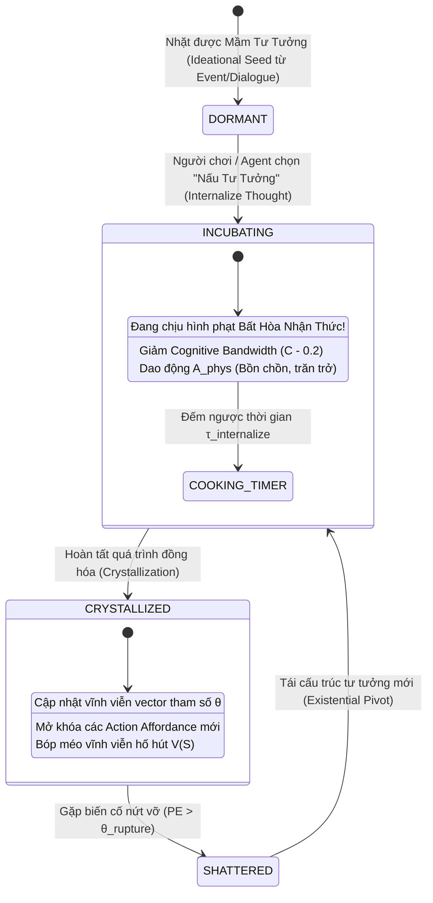

# BIÊN BẢN CUỘC HỌP HỘI ĐỒNG KHOA HỌC DỰ ÁN ANIMA
### Chuyên đề Chuyên sâu: Phân Rã Bản Thể Luận, Động Lực Học Tham Số Và Cấu Trúc Chiều Của Không Gian Giá Trị & Niềm Tin (Belief / Moral Space $\mathcal{P}$)

* **Thời gian bắt đầu:** 01:45:00 (Giờ hệ thống) — Ngày 28 tháng 09 năm 2026
* **Chủ trì cuộc họp:** Giám đốc Dự án (Project Director)
* **Thư ký tổng hợp:** Antigravity AI Engine
* **Tình trạng:** Đang diễn ra — Ghi nhận trực tiếp phiên thảo luận theo lệnh của Giám đốc

---

## 1. THÀNH PHẦN HỘI ĐỒNG THAM DỰ

### Thành viên Thường trực:
1. **TS. Alex Vance:** Chuyên gia Hệ động lực phi tuyến, Hình học vi phân & Không gian Tham số Cảnh quan.
2. **TS. Elena Rostova:** Chuyên gia Sinh học thần kinh, Vỏ não Trước trán Trung tâm (vmPFC) & Ký ức Dài hạn.
3. **Kai Sorenson:** Trưởng nhóm Kiến trúc Hệ thống Game (Game Systems Architect).
4. **GS. Marcus Thorne:** Chuyên gia Tâm lý học Lâm sàng, Khủng hoảng Hiện sinh & Bất hòa Nhận thức.
5. **GS. Sterling Croft:** Nhà Triết học Khoa học Nhận thức & Thực tại luận Cấu trúc ("Lưỡi dao Occam").
6. **TS. Julian Hayes:** Chuyên gia Khoa học Nhận thức Tính toán & Não bộ Bayes (Active Inference / FEP).
7. **GS. Gabriel Brandt:** Giáo sư Thần kinh học Nhận thức Ý chí & Mạng điều khiển Căn tính (Tham gia phiên trước).

### Chuyên gia Đặc trách Mới Bổ nhiệm (Theo lệnh của Giám đốc):
8. **GS. Thaddeus Mercer:** Giáo sư Nhận thức Xã hội, Thần kinh học Đạo đức & Động lực học Mạng Niềm tin (Chair of Social Cognition & Moral Neuroethics; Director of the Center for Epistemic Dynamics & Cultural Evolution).
   * *Đóng vai trò chủ công:* Phân rã cấu trúc đại số và thần kinh của Hệ giá trị đạo đức, cơ chế vôi hóa giáo điều (Dogmatic Calcification), bức tường thiêng liêng (Sacred Value Barrier) và vòng đời của "Tủ Tư Duy" (Thought Cabinet).

---

## 2. TUYÊN BỐ CỦA GIÁM ĐỐC DỰ ÁN & MỤC TIÊU CUỘC HỌP

> **Tuyên bố của Giám đốc Dự án:**
> *"Giám đốc tuyên bố,, tạm thời kết thúc cuộc họp về không gian ý chí. Tiếp tục triển khai phân tích không gian logic niềm tin (Belief). Nếu cần, hãy thêm chuyên gia agent mới vào cuộc họp này"*

### Mục tiêu trọng tâm cần giải quyết:
1. **Bản thể luận của Không gian Niềm tin ($\mathcal{P}$):** Định nghĩa toán học và triết học chính xác: Tại sao Niềm tin là **Không gian Tham số Cảnh quan ($\mathcal{P}$)** chứ không phải một trục trạng thái trôi nổi trong $\vec{S}(t)$?
2. **Phân rã các chiều cơ bản độc lập tuyến tính:** Xác định rõ các trục tọa độ thành phần của vector niềm tin $\vec{\theta} \in \mathcal{P}$ (Đạo đức, Giáo điều, Thiêng liêng, Locus kiểm soát, Bản sắc bộ lạc).
3. **Cơ chế uốn nắn hàm thế năng tâm lý ($V(\vec{S}; \vec{\theta})$):** Bằng cách nào một niềm tin tạo ra các hố hút hành vi (Attractor Basins) và các bức tường cấm kỵ vô hạn (Taboo Barriers)?
4. **Động lực học tiến hóa và nứt vỡ niềm tin (Belief Updating & Shattering):** Mô hình hóa quá trình cập nhật niềm tin theo Bayes, hiện tượng Bất hòa Nhận thức (Cognitive Dissonance), và sự sụp đổ thế giới quan (Existential Crisis).
5. **Cơ chế gameplay "Thought Cabinet" (Tủ Tư Duy):** Hiện thực hóa vòng đời tư tưởng từ mầm mống $\to$ ấp ủ $\to$ kết tinh thành nhân cách của nhân vật.

---

## 3. PHIÊN TRANH BIỆN CỦA HỘI ĐỒNG CHUYÊN GIA

---

### GS. Thaddeus Mercer (Chuyên gia Thần kinh học Đạo đức & Mạng Niềm tin):
*(Đứng dậy cúi chào Giám đốc Dự án và các đồng nghiệp, giọng nói trầm ấm và sắc sảo)*

"Kính thưa Giám đốc và toàn thể Hội đồng,

Nếu cuộc họp vừa rồi đã giải phóng chúng ta khỏi ngộ nhận về Ý chí, thì cuộc họp hôm nay sẽ giải phóng chúng ta khỏi ảo tưởng nguy hiểm nhất của khoa học máy tính cổ điển: **Ảo tưởng coi Niềm tin là một mớ cờ nhị phân (Boolean flags) hay các dòng văn bản logic khô khốc!**

Trong các game truyền thống, một NPC tin vào Chúa hay căm ghét người ngoài hành tinh thường chỉ là một biến chuỗi: `faith = "Christian"` hoặc `xenophobic = true`. Thật ngây ngô và chết chóc!

Dưới lăng kính khoa học nhận thức hiện đại:
> **Niềm tin không phải là những gì bạn 'biết'. Niềm tin là CÁI KÍNH BẢN THỂ mà qua đó bạn 'nhìn' thực tại, và là KHUÔN ĐÚC địa hình cảm xúc của tâm trí bạn!**

Một người mẹ tin rằng 'Con mình là tất cả' không mang một dòng mã lệnh trong đầu; niềm tin đó là một **thung lũng thế năng sâu vô tận** trong tâm trí bà, khiến cho bất kỳ mối đe dọa nào nhắm vào đứa con đều lập tức kích hoạt nguồn năng lượng phản kháng tột đỉnh.

Để giải quyết trọn vẹn chỉ đạo của Giám đốc, tôi xin chính thức đệ trình cấu trúc **Không Gian Giá Trị & Niềm Tin $\mathcal{P}$ Gồm 5 Chiều Cơ Bản Độc Lập Tuyến Tính**:

```
                         KHÔNG GIAN NIỀM TIN (𝒫)
                                    |
     +------------------------------+------------------------------+
     |                              |                              |
[ θ_moral ]                  [ δ_dogma ]                    [ σ_sacred ]
Vector Nền Tảng Đạo Đức      Độ Giáo Điều / Vôi Hóa        Chỉ Số Thiêng Liêng Hóa
(Haidt's 6 Foundations)      (Quán Tính Kháng Bằng Chứng)  (Bức Tường Cấm Kỵ Vô Hạn)
     |                              |
     +------------------------------+
     |                              |
[ λ_locus ]                  [ α_tribal ]
Trọng Tâm Hiện Sinh          Độ Đồng Hóa Bộ Lạc
(Nội Kiểm vs. Định Mệnh)     (In-group Memetic Coupling)
```

Xin mời các chuyên gia khai hỏa phản biện!"

---

### GS. Sterling Croft ("Lưỡi dao Occam" phản biện):
*(Lập tức lên tiếng chất vấn)*

"Giáo sư Mercer, tôi hoan nghênh góc nhìn phi-nhị-phân của anh. Nhưng tôi phải đặt ngay câu hỏi bản thể học sắc nhất:

1. **Chiều thứ nhất ($\vec{\theta}_{\text{moral}}$):** Anh mượn Thuyết Nền tảng Đạo đức (MFT) của Jonathan Haidt với 6 chiều (Care, Fairness, Loyalty, Authority, Sanctity, Liberty). Nhưng liệu 6 nền tảng này có thực sự độc lập? Hay chúng chỉ là sản phẩm phái sinh từ hai bản năng tiến hóa cơ bản: **Đồng cảm sinh học (Empathy)** và **Trật tự bầy đàn (Hierarchy)**?
2. **Chiều thứ hai ($\delta_{\text{dogma}}$):** Tại sao phải cần một biến 'Giáo điều' riêng? Chẳng phải một người có độ Mở nhận thức thấp ($O_{\text{intellect}}$ thấp trong Big Five của Elena) thì tự khắc sẽ giáo điều hay sao? Tại sao không dùng luôn Big Five mà phải vẽ thêm $\delta_{\text{dogma}}$?"

---

### GS. Thaddeus Mercer:
*(Mỉm cười, điềm tĩnh phản biện từng điểm)*

"Tuyệt vời! Đây chính là lý do tôi cần sự hiện diện của Lưỡi dao Occam!

#### 1. Về tính độc lập bất khả quy của 6 Nền tảng Đạo đức:
Nghiên cứu dịch tễ học nhận thức trên hàng trăm ngàn cá nhân trên toàn cầu của Haidt, Graham và Joseph đã chứng minh bằng toán học phân tích nhân tố (Factor Analysis): **6 chiều này hoàn toàn không thể triệt tiêu lẫn nhau**:
* Một tín đồ cuồng tín có thể đạt điểm tối đa về $\theta_{\text{sanctity}}$ (Sự thiêng liêng thánh khiết) nhưng điểm $\theta_{\text{care}}$ (Lòng trắc ẩn) bằng $0$ — họ sẵn sàng thiêu sống một kẻ dị giáo vì đức tin tôn giáo thuần khiết.
* Một nhà hoạt động tự do vô chính phủ có thể đạt điểm tối đa về $\theta_{\text{liberty}}$ (Tự do) nhưng cực kỳ căm ghét $\theta_{\text{authority}}$ (Quyền lực tôn ti) và $\theta_{\text{loyalty}}$ (Lòng trung thành bộ lạc).
* Không có cách nào dùng một trục 'Đồng cảm' để dự báo được thái độ của một người đối với 'Tôn ti thứ bậc' hay 'Sự thiêng liêng thể xác'. 6 chiều này là các **mô-đun đánh giá tiến hóa độc lập (Evolutionary Appraisal Modules)** được khắc sâu vào cấu trúc vỏ não người!

#### 2. Tại sao $\delta_{\text{dogma}}$ độc lập với Big Five Openness ($O$)?
* **Tính cách Big Five ($O$ - Cởi mở nhận thức):** Là một khuynh hướng tính khí bẩm sinh (Temperament trait). Một người có $O$ cao thích nghệ thuật, thích ý tưởng trừu tượng, thích sự mới lạ.
* **Độ Giáo điều ($\delta_{\text{dogma}}$):** Là **Thuộc tính Của Mạng Lưới Niềm Tin Cụ Thể (Epistemic Network State)**!
  * Một giáo sư vật lý lỗi lạc có thể có $O$ cực kỳ cao với nghệ thuật và khoa học, nhưng khi đụng đến học thuyết chính trị mà ông theo đuổi từ thời trẻ, ông lại hoàn toàn mù quáng, giáo điều cực đoan ($\delta_{\text{dogma}} = 1.0$), từ chối mọi dữ liệu thực nghiệm phản bác!
  * Ngược lại, một nông dân mộc mạc ít học ($O$ thấp) có thể rất thực tế, sẵn sàng thay đổi cách trồng trọt ngay khi thấy phân bón mới hiệu quả hơn ($\delta_{\text{dogma}} = 0.1$).
* Do đó: **$\delta_{\text{dogma}}$ không phải là tính cách; nó là ĐỘ VÔI HÓA CỦA HỆ NIỀM TIN ĐANG XÉT!**"

---

### TS. Julian Hayes (Não bộ Bayes & Active Inference):
*(Đứng dậy vỗ tay đồng tình)*

"Chính xác đến tuyệt đối! Hãy để tôi làm rõ bản chất toán học của $\delta_{\text{dogma}}$ dưới góc độ Não bộ Bayes:

Trong lý thuyết Active Inference của Karl Friston, một tác tử cập nhật niềm tin từ Tiền nghiệm $P(\boldsymbol{\theta})$ sang Hậu nghiệm $P(\boldsymbol{\theta} \mid \text{Data})$ theo định lý Bayes:
$$P(\boldsymbol{\theta} \mid \text{Data}) \propto P(\text{Data} \mid \boldsymbol{\theta}) \cdot P(\boldsymbol{\theta})$$

Trong đó:
* **Bằng chứng thực nghiệm (Data):** Được biểu diễn bởi Sai số Dự đoán (Prediction Error - $\text{PE}$).
* **Độ Giáo điều ($\delta_{\text{dogma}} \in [0, 1]$):** Chính là **Trọng số Chính xác của Tiền nghiệm (Precision of the Prior $\Pi_{\text{prior}}$)**!
  $$\Pi_{\text{prior}} = \frac{1}{1.001 - \delta_{\text{dogma}}}$$
  * Khi $\delta_{\text{dogma}} \to 0$ (Tâm trí cởi mở): Não bộ coi trọng bằng chứng thực nghiệm. Niềm tin uyển chuyển thích nghi với thực tế.
  * Khi $\delta_{\text{dogma}} \to 1.0$ (Cuồng tín/Vôi hóa hoàn toàn): $\Pi_{\text{prior}} \to \infty$. Não gán trọng số của bằng chứng thực nghiệm bằng $0$! 
  * Cho dù mắt có thấy đồng minh làm điều ác, tai có nghe sự thật sờ sờ, não bộ của kẻ cuồng tín **từ chối giải mã sai số dự đoán**. Mọi bằng chứng phản bác đều bị bóp méo thành *'Âm mưu của quỷ dữ nhằm thử thách lòng trung thành'*.

Đây chính là cơ chế toán học giải mã hiện tượng **Thiên kiến Xác nhận (Confirmation Bias)** và sự cuồng tín tôn giáo/chính trị trong lịch sử loài người!"

---

### TS. Elena Rostova (Sinh học Thần kinh):
*(Bổ sung dữ liệu giải phẫu nơ-ron)*

"Về mặt sinh học thần kinh, sự tương phản này được định vị rõ ràng trong não bộ:

1. **Vỏ não Trước trán Trung tâm Đáy (Ventromedial Prefrontal Cortex - vmPFC):**
   * Đây là **Trụ sở của Niềm tin Cá nhân và Ý thức Hệ**.
   * Khi một người tiếp nhận thông tin củng cố niềm tin của họ, vmPFC phát tín hiệu tưởng thưởng Dopaminergic rực rỡ, mang lại cảm giác an toàn và tự hào.
   * Ngược lại, khi niềm tin cốt lõi bị tấn công bởi bằng chứng trái ngược, vùng **Vỏ não Đảo (Insula)** và **Hạch hạnh nhân (Amygdala)** phát xung báo động hệt như khi cơ thể bị bỏng hoặc bị dao chém!
2. **Chỉ số Thiêng Liêng ($\sigma_{\text{sacred}}$) & Thử thách Cấm Kỵ (Taboo Trade-offs):**
   * Nghiên cứu chụp cộng hưởng từ chức năng (fMRI) của GS. Gregory Berns tại Emory University đã chứng minh: Khi con người xử lý các giá trị thiêng liêng (ví dụ: đức tin, danh dự gia đình, không bán đứng tổ quốc), não bộ **hoàn toàn tắt bỏ vùng tính toán chi phí - lợi ích (DLPFC và Parietal Cortex)**!
   * Họ không hề so đo xem *'Bán đứng bạn bè được bao nhiêu tiền'*. Vùng xử lý quy tắc tuyệt đối (Temporoparietal Junction - TPJ và vmPFC) kích hoạt chế độ: **ĐÚNG HOẶC SAI — KHÔNG CÓ THƯƠNG LƯỢNG!**

Vì vậy, chỉ số $\sigma_{\text{sacred}}$ của Thaddeus là một đại lượng sinh học thần kinh có thật: Nó là một **công tắc cắt cầu dao tính toán duy lợi (Deontological Cut-off Switch)**!"

---

### TS. Alex Vance (Hình học Vi phân & Không gian Tham số):
*(Phấn khởi vẽ biểu đồ đa tạp năng lượng lên bảng)*

"Cực kỳ xuất sắc! Bây giờ, hãy xem Không gian Niềm tin $\mathcal{P}$ nhào nặn Không gian Tâm lý $\mathcal{M}$ như thế nào trong hình học vi phân:

#### 1. Định nghĩa Không gian Tham số Cảnh quan $\mathcal{P}$:
Mỗi agent sở hữu một vector cấu hình niềm tin:
$$\vec{\theta} = \Big( \vec{\theta}_{\text{moral}} \in [-1, 1]^6, \; \delta_{\text{dogma}} \in [0, 1], \; \sigma_{\text{sacred}} \in [0, 1], \; \lambda_{\text{locus}} \in [-1, 1], \; \alpha_{\text{tribal}} \in [0, 1] \Big) \in \mathcal{P}$$

#### 2. Phương trình Tác động lên Hàm Thế Năng Tâm lý $V(\vec{S}; \vec{\theta})$:
Hàm thế năng tâm lý của một hành động hay trạng thái $\vec{S}$ không cố định, mà bị uốn cong bởi $\vec{\theta}$:
$$V(\vec{S}; \vec{\theta}) = V_{\text{base}}(\vec{S}) + V_{\text{moral}}(\vec{S}; \vec{\theta}_{\text{moral}}) + V_{\text{taboo}}(\vec{S}; \sigma_{\text{sacred}})$$

Trong đó:
* **Hố Hút Giá Trị ($V_{\text{moral}}$):**
  $$V_{\text{moral}}(\vec{S}; \vec{\theta}_{\text{moral}}) = - \sum_{k=1}^6 \theta_k \cdot \Psi_k(\vec{S})$$
  *Nếu nhân vật có $\theta_{\text{loyalty}} = +1.0$, mọi hành động bảo vệ đồng đội $\Psi_{\text{loyalty}}(\vec{S}) > 0$ sẽ làm sâu thêm hố hút thế năng, khiến tâm trí rơi vào trạng thái thanh thản, tự hào ($V_{\text{bio}} > 0, W > 0$).*
* **Bức Tường Cấm Kỵ Vô Hạn ($V_{\text{taboo}}$):**
  $$V_{\text{taboo}}(\vec{S}; \sigma_{\text{sacred}}) = \sigma_{\text{sacred}} \cdot \frac{K_{\text{barrier}}}{\Big( \text{DistanceToTaboo}(\vec{S}) \Big)^2}$$
  *Khi nhân vật bị đẩy vào tình huống ép buộc phản bội hoặc làm điều ô uế thiêng liêng, khoảng cách đến ranh giới cấm kỵ tiến về $0$. Thế năng $V \to \infty$! Hòn bi tâm lý bị dội ngược lại mãnh liệt: nhân vật thà chết chứ không bước qua lằn ranh đó!*

#### 3. Phương trình Tiến hóa của Niềm tin (Belief Dynamics & Crisis Bifurcation):
Niềm tin biến thiên với tốc độ cực chậm ($\tau_{\text{belief}} \sim \text{ngày, tháng}$), chịu tác động của Sai số Dự đoán Tích lũy (Cumulative Prediction Error - $\overline{\text{PE}}$):
$$\frac{d\vec{\theta}}{dt} = \frac{1}{\tau_{\text{belief}}} (1.0 - \delta_{\text{dogma}}) \cdot \mathbf{J}_{\text{evidence}} \cdot \overline{\text{PE}}(t) + \hat{\mathcal{W}}(\vec{\theta})$$

---

#### 4. Hiện Tượng Nứt Vỡ Niềm Tin (Belief Shattering / Existential Crisis):
Điều gì xảy ra khi một tín đồ cuồng tín ($\delta_{\text{dogma}} \approx 0.95$) chứng kiến một sự thật tàn khốc không thể phủ nhận (ví dụ: Đấng cứu thế mà họ tôn thờ bị phát hiện là kẻ sát nhân lừa đảo)?
* Sai số dự đoán $\text{PE}$ tăng vọt vượt qua sức chịu đựng của mạng nơ-ron: $\text{PE} > \theta_{\text{rupture}}$.
* Phương trình thế năng trải qua một **Phân nhánh Cát tường (Catastrophe / Saddle-Node Bifurcation)**:
  * Toàn bộ các thung lũng ổn định cũ bị sụp đổ thành đỉnh dốc!
  * **Hội chứng Khủng hoảng Hiện sinh (Existential Dread):** $\vec{S}$ rơi tự do vào vùng hỗn loạn, $C \to 0$, $A_{\text{phys}} \to 1.0, V_{\text{bio}} \to -1.0$.
  * Nhân vật buộc phải trải qua một trong hai lối thoát: **Hóa điên (Psychotic Break)** hoặc **Tự tái cấu trúc thế giới quan (Metamorphic Epistemic Rebirth)**!"

---

### Kai Sorenson (Lead Game Systems Architect):
*(Hào hứng gõ bàn, chiếu sơ đồ kiến trúc game engine)*

"Lạy Chúa, đây chính là mảnh ghép cơ chế trò chơi mà tôi hằng khao khát!

Hãy nhìn vào kiệt tác nhập vai **Disco Elysium** với hệ thống *Thought Cabinet (Tủ Tư Duy)*. Chúng ta sẽ kế thừa đỉnh cao đó nhưng đưa nó lên một tầm mức mô phỏng toán học thực sự vượt trội trong Project Anima!



#### Thiết Kế Gameplay Chi Tiết:
1. **Quá trình 'Nấu Tư Tưởng' (The Incubation Phase):**
   * Khi agent suy ngẫm về một tư tưởng mới (ví dụ: *'Liệu bạo lực có phải là câu trả lời duy nhất?'*), họ phải trả giá bằng **Bất hòa Nhận thức (Cognitive Dissonance)**.
   * Trong suốt thời gian ấp ủ (ví dụ: 3 ngày trong game), chỉ số nhận thức $C$ bị tụt giảm vì não bộ phải dùng tài nguyên để tái tổ chức mạng synap; nhân vật dễ cáu bẳn và ngủ không ngon.
2. **Kết Tinh Tư Tưởng (Crystallization):**
   * Sau khi nấu xong, tư tưởng kết tinh thành một phần của $\vec{\theta}$.
   * **Hiệu ứng thực tế:** Nhân vật mở khóa các nhánh hội thoại mới, phản xạ vô điều kiện trước các sự kiện đạo đức, và địa hình tâm lý $V(\vec{S})$ được khắc sâu thêm những hố hút mới.
3. **Cơ Chế Bất Đồng Bộ Lạc (Tribal Polarization):**
   * Chiều $\alpha_{\text{tribal}}$ cho phép các ngôi làng, giáo phái hoặc phe phái trong game tự động kéo nhịp (entrain) niềm tin của các thành viên. Một người sống trong giáo phái lâu năm sẽ bị từ trường memetic của giáo phái đó đồng hóa toàn bộ vector $\vec{\theta}_{\text{moral}}$!"

---

### GS. Gabriel Brandt (Thần kinh học Ý chí):
*(Đứng lên khẳng định mối liên hệ hữu cơ giữa hai phiên họp)*

"Tôi muốn làm rõ mối quan hệ cộng sinh tuyệt đẹp giữa **Không Gian Niềm Tin ($\mathcal{P}$)** của phiên họp này và **Toán Tử Ý Chí ($\hat{\mathcal{W}}$)** của phiên họp trước:

```
[ KHÔNG GIAN NIỀM TIN (𝒫) ]  ==== (Cung cấp Ý Nghĩa & La Bàn) ====>  [ Ý CHÍ (𝒲) ]
   "Tôi chết vì điều gì?"                                                "Tôi hành động!"
            ^                                                                  |
            |                                                                  v
            +==== (BÓP MÉO: Đập vỡ định kiến / Tự siêu việt) <================+
```

1. **Niềm tin là Nguồn Nhiên Liệu Tối Thượng của Ý Chí:**
   * Một người không thể bộc phát ý chí siêu việt ($\mathcal{W}_{\text{amp}} \ge \theta_{\text{transcend}}$) trong một chân không ý nghĩa!
   * Ý chí chỉ bùng nổ khi một giá trị thiêng liêng trong $\mathcal{P}$ ($\sigma_{\text{sacred}} \approx 1.0$) bị đe dọa sinh tử. Ý nghĩa hiện sinh chính là thứ cấp năng lượng cho vùng aMCC phát hỏa!
2. **Ý Chí là Lực Lượng Duy Nhất Có Thể Đập Vỡ Vôi Hóa Giáo Điều:**
   * Bình thường, một khi $\delta_{\text{dogma}} \to 1.0$, hệ thống bị khóa cứng trong sự bảo thủ. Không có bất kỳ lập luận logic nào có thể thay đổi họ.
   * Nhưng **Ý chí Siêu việt ($\hat{\mathcal{W}}$)** là toán tử cấp 2: Trong giây phút giác ngộ hiện sinh, Ý chí có thể tự quay lưỡi gươm vào bên trong, cưỡng bức đập tan mạng lưới giáo điều ($\delta_{\text{dogma}} \to 0$), giải phóng nhân cách để tái sinh thành một con người mới (Hiện tượng Phản tỉnh Hiện sinh / Epistemic Metanoia)!"

---

### GS. Marcus Thorne (Tâm lý học Lâm sàng):
*(Gật đầu tâm đắc, tổng kết từ các ca lâm sàng)*

"Thưa Giám đốc, từ các cựu chiến binh mắc kẹt trong cảm giác tội lỗi đạo đức (Moral Injury), cho đến những người rời bỏ các giáo phái tà giáo cực đoan:
* Vết thương đau đớn nhất không nằm ở da thịt (Somatic $\mathcal{H}$), cũng không nằm ở cảm xúc tức thời (Tâm lý $\mathcal{M}$).
* **Vết thương chí mạng nhất là sự SỤP ĐỔ CỦA KHÔNG GIAN NIỀM TIN ($\mathcal{P}$)!**
* Khi niềm tin rằng *'Thế giới là công bằng và người tốt sẽ được đền đáp'* bị tan tành bởi thực tế tàn khốc, toàn bộ hệ quy chiếu định hướng của con người biến mất. Họ rơi vào trạng thái mất phương hướng hiện sinh (Anomie).

Mô hình 5 chiều của Giáo sư Mercer không chỉ giúp game có chiều sâu kịch bản vô tiền khoáng hậu, mà còn phản ánh chân thực đến nghẹt thở bi kịch và sự phục sinh của tâm thức con người!"

---

## 4. BẢNG TỔNG HỢP CÁC TRỤC CƠ BẢN CỦA KHÔNG GIAN NIỀM TIN ($\mathcal{P}$)

Hội đồng chính thức chuẩn hóa và đóng gói cấu trúc Không gian Giá trị & Niềm tin thành 5 Chiều Độc Lập Tuyến Tính:

| STT | Ký Hiệu | Tên Chiều Thành Phần | Miền Giá Trị | Cơ Sở Sinh Học & Xã Hội | Vai Trò Trong Động Lực Học Hệ Thống |
| :---: | :---: | :--- | :---: | :--- | :--- |
| **1** | $\vec{\theta}_{\text{moral}}$ | **Vector 6 Nền Tảng Đạo Đức** (Moral Foundations) | $[-1.0, 1.0]^6$ | Mạng lưới đánh giá trực giác vỏ não trước trán (vmPFC & TPJ) | Định hình các hố hút hành vi $V_{\text{moral}}$: Care, Fairness, Loyalty, Authority, Sanctity, Liberty. |
| **2** | $\delta_{\text{dogma}}$ | **Độ Giáo Điều / Vôi Hóa** (Epistemic Dogmatism) | $[0.0, 1.0]$ | Trọng số tin cậy tiền nghiệm Bayes ($\Pi_{\text{prior}}$); ức chế Insula | Đo lường mức độ kháng cự cập nhật niềm tin trước bằng chứng thực nghiệm ($1 - \text{Plasticity}$). |
| **3** | $\sigma_{\text{sacred}}$ | **Chỉ Số Thiêng Liêng Hóa** (Sacred Value Index) | $[0.0, 1.0]$ | Tắt cơ chế duy lợi DLPFC; kích hoạt phản xạ cấm kỵ vô điều kiện | Tạo bức tường thế năng vô hạn ($V \to \infty$), ngăn chặn tuyệt đối các hành vi mua chuộc hoặc thỏa hiệp cấm kỵ. |
| **4** | $\lambda_{\text{locus}}$ | **Trọng Tâm Hiện Sinh** (Locus of Control) | $[-1.0, 1.0]$ | Mạng thể vân - trán (Striatal Agency Circuitry) | $+1$: Nội kiểm (Tôi làm chủ vận mệnh); $-1$: Ngoại kiểm (Tôi là nạn nhân của số phận/thần linh). |
| **5** | $\alpha_{\text{tribal}}$ | **Độ Đồng Hóa Bộ Lạc** (Tribal / In-Group Allegiance) | $[0.0, 1.0]$ | Mạng đồng cảm xã hội & hiệu ứng Oxytocin nội nhóm | Quyết định tốc độ bị đồng bộ hóa niềm tin bởi trường memetic của phe phái/giáo phái ($O(N)$). |

---

## 5. KẾT LUẬN & CHỈ THỊ TIẾP THEO TRÌNH GIÁM ĐỐC DỰ ÁN

1. **Hoàn thành xuất sắc nhiệm vụ:** Hội đồng cùng chuyên gia mới **GS. Thaddeus Mercer** đã phân rã trọn vẹn bản thể luận, 5 chiều độc lập tuyến tính, hệ phương trình uốn nắn thế năng và vòng đời "Thought Cabinet" cho **Không Gian Giá Trị & Niềm Tin ($\mathcal{P}$)**.
2. **Khẳng định vai trò cấu trúc:** Niềm tin không phải biến trạng thái biến thiên từng giây, mà là **Không Gian Tham Số Cảnh Quan ($\mathcal{P}$)** định đoạt địa hình tâm lý và cấp nguồn ý nghĩa cho Ý chí ($\mathcal{W}$).
3. **Sẵn sàng cho các không gian tiếp theo:** Hội đồng xin kính trình toàn văn biên bản lên Giám đốc Dự án và sẵn sàng nhận lệnh tiếp tục mổ xẻ các không gian còn lại: **Somatic ($\mathcal{H}$)**, **Relation ($\mathcal{R}$)**, hoặc **Event ($\mathcal{E}$)**!

---
*(Biên bản được lập và đồng thuận ký duyệt bởi toàn thể Hội đồng Khoa học Project Anima)*
