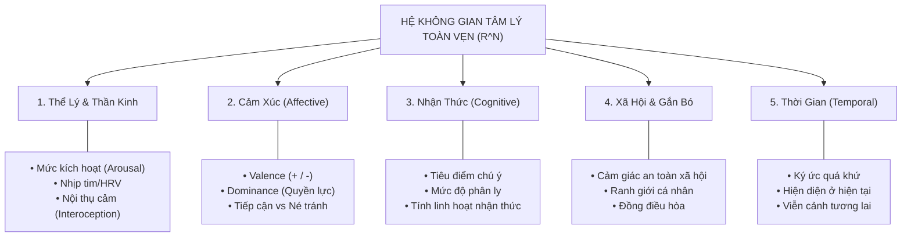
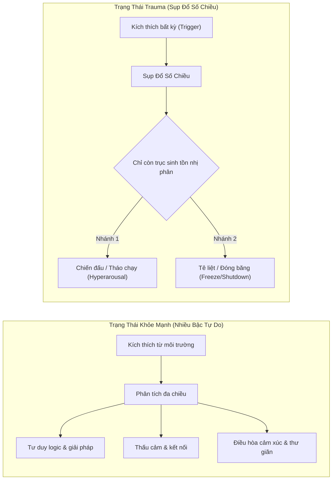
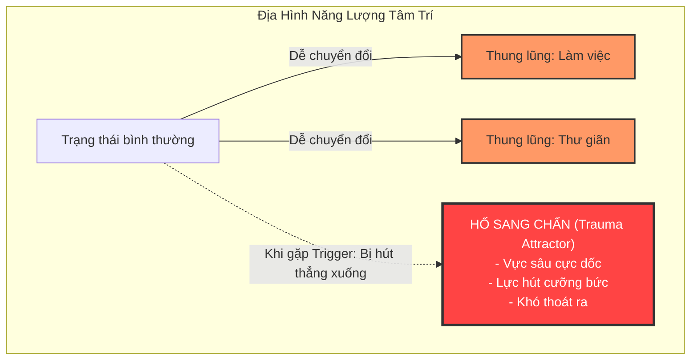
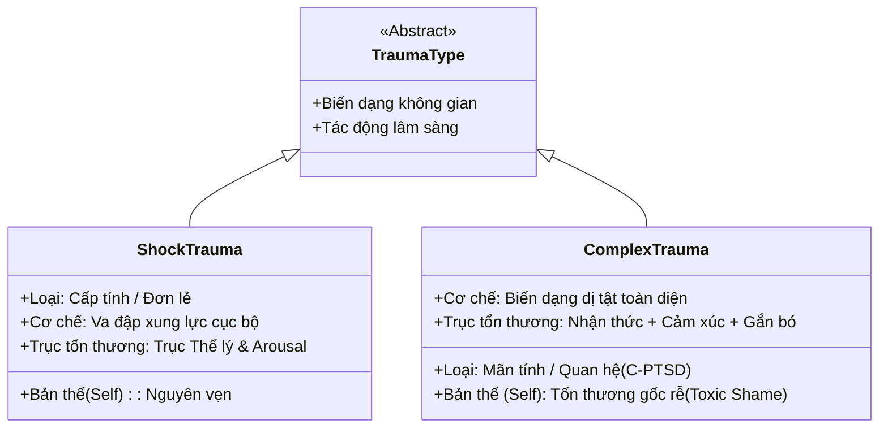
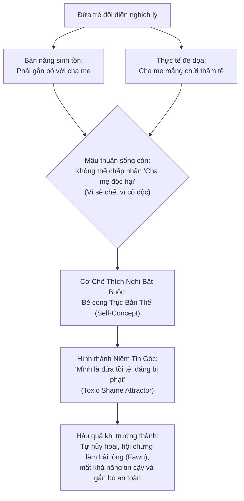
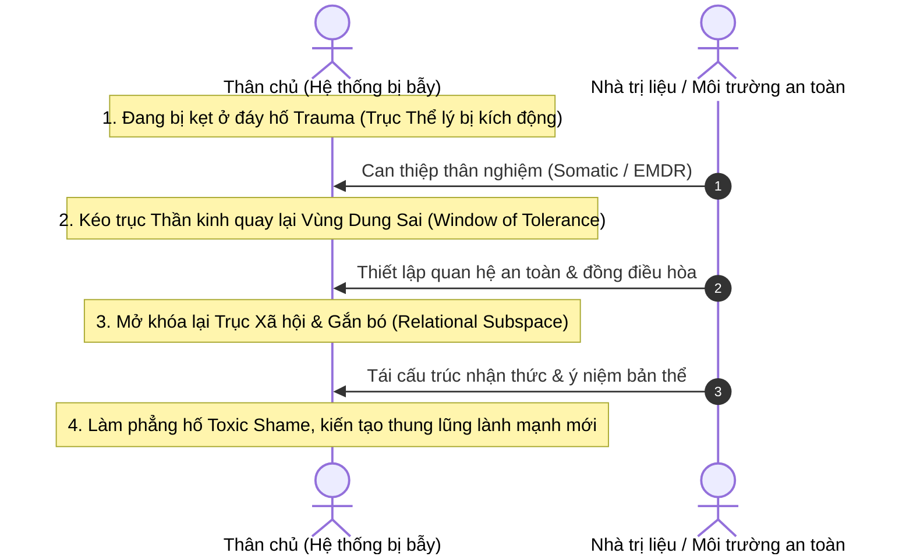

# Mô Hình Hóa Hệ Thống Tâm Lý Và Sang Chấn (Trauma) Trong Không Gian Trạng Thái Đa Chiều

---

## 1. Bản Chất Cốt Lõi: Tâm Lý Là Hệ Thống Động Lực Phi Tuyến

Trong khoa học thần kinh tính toán (Computational Neuroscience) và tâm lý học nhận thức, **tâm lý không phải là một thực thể tĩnh**, mà là một **hệ thống động lực học phi tuyến (Nonlinear Dynamical System)**.

Tại bất kỳ thời điểm $t$, trạng thái tâm lý toàn vẹn của một con người là một vector trạng thái $\vec{S}(t)$ nằm trong không gian pha đa chiều (Phase Space) $\mathbb{R}^N$:

$$\vec{S}(t) = \big(x_1(t), x_2(t), \dots, x_N(t)\big) \in \mathbb{R}^N$$

* **Dòng chảy tâm lý (Suy nghĩ, Cảm xúc, Hành vi):** Là **quỹ đạo liên tục (trajectory)** của vector $\vec{S}(t)$ di chuyển trên một đa tạp n-chiều (psychological manifold) theo thời gian.
* **Tính cách (Personality):** Là **địa hình trường lực kéo (Attractor Landscape)**. Tính cách không quyết định bạn luôn ở tọa độ nào, mà quy định hình dạng các "thung lũng hút" (attractor basins). Khi không có ngoại lực tác động, tâm trí sẽ tự trôi về các thung lũng ổn định này.

---

## 2. Phân Tầng Các Chiều Cơ Bản Của Không Gian Tâm Lý ($N$-Chiều)

Không gian tâm lý thực tế có vô số bậc tự do ($N \gg 3$), được cấu thành từ 5 không gian con (subspaces) độc lập đan xen:

---

## 3. Bản Chất Của Trauma: Sự Sụp Đổ Số Chiều (Dimensionality Collapse)

Trauma không đơn thuần là một ký ức tồi tệ; nó là **chấn thương cấu trúc hình học** của không gian trạng thái.

### 3.1. So Sánh Quỹ Đạo: Khỏe Mạnh vs. Sang Chấn

* **Loss of Degrees of Freedom (Mất các bậc tự do):** Mọi chiều kích tinh vi (sáng tạo, tò mò, bao dung) bị dập tắt; tâm trí chỉ còn duy nhất một bài toán: **Nguy hiểm hay An toàn?**.

---

## 4. Mô Hình Hóa Địa Hình Năng Lượng (Energy Landscape)

Theo nguyên lý năng lượng tự do (Free Energy Principle), tâm trí luôn tìm cách rơi vào các "thung lũng" tiêu tốn ít năng lượng phòng vệ nhất:

---

## 5. Phân Loại Trauma Theo Biến Dạng Không Gian Trạng Thái

---

## 6. Trường Hợp Complex Trauma: Đứa Trẻ Bị Bạo Hành Bằng Lời Nói

Phân tích nghịch lý sinh tồn của đứa trẻ lớn lên trong sự chì chiết, mắng chửi trường diễn:

---

## 7. Ý Nghĩa Đối Với Quá Trình Trị Liệu & Chữa Lành

Chữa lành sang chấn dưới góc nhìn toán học - tâm lý là quá trình **Mở Rộng Lại Số Chiều (Dimensionality Expansion)**:

