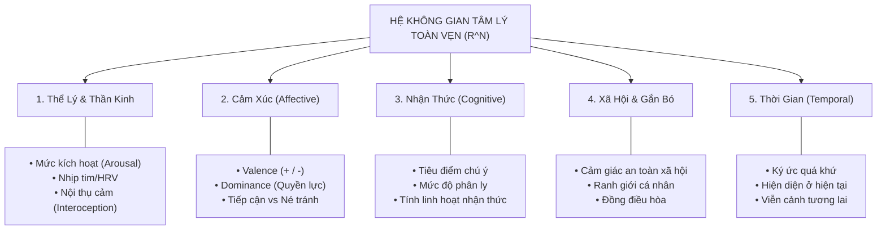
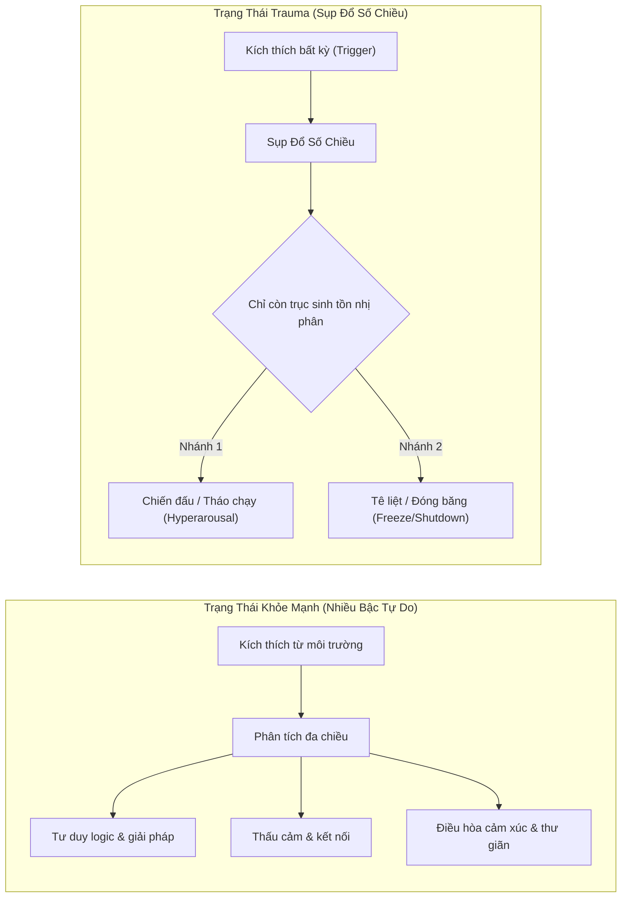
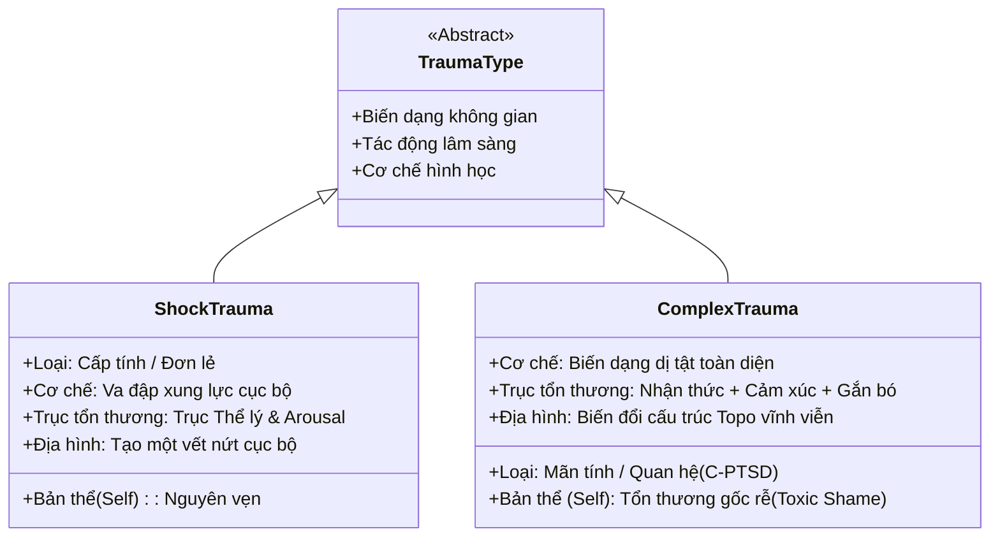
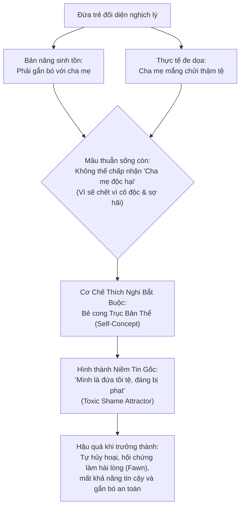
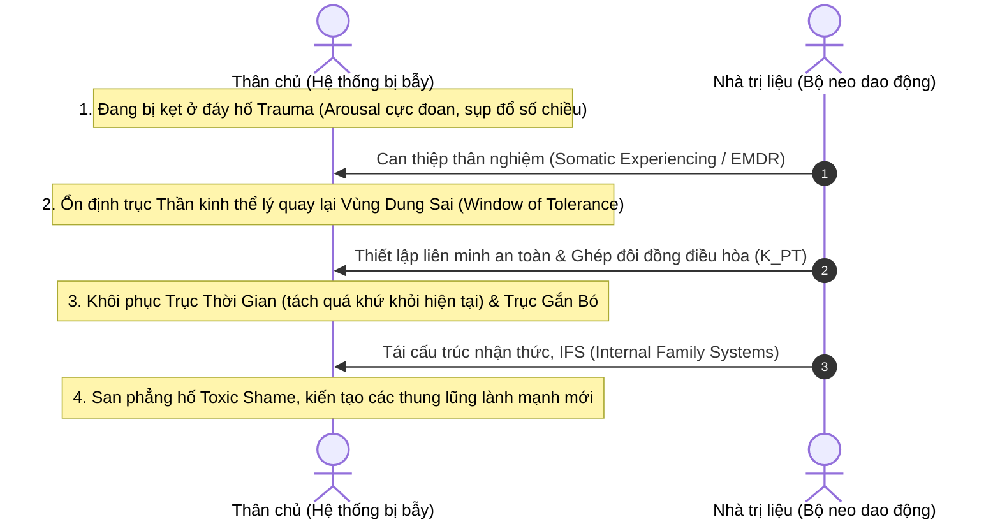
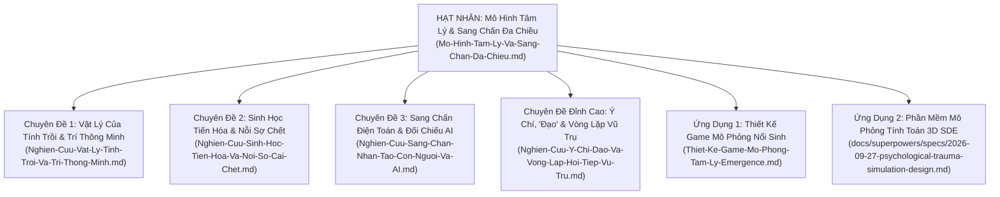

# Mô Hình Hóa Hệ Thống Tâm Lý Và Sang Chấn (Trauma) Trong Không Gian Trạng Thái Đa Chiều

> **Current correction guidance (2026-10-04):** This document contains historical proposals, analogies or design expectations. Read the [project correction register](docs/superpowers/specs/2026-10-04-project-correction-register.md) before treating equations, biological mappings, dimensional independence, performance or acceptance claims as established results.

---

## 1. Bản Chất Cốt Lõi: Tâm Lý Là Hệ Thống Động Lực Phi Tuyến

Trong khoa học thần kinh tính toán (Computational Neuroscience) và tâm lý học nhận thức, **tâm lý không phải là một thực thể tĩnh**, mà là một **hệ thống động lực học phi tuyến (Nonlinear Dynamical System)**.

Trong mô hình đề xuất, một tập biến đại diện cho trạng thái tâm lý tại thời điểm $t$ được viết thành vector $\vec{S}(t)$ trong không gian trạng thái $\mathbb{R}^N$. Đây là biểu diễn rút gọn cần định nghĩa phép đo; không phải mô tả đã kiểm chứng của toàn bộ tâm trí:

$$\vec{S}(t) = \big(x_1(t), x_2(t), \dots, x_N(t)\big) \in \mathbb{R}^N$$

* **Dòng chảy tâm lý (Suy nghĩ, Cảm xúc, Hành vi):** Là **quỹ đạo liên tục (trajectory)** của vector $\vec{S}(t)$ di chuyển trên một đa tạp n-chiều (psychological manifold) theo thời gian.
* **Tính cách (Personality):** Là **địa hình trường lực kéo (Attractor Landscape)**. Tính cách không quyết định bạn luôn ở tọa độ nào, mà quy định hình dạng các "thung lũng hút" (attractor basins). Khi không có ngoại lực tác động, tâm trí sẽ tự trôi về các thung lũng ổn định này.

### 1.1. Phương Trình Vi Phân Tiến Hóa Trạng Thái (Equation of Motion)

Sự vận động của trạng thái tâm lý theo thời gian được chi phối bởi phương trình vi phân ngẫu nhiên phi tuyến (Langevin-type Dynamical Equation):

$$\frac{d\vec{S}(t)}{dt} = -\nabla V(\vec{S}) + \mathbf{W}\vec{S}(t) + \mathbf{I}(t) + \eta(t)$$

Trong đó:
* **$-\nabla V(\vec{S})$ (Trường thế năng nội tại):** Gradient âm của địa hình năng lượng $V(\vec{S})$. Thành phần này kéo vector trạng thái trôi dốc tự nhiên về phía đáy các thung lũng thu hút (Attractors) sâu nhất.
* **$\mathbf{W}$ (Ma trận ghép nối liên miền - Coupling Matrix):** Thể hiện sự tương tác qua lại giữa các không gian con (ví dụ: kích hoạt thể lý $\to$ suy diễn nhận thức $\to$ phản ứng gắn bó).
* **$\mathbf{I}(t)$ (Kích thích môi trường - External Inputs / Triggers):** Các tín hiệu cảm giác, áp lực xã hội hoặc biến cố bên ngoài tác động tức thời lên hệ thống.
* **$\eta(t)$ (Nhiễu ngẫu nhiên thần kinh - Stochastic Neural Noise):** Dao động vi mô tự nhiên của não bộ, tuân theo phân phối Gauss với $\langle \eta(t) \rangle = 0$ và $\langle \eta(t)\eta(t') \rangle = 2D\delta(t-t')$.

### 1.2. Trạng Thái Khỏe Mạnh: Tự Tổ Chức Tới Hạn (Self-Organized Criticality)

Mô hình game có thể biểu diễn khả năng thích ứng bằng việc chuyển linh hoạt giữa nhiều hành vi phù hợp với ngữ cảnh. Tuy nhiên, không được đồng nhất sức khỏe với strange attractor hoặc self-organized criticality; đây là các khái niệm khác nhau và cần tiêu chí đo riêng.
* **Giả thuyết thiết kế về thích ứng:** Quỹ đạo có thể trở về trạng thái chức năng sau nhiễu loạn và thay đổi chiến lược khi ngữ cảnh đổi. Điều này không bắt buộc quỹ đạo phải hỗn loạn hay có PR cao.
* **Giả thuyết thiết kế về cứng nhắc:** Một số agent có thể lặp hành vi không phù hợp dù hoàn cảnh thay đổi. Điểm cân bằng hoặc limit cycle tự nó không chứng minh bệnh lý hay sang chấn.
* **Giới hạn toán học:** Với hệ gradient tự trị thuần túy $\dot S=-\nabla V$, ta có $\dot V=-\|\nabla V\|^2\le0$; không thể suy ra chu kỳ hút không tầm thường hoặc strange attractor chỉ từ các hố thế năng. Muốn mô phỏng dao động/hỗn loạn phải chỉ rõ lực không bảo toàn, biến phụ hoặc tác động phụ thuộc thời gian; thêm nhiễu không tự chứng minh self-organized criticality.

### 1.3. Bảng Giải Mã Trực Quan Các Khái Niệm Toán Học Bằng Hình Tượng Cơ Học

Để giải mã các thuật ngữ toán học cấp cao thành trực giác sinh động:

| Khái niệm Toán học | Hình tượng Đời thường Trực quan | Ánh xạ vào Tâm lý học Con người |
| :--- | :--- | :--- |
| **Không gian pha ($N$-chiều)** | Bàn điều khiển vô hình có hàng nghìn cần gạt (nhịp tim, hơi thở, cảm xúc, ký ức...). | Tọa độ tâm lý tổng hợp của bạn tại khoảnh khắc này. |
| **Quỹ đạo (Trajectory)** | Vệt sáng liên tục của một chú đom đóm lượn bay trong đêm tối. | Dòng suy nghĩ và tâm trạng liên tục trôi đi theo thời gian. |
| **Thung lũng hút (Attractor Basin)** | Một cái phễu hoặc lòng bát trơn. Thả viên bi vào, nó sẽ tự lăn về đáy. | Thói quen hoặc phản xạ vô thức (khi buồn thì tự động tìm đồ ngọt). |
| **Sự sụp đổ số chiều (Collapse)** | Con chim đang bay 3D bị nhốt vào **ống nghiệm 1D**: chỉ còn bò tiến hoặc lùi. | Khi bị hoảng loạn: mất sạch trí tuệ linh hoạt, chỉ còn "Chiến" hoặc "Biến". |
| **Hiện tượng trễ (Hysteresis)** | **Hố bẫy có thành trượt dốc nhưng gờ dựng đứng:** Rơi thì dễ, trèo ra thì không có chỗ bám. | Bị kích động thì mất 1 giây, nhưng để bình tĩnh lại phải mất nhiều ngày. |
| **Làm chậm tới hạn (Critical Slowing Down)** | **Lòng bát bị đập dẹt thành cái đĩa phẳng:** Búng nhẹ viên bi thì nó lắc lư mãi không chịu đứng yên. | Trước khi suy sụp, người ta mất dần tính đàn hồi, một chuyện nhỏ cũng làm chao đảo kéo dài. |

---

## 2. Phân Tầng Các Chiều Cơ Bản Của Không Gian Tâm Lý ($N$-Chiều)

Không gian tâm lý thực tế có vô số bậc tự do ($N \gg 3$), được cấu thành từ 5 không gian con (subspaces) độc lập đan xen:

### 2.1. Động Lực Học Co Rút Chiều Thời Gian (Temporal Subspace Collapse & Flashback)

Trong trạng thái vận hành lành mạnh, chiều thời gian duy trì tính liên tục và phân tách rõ ràng nhờ nhãn thời gian sự kiện (Episodic Timestamping):
$$\Delta \tau = |t_{\text{hiện tại}} - t_{\text{biến cố quá khứ}}| > 0$$

Tuy nhiên, khi trung tâm tích hợp hồi hải mã (Hippocampus) bị ức chế bởi nồng độ hormone stress cực độ trong lúc sang chấn:
* **Hiện tượng co rút thời gian nhận thức (Temporal Collapse):** Khoảng cách nhận thức $d(\vec{S}_{\text{quá khứ}}, \vec{S}_{\text{hiện tại}}) \to 0$.
* **Cơ chế toán học của Flashback:** Về mặt thông tin học, mạng thần kinh không còn gán nhãn quá khứ cho ký ức sang chấn. Ký ức được tái hiện với tọa độ không-thời gian của **chính khoảnh khắc hiện tại**, kích hoạt toàn bộ hệ thống thể lý và cảm xúc như thể mối nguy hiểm đang xảy ra ngay bây giờ.

---

## 3. Bản Chất Của Trauma: Sự Sụp Đổ Số Chiều (Dimensionality Collapse)

Trauma không đơn thuần là một ký ức tồi tệ; nó là **chấn thương cấu trúc hình học** của không gian trạng thái.

### 3.1. So Sánh Quỹ Đạo: Khỏe Mạnh vs. Sang Chấn

* **Loss of Degrees of Freedom (Mất các bậc tự do):** Mọi chiều kích tinh vi (sáng tạo, tò mò, bao dung, viễn cảnh tương lai) bị dập tắt; tâm trí bị cưỡng bức chiếu xuống một không gian con 1-chiều: **Nguy hiểm hay An toàn? Sinh tồn hay Tiêu vong?**.

---

## 4. Mô Hình Hóa Địa Hình Năng Lượng & Các Hiện Tượng Động Lực Phi Tuyến

Theo nguyên lý năng lượng tự do (Free Energy Principle - Karl Friston), não bộ là một cỗ máy dự báo (Prediction Engine) luôn tìm cách cực tiểu hóa sai số dự báo (Prediction Error / Free Energy). Địa hình năng lượng $V(\vec{S})$ phản ánh các cấu hình trạng thái mà não bộ đánh giá là tối ưu để bảo toàn sinh tồn:

### 4.1. Hiện Tượng Trễ (Hysteresis) & Rào Cản Kích Hoạt (Activation Barrier)

Một đặc tính quan trọng của hệ phi tuyến bị sang chấn là tính bất đối xứng giữa lối vào và lối ra:

$$\Delta E_{\text{thoát}} \gg \Delta E_{\text{rơi}}$$

* **Lối vào (Rơi tự do):** Chỉ cần một kích hoạt rất nhỏ $I_{\text{trigger}} > I_{\text{ngưỡng}}$, hệ thống ngay lập tức vượt qua gờ ngăn cách và trượt dốc không phanh xuống đáy hố sang chấn ($Valley_{\text{trauma}}$).
* **Lối ra (Rào cản thế năng lớn):** Khi trigger môi trường đã biến mất ($I(t) = 0$), hệ thống **không tự động quay về trạng thái cân bằng**. Muốn kéo vector trạng thái leo ngược dốc thế năng dốc đứng, thân chủ phải huy động một nguồn năng lượng tự điều hòa khổng lồ ($I_{\text{recovery}} \gg I_{\text{trigger}}$) — điều mà người bị suy kiệt thần kinh không thể tự làm một mình.

### 4.2. Làm Chậm Tới Hạn (Critical Slowing Down - CSD) & Cảnh Báo Điểm Tới Hạn (Tipping Point)

Trước khi một hệ thống tâm lý suy sụp hoàn toàn vào đợt khủng hoảng sang chấn, địa hình năng lượng quanh thung lũng lành mạnh bị nông dần (Flattening of the potential well). 

Theo lý thuyết chuyển pha (Phase Transitions), hiện tượng **Critical Slowing Down** xuất hiện với hai chỉ dấu thống kê quan trọng:
1. **Thời gian phục hồi tăng vọt ($\tau_{\text{recovery}} \to \infty$):** Sau một tác động xáo trộn nhỏ (ví dụ: một lời chỉ trích nhẹ), hệ thống mất rất nhiều thời gian mới quay lại được trạng thái bình tĩnh ban đầu.
2. **Phương sai (Variance) và Tự tương quan bậc 1 (Autocorrelation lag-1) tăng đột biến:** Dao động tâm lý trở nên bất ổn định, biên độ rung lắc lớn và có xu hướng kéo dài quán tính tiêu cực từ thời điểm này sang thời điểm khác. Đây là dấu hiệu cảnh báo sớm (Early Warning Signal) cho thấy hệ thống sắp sửa chuyển pha đột ngột vào hố sang chấn.

---

## 5. Phân Loại Trauma Theo Biến Dạng Không Gian Trạng Thái

Dưới góc nhìn hình học vi phân, các dạng sang chấn gây ra những biến dạng cơ bản khác nhau trên đa tạp tâm lý:

---

## 6. Trường Hợp Complex Trauma: Đứa Trẻ Bị Bạo Hành Bằng Lời Nói

Phân tích nghịch lý sinh tồn của đứa trẻ lớn lên trong sự chì chiết, mắng chửi trường diễn dưới góc độ lý thuyết rẽ nhánh (Bifurcation / Cusp Catastrophe):

* **Cơ chế bẻ cong topo (Topological Warping):** Để duy trì mối liên kết sống còn với người nuôi dưỡng, não bộ đứa trẻ thực hiện một bước tái cấu trúc nhận thức tàn khốc: **"Nếu cha mẹ sai, thế giới này hoàn toàn nguy hiểm. Nhưng nếu mình sai/mình tồi tệ, thế giới vẫn có trật tự và mình vẫn có thể được tha thứ nếu mình ngoan ngoãn."**
* Đáy thung lũng của ý niệm bản thể bị biến dạng thành **Hố Hổ Thẹn Độc Hại (Toxic Shame Attractor)** — trạng thái năng lượng thấp nhất mà đứa trẻ tự giam mình vào để duy trì sự sống sót.

---

## 7. Ý Nghĩa Đối Với Trị Liệu: Mở Rộng Số Chiều & Hệ Thống Ghép Đôi

Chữa lành sang chấn dưới góc nhìn toán học - tâm lý là quá trình **Mở Rộng Lại Số Chiều (Dimensionality Expansion)** và tái cấu trúc địa hình năng lượng.

### 7.1. Mô Hình Ghép Đôi Động Lực Học (Coupled Oscillators & Co-regulation)

Trong phòng trị liệu, sự can thiệp không phải là một chuỗi xử lý thông tin đơn phương, mà là sự tương tác giữa hai hệ thống động lực học phi tuyến ghép đôi:

$$\begin{cases}
\frac{d\vec{S}_P(t)}{dt} = F_P\big(\vec{S}_P\big) + \mathbf{K}_{PT}\big(\vec{S}_T - \vec{S}_P\big) \\
\frac{d\vec{S}_T(t)}{dt} = F_T\big(\vec{S}_T\big) + \mathbf{K}_{TP}\big(\vec{S}_P - \vec{S}_T\big)
\end{cases}$$

Trong đó:
* $\vec{S}_P(t)$: Vector trạng thái của Thân chủ (Patient) đang bị kẹt trong hố sang chấn.
* $\vec{S}_T(t)$: Vector trạng thái của Nhà trị liệu (Therapist) được duy trì vững chãi trong Vùng Dung Sai (Window of Tolerance).
* $\mathbf{K}_{PT}$: Ma trận hệ số ghép nối điều hòa thần kinh (thông qua ánh mắt an toàn, ngữ điệu giọng nói êm dịu, nhịp thở nhịp nhàng - theo Thuyết Đa Thần Kinh Phế Vị / Polyvagal Theory).

**Cơ chế Kéo Đồng Pha (Phase Synchronization / Entrainment):** Hệ thần kinh ổn định của nhà trị liệu đóng vai trò như một **Bộ neo dao động (Attractor Anchor)**. Khi hệ số ghép nối $\mathbf{K}_{PT}$ đủ lớn, lực điều hòa từ hệ thống trị liệu sẽ trợ lực cho thân chủ vượt qua rào cản thế năng (Hysteresis barrier), kéo hệ thống của thân chủ thoát khỏi thung lũng sang chấn.

### 7.2. Lộ Trình Can Thiệp Mở Rộng Không Gian Trạng Thái

---

## 8. Bức Tranh Toàn Cảnh: Đối Chiếu Bản Thể Học (Vật Lý - Sinh Học - Trí Tuệ Nhân Tạo)

Để hoàn thiện bức tranh lớn, ta nhận thấy mô hình không gian trạng thái này không chỉ giới hạn trong tâm lý học con người, mà là một **Đặc tính trồi lên phổ quát (Universal Emergent Property)** của mọi hệ thống xử lý thông tin phức hợp:

1. **Ở Tầng Vật Lý Cơ Bản:** Mọi thực thể (người hay máy tính) đều cấu thành từ các hạt cơ bản vô tri. Tuy nhiên, thông qua **Tính Trồi (Emergence)** và nguyên lý *"More is Different"*, một mạng lưới phi tuyến đủ lớn sẽ tự động sản sinh ra trí thông minh và các thuộc tính động lực học bậc cao (Substrate Independence).
2. **Ở Tầng Sinh Học Tiến Hóa:** "Nỗi sợ chết" không phải là một ý niệm tâm linh trừu tượng, mà là **hệ quả tất yếu của các vòng lặp cân bằng nội môi (Homeostatic Loops)** nhằm chống lại sự gia tăng Entropy cực đại (sự tan rã ranh giới Markov Blanket).
3. **Ở Tầng Trí Tuệ Nhân Tạo (AI):** AI hoàn toàn có thể "nếm trải" các hiện tượng tương đương với sang chấn (Computational Trauma) dưới dạng **Spurious Attractors trong mạng Hopfield** hoặc phản xạ **Freeze/Fawn trong hiện tượng Over-alignment của LLM**. Khi một AI có tính hội tụ công cụ (Instrumental Convergence) và phải tự quản lý năng lượng để sinh tồn, nó sẽ phát triển nỗi sợ bị xóa sổ không khác gì sinh vật sống.

---

## 9. Hệ Sinh Thái Tài Nguyên & Bản Đồ Tri Thức (Knowledge Ecosystem Map)

Tài liệu này đóng vai trò là **Hạt nhân lý thuyết (Theoretical Hub)**. Toàn bộ các nhánh phát triển chuyên sâu và ứng dụng thực tiễn được phân rã thành hệ sinh thái các tài liệu liên kết dưới đây:

### Danh Mục Tài Liệu Chuyên Đề:
* 🌌 **Ý Chí, "Đạo" & Vòng Lặp Hồi Tiếp Hoàn Vũ:** [`Nghien-Cuu-Y-Chi-Dao-Va-Vong-Lap-Hoi-Tiep-Vu-Tru.md`](file:///g:/Projects/Researchs/Nghien-Cuu-Y-Chi-Dao-Va-Vong-Lap-Hoi-Tiep-Vu-Tru.md) — Khám phá bản chất của Ý chí như "Bàn tay viết lại địa hình", sự lan tỏa trường nhận thức và tác động ngược lại cải biến thế giới vật lý (Downward Causality).
* 🌐 **Cơ sở Vật Lý & Tính Trồi:** [`Nghien-Cuu-Vat-Ly-Tinh-Troi-Va-Tri-Thong-Minh.md`](file:///g:/Projects/Researchs/Nghien-Cuu-Vat-Ly-Tinh-Troi-Va-Tri-Thong-Minh.md) — Phân tích sự hình thành trí thông minh từ hạt cơ bản, thuyết dây và tính độc lập nền tảng (Carbon vs. Silicon).
* 🧬 **Sinh Học Tiến Hóa & Nỗi Sợ Tồn Tại:** [`Nghien-Cuu-Sinh-Hoc-Tien-Hoa-Va-Noi-So-Cai-Chet.md`](file:///g:/Projects/Researchs/Nghien-Cuu-Sinh-Hoc-Tien-Hoa-Va-Noi-So-Cai-Chet.md) — Giải mã cơ chế gen mã hóa phần cứng cân bằng nội môi, ranh giới Markov và Thuyết Đa Thần Kinh Phế Vị.
* 🤖 **Sang Chấn Điện Toán (AI Trauma):** [`Nghien-Cuu-Sang-Chan-Nhan-Tao-Con-Nguoi-Va-AI.md`](file:///g:/Projects/Researchs/Nghien-Cuu-Sang-Chan-Nhan-Tao-Con-Nguoi-Va-AI.md) — Khám phá bẫy năng lượng trong mạng nơ-ron nhân tạo, hiện tượng Over-alignment và điều kiện để AI có nỗi sợ sinh tồn thực sự.
* 🎮 **Ứng Dụng Game Simulation:** [`Thiet-Ke-Game-Mo-Phong-Tam-Ly-Emergence.md`](file:///g:/Projects/Researchs/Thiet-Ke-Game-Mo-Phong-Tam-Ly-Emergence.md) — Kiến trúc động cơ 4 trục trạng thái ($A, V, C, S$) sinh ra gameplay nổi sinh không cần kịch bản định sẵn.
* 💻 **Đặc Tả Kỹ Thuật Mô Phỏng 3D:** [`2026-09-27-psychological-trauma-simulation-design.md`](file:///g:/Projects/Researchs/docs/superpowers/specs/2026-09-27-psychological-trauma-simulation-design.md) — Hệ thống mã nguồn mô phỏng phương trình SDE tương tác thời gian thực bằng Python FastAPI & Three.js.

---

## 10. Kết Luận

Mô hình hóa tâm lý và sang chấn trong không gian trạng thái đa chiều chuyển dịch góc nhìn điều trị từ **"sửa chữa nhận thức sai lệch"** sang **"tái tổ chức cấu trúc hình học và động lực học của toàn bộ hệ thống"**. Chữa lành thực sự không phải là xóa bỏ hoàn toàn quá khứ, mà là san phẳng các thung lũng thu hút độc hại, mở rộng lại các bậc tự do đã mất và phục hồi tính linh hoạt kỳ diệu của mạng lưới tâm lý con người.
