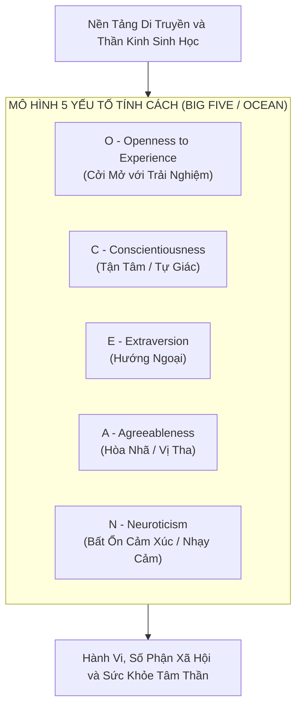
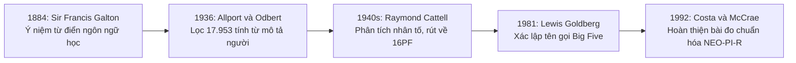
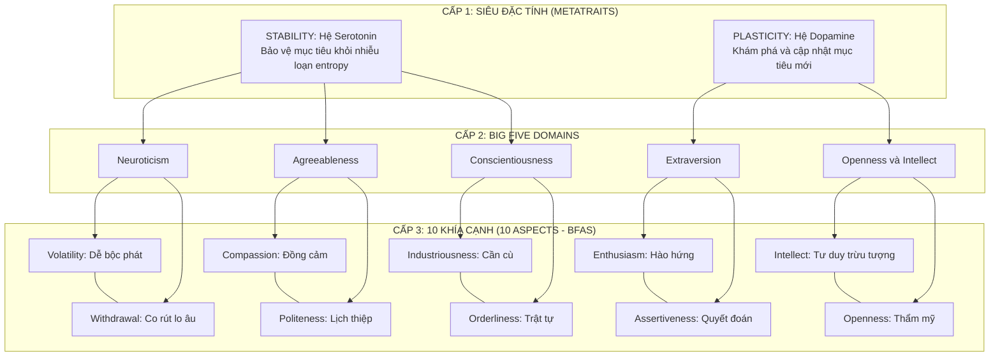
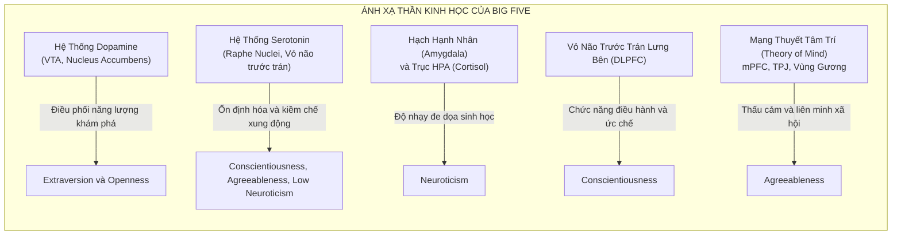
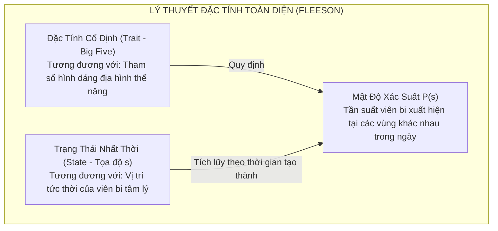

# Nghiên Cứu Chuyên Sâu: Mô Hình Tính Cách Big Five (Five-Factor Model)
### Từ Nền Tảng Thực Chứng, Sinh Học Thần Kinh, Lý Thuyết Điều Khiển Học (CB5T) Đến Mô Hình Hóa Động Lực Học Toán Học

---

## 1. Mở Đầu & Ý Nghĩa Khoa Học

Trong lịch sử tâm lý học nhân cách, câu hỏi trọng tâm luôn là: **"Liệu có tồn tại một tập hợp hữu hạn các chiều kích cơ bản để mô tả toàn bộ sự biến thiên trong hành vi, nhận thức và cảm xúc của con người?"**

Trước thập niên 1980, ngành tâm lý học rơi vào tình trạng phân mảnh với hàng trăm bài kiểm tra và lý thuyết xung đột (như 16 nhân tố của Cattell, 3 yếu tố PEN của Eysenck, hay mô hình loại hình thiếu kiểm chứng MBTI). Sự đồng thuận khoa học chỉ thực sự xuất hiện khi **Mô Hình 5 Yếu Tố Tính Cách (Five-Factor Model - FFM hay Big Five)** được chuẩn hóa và kiểm chứng trên quy mô toàn cầu.

Ngày nay, Big Five không chỉ là "chuẩn mực vàng" (Gold Standard) trong tâm lý học thực chứng, mà còn trở thành nền tảng cốt lõi trong **Khoa học thần kinh nhận thức (Cognitive Neuroscience)**, **Mô phỏng xã hội & AI (Agent Personality Alignment)**, và **Thiết kế Game Mô phỏng Nổi sinh** (như hệ thống 30 Facets của *Dwarf Fortress*).

---

## 2. Lịch Sử Hình Thành & Giả Thuyết Từ Vựng (Lexical Hypothesis)

Mô hình Big Five không phải là một phát kiến ngẫu nhiên từ phòng thí nghiệm, mà là kết quả của hơn một thế kỷ phân tích thống kê thực chứng dựa trên **Giả Thuyết Từ Vựng (Lexical Hypothesis)**.

### 2.1. Giả thuyết từ vựng của Galton & Allport
* **Tiền đề triết học (Sir Francis Galton, 1884):** Những khác biệt cá nhân quan trọng nhất đối với sự sinh tồn và tương tác xã hội của loài người sẽ tự động được mã hóa vào ngôn ngữ tự nhiên.
* **Công trình đồ sộ của Allport & Odbert (1936):** Rà soát toàn bộ từ điển tiếng Anh quốc tế Webster, trích xuất **17.953 từ vựng** mô tả hành vi và tính cách con người, sau đó phân loại thành 4 nhóm lớn (đặc tính ổn định, trạng thái tạm thời, đánh giá xã hội, và đặc điểm ngoại hình).

### 2.2. Phân tích nhân tố (Factor Analysis) & Cuộc cách mạng Big Five
* **Raymond Cattell (1940s):** Sử dụng ma trận tương quan và thuật toán phân tích nhân tố sơ khai để rút gọn tập từ vựng xuống còn 171 cụm, và cuối cùng phát triển nên bảng câu hỏi 16 nhân tố (*16 Personality Factors - 16PF*).
* **Tupes & Christal (1961) và Warren Norman (1963):** Khi tái phân tích dữ liệu của Cattell, các nhà nghiên cứu phát hiện ra rằng thực chất chỉ có **5 nhân tố mạnh mẽ và độc lập** lặp đi lặp lại một cách ổn định.
* **Lewis Goldberg (1981):** Đặt ra thuật ngữ chính thức **"Big Five"** nhằm nhấn mạnh rằng 5 nhân tố này bao trùm ở cấp độ vĩ mô cao nhất của nhân cách con người.
* **Paul Costa & Robert McCrae (1985, 1992):** Phát triển bộ công cụ đo lường tiêu chuẩn **NEO Personality Inventory (NEO-PI-R)**, mở rộng mỗi nhân tố thành 6 khía cạnh cụ thể (tổng cộng 30 Facets), chứng minh tính phổ quát xuyên văn hóa và tính di truyền sinh học.

---

## 3. Giải Phẫu Chi Tiết 5 Miền Tính Cách (The OCEAN Dimensions) & 30 Facets

Mỗi miền tính cách không phải là một nhãn dán nhị phân (bật/tắt), mà là một **trục phổ liên tục (Continuous Spectrum)** tuân theo phân phối chuẩn Gauss trong dân số.

```mermaid
graph TD
    subgraph O_BLOCK["1. OPENNESS (Cởi Mở)"]
        O1["Fantasy: Tưởng tượng"] --- O2["Aesthetics: Mỹ cảm"] --- O3["Feelings: Cảm xúc sâu"]
        O4["Actions: Thử nghiệm"] --- O5["Ideas: Ý niệm trí tuệ"] --- O6["Values: Giá trị mới"]
    end

    subgraph C_BLOCK["2. CONSCIENTIOUSNESS (Tận Tâm)"]
        C1["Competence: Năng lực"] --- C2["Order: Trật tự ngăn nắp"] --- C3["Dutifulness: Trách nhiệm"]
        C4["Achievement: Khát vọng"] --- C5["Self-Discipline: Tự giác"] --- C6["Deliberation: Thận trọng"]
    end

    subgraph E_BLOCK["3. EXTRAVERSION (Hướng Ngoại)"]
        E1["Warmth: Ấm áp"] --- E2["Gregariousness: Bầy đàn"] --- E3["Assertiveness: Quyết đoán"]
        E4["Activity: Năng động"] --- E5["Excitement: Cảm giác mạnh"] --- E6["Positive: Cảm xúc tích cực"]
    end

    subgraph A_BLOCK["4. AGREEABLENESS (Hòa Nhã)"]
        A1["Trust: Lòng tin"] --- A2["Straightforwardness: Bộc trực"] --- A3["Altruism: Vị tha"]
        A4["Compliance: Nhượng bộ"] --- A5["Modesty: Khiêm tốn"] --- A6["Tender: Dễ xúc động"]
    end

    subgraph N_BLOCK["5. NEUROTICISM (Bất Ổn Cảm Xúc)"]
        N1["Anxiety: Lo âu"] --- N2["Hostility: Giận dữ thù địch"] --- N3["Depression: Trầm uất"]
        N4["Self-Conscious: Tự ti"] --- N5["Impulsiveness: Bốc đồng"] --- N6["Vulnerability: Dễ tổn thương"]
    end
```

---

### 3.1. Openness to Experience (Cởi Mở với Trải Nghiệm)
* **Bản chất tâm lý:** Mức độ tò mò trí tuệ, khả năng tiếp nhận ý tưởng mới, cảm thụ nghệ thuật và sự sẵn sàng đặt câu hỏi trước các chuẩn mực truyền thống.
* **Hai đầu cực:**
  * *Điểm cao:* Sáng tạo, giàu trí tưởng tượng, tư duy trừu tượng, thích sự đổi mới, dễ bị xúc động bởi cái đẹp.
  * *Điểm thấp (Conventional/Closed):* Thực tế, ưa chuộng sự quen thuộc, tập trung vào chi tiết cụ thể, bảo thủ về mặt văn hóa, đề cao quy tắc truyền thống.
* **6 Facets (NEO-PI-R):**
  1. `O1: Fantasy` — Trí tưởng tượng sống động, khả năng xây dựng thế giới nội tâm phong phú.
  2. `O2: Aesthetics` — Nhạy cảm với nghệ thuật, âm nhạc, văn thơ và thiên nhiên.
  3. `O3: Feelings` — Tiếp cận sâu sắc với các cung bậc cảm xúc nội tâm của chính mình.
  4. `O4: Actions` — Thích phiêu lưu, thử món ăn mới, đi đến những vùng đất mới.
  5. `O5: Ideas` — Hứng thú với các câu hỏi triết học, giải đố logic và tranh luận trí tuệ.
  6. `O6: Values` — Sẵn sàng xem xét lại các giá trị xã hội, chính trị, tôn giáo đã định hình.

---

### 3.2. Conscientiousness (Tận Tâm / Tự Giác)
* **Bản chất tâm lý:** Năng lực kiểm soát xung động, định hướng mục tiêu dài hạn, trì hoãn sự thỏa mãn tức thì (Delay of Gratification) và duy trì tính ngăn nắp.
* **Hai đầu cực:**
  * *Điểm cao:* Kỷ luật, đúng giờ, chu đáo, kiên trì theo đuổi mục tiêu, có tổ chức cao, đáng tin cậy trong công việc.
  * *Điểm thấp (Spontaneous/Unorganized):* Tùy hứng, dễ mất tập trung, cẩu thả, trì hoãn công việc, ưu tiên niềm vui tức thời.
* **6 Facets (NEO-PI-R):**
  1. `C1: Competence` — Niềm tin vào năng lực tự thân và sự thành thạo trong việc xử lý tình huống.
  2. `C2: Order` — Nhu cầu về trật tự, tính ngăn nắp và phương pháp làm việc có cấu trúc.
  3. `C3: Dutifulness` — Tinh thần trách nhiệm, tuân thủ nghiêm ngặt các cam kết đạo đức.
  4. `C4: Achievement Striving` — Khát vọng vươn lên đỉnh cao, đặt ra những tiêu chuẩn khắt khe cho bản thân.
  5. `C5: Self-Discipline` — Khả năng bắt tay vào làm việc ngay cả khi cảm thấy chán nản hoặc mệt mỏi.
  6. `C6: Deliberation` — Xu hướng suy tính kỹ càng trước khi đưa ra quyết định hành động.

---

### 3.3. Extraversion (Hướng Ngoại)
* **Bản chất tâm lý:** Mức độ nhạy cảm của hệ thần kinh trước các phần thưởng xã hội và kích thích môi trường bên ngoài; mức độ năng lượng vận động.
* **Hai đầu cực:**
  * *Điểm cao:* Tràn đầy năng lượng, thích giao lưu, nói nhiều, tìm kiếm sự phấn khích, bộc lộ cảm xúc tích cực mãnh liệt.
  * *Điểm thấp (Introversion/Hướng nội):* Trầm lặng, kín đáo, thích ở một mình hoặc trong nhóm nhỏ, ít phụ thuộc vào sự tán thưởng từ đám đông (lưu ý: hướng nội khác với nhút nhát hay sợ xã hội).
* **6 Facets (NEO-PI-R):**
  1. `E1: Warmth` — Sự ấm áp, nồng hậu và dễ gần trong tiếp xúc ban đầu.
  2. `E2: Gregariousness` — Thích tụ tập đám đông, cảm thấy cô đơn nếu phải ở một mình lâu.
  3. `E3: Assertiveness` — Tính quyết đoán, thích nắm quyền chỉ huy, lên tiếng bảo vệ quan điểm.
  4. `E4: Activity` — Nhịp độ sống nhanh, luôn chân luôn tay, nhiều năng lượng thể lý.
  5. `E5: Excitement Seeking` — Tìm kiếm cảm giác mạnh, thích rủi ro và các kích thích thị giác/âm thanh lớn.
  6. `E6: Positive Emotions` — Tần suất trải nghiệm niềm vui, tiếng cười, sự hào hứng và phấn khích.

---

### 3.4. Agreeableness (Hòa Nhã / Vị Tha)
* **Bản chất tâm lý:** Xu hướng định vị bản thân trong mối quan hệ với đồng loại; mức độ hợp tác so với cạnh tranh; lòng thấu cảm xã hội.
* **Hai đầu cực:**
  * *Điểm cao:* Đồng cảm, vị tha, tin cậy người khác, sẵn sàng nhường nhịn, ghét xung đột, xem trọng sự hài hòa cộng đồng.
  * *Điểm thấp (Disagreeable/Competitive):* Hoài nghi, cạnh tranh khốc liệt, thích đối đầu, thực dụng, lạnh lùng, ít bị cảm xúc của người khác chi phối.
* **6 Facets (NEO-PI-R):**
  1. `A1: Trust` — Mặc định tin rằng người khác có ý tốt và trung thực.
  2. `A2: Straightforwardness` — Sự thẳng thắn, bộc trực, không dùng mánh khóe thao túng tâm lý.
  3. `A3: Altruism` — Lòng nhân ái, tích cực giúp đỡ người khó khăn mà không toan tính vụ lợi.
  4. `A4: Compliance` — Xu hướng hòa giải, kiềm chế cơn giận, nhượng bộ để giữ hòa khí.
  5. `A5: Modesty` — Sự khiêm nhường, không thích khoe khoang hay tự cao tự đại.
  6. `A6: Tender-Mindedness` — Sự mủi lòng, dễ xúc động trước nỗi đau khổ của người khác.

---

### 3.5. Neuroticism (Bất Ổn Cảm Xúc / Tính Nhạy Cảm)
* **Bản chất tâm lý:** Ngưỡng kích hoạt của hệ thống phát hiện mối đe dọa sinh học; mức độ nhạy cảm trước cảm xúc tiêu cực (lo âu, buồn bã, sợ hãi, giận dữ).
* **Hai đầu cực:**
  * *Điểm cao:* Dễ căng thẳng, phản ứng thái quá với các kích thích nhỏ, hay lo âu, cảm giác bất an thường trực, dễ rơi vào trầm cảm.
  * *Điểm thấp (Emotional Stability/Ổn định cảm xúc):* Bình tĩnh, vững vàng trước áp lực, ít khi hoảng loạn, khả năng phục hồi tâm lý sau biến cố rất nhanh.
* **6 Facets (NEO-PI-R):**
  1. `N1: Anxiety` — Xu hướng dự cảm về hiểm nguy, căng thẳng thần kinh thường trực.
  2. `N2: Angry Hostility` — Dễ bực bội, cáu gắt và căm phẫn khi mọi chuyện không như ý.
  3. `N3: Depression` — Cảm giác tuyệt vọng, cô đơn, tự trách bản thân và u sầu.
  4. `N4: Self-Consciousness` — Cảm giác ngượng ngùng, xấu hổ, sợ bị người khác phán xét hoặc chê cười.
  5. `N5: Impulsiveness` — Bất lực trong việc kiềm chế cơn thèm muốn hoặc cám dỗ nhất thời dưới áp lực.
  6. `N6: Vulnerability` — Dễ sụp đổ tâm lý, hoảng loạn và mất phương hướng khi đối mặt với khủng hoảng.

---

## 4. Lý Thuyết Điều Khiển Học Big Five (Cybernetic Big Five Theory - CB5T)

Bước đột phá lớn nhất đưa Big Five từ một **bản mô tả thống kê tĩnh** thành một **mô hình cơ chế động lực học** chính là công trình của nhà tâm lý học **Colin DeYoung (2014, 2015)**: *Cybernetic Big Five Theory (CB5T)*.

### 4.1. Điều Khiển Học (Cybernetics) Là Gì Trong Ngữ Cảnh Nhân Cách?
Điều khiển học là khoa học nghiên cứu về **các hệ thống tự điều chỉnh, hướng mục tiêu (Goal-Directed Systems)** thông qua các vòng lặp phản hồi thông tin (*Feedback Loops*).
* Con người là một hệ thống điều khiển học sinh học: liên tục duy trì cân bằng nội môi, dự đoán tương lai và theo đuổi các trạng thái mục tiêu trong môi trường đầy bất định và entropy.
* **Tính cách không phải là hành vi, mà là các thông số điều chỉnh (Tuning Parameters) của bộ máy điều khiển học này.**

### 4.2. Hai Siêu Đặc Tính (Metatraits): Stability vs. Plasticity (Digman 1997 / DeYoung)
Phân tích nhân tố bậc cao phát hiện ra 5 miền tính cách tự động hội tụ vào 2 siêu nhân tố cốt lõi:

#### 1. Stability (Siêu nhân tố Ổn Định - Hệ Serotonin):
* Gồm có: **Conscientiousness, Agreeableness, và Emotional Stability (Low Neuroticism)**.
* **Chức năng điều khiển học:** Bảo vệ các mục tiêu hiện tại, các kế hoạch và mối quan hệ khỏi sự gián đoạn của xung động nội tại và nhiễu loạn bên ngoài.
  * *Emotional Stability* bảo vệ hệ thống khỏi sự xâm nhập của nỗi sợ và hoảng loạn vô căn cứ.
  * *Conscientiousness* bảo vệ mục tiêu dài hạn khỏi sự chệch hướng của ham muốn ngắn hạn.
  * *Agreeableness* bảo vệ cấu trúc liên minh xã hội khỏi sự phá vỡ của xung đột cá nhân.

#### 2. Plasticity (Siêu nhân tố Mềm Dẻo - Hệ Dopamine):
* Gồm có: **Extraversion và Openness/Intellect**.
* **Chức năng điều khiển học:** Thúc đẩy hệ thống chủ động khám phá môi trường, giải mã các thông tin mới, đón nhận rủi ro và tái cấu trúc mục tiêu khi hoàn cảnh thay đổi.
  * *Extraversion* dẫn dắt hành vi khám phá các phần thưởng thể lý và vị thế xã hội.
  * *Openness/Intellect* dẫn dắt hành vi khám phá các ý niệm trừu tượng, mô hình tri thức và trải nghiệm giác quan mới.

### 4.3. Cấp Độ Trung Gian: 10 Khía Cạnh Tính Cách (The 10 Aspects)
Nghiên cứu của DeYoung, Quilty & Peterson (2007) chỉ ra rằng mỗi miền trong Big Five có thể chia chính xác thành 2 khía cạnh độc lập mang cơ chế sinh học phân hóa rõ rệt:

| Miền Big Five | Khía Cạnh 1 (Aspect 1) | Khía Cạnh 2 (Aspect 2) | Khác Biệt Cơ Học Thần Kinh |
| :--- | :--- | :--- | :--- |
| **Neuroticism** | **Volatility (Dễ bộc phát):** Dễ nổi giận, dễ cáu kỉnh, phòng vệ cấp tính. | **Withdrawal (Co rút/Rút lui):** Dễ hoảng sợ, lo âu, thu mình, nhạy cảm đau đớn. | Volatility liên quan đến phản xạ *Fight*; Withdrawal liên quan đến phản xạ *Flight/Freeze*. |
| **Agreeableness** | **Compassion (Đồng cảm):** Thấu hiểu nỗi đau, cảm nhận cảm xúc người khác. | **Politeness (Lịch thiệp):** Tuân thủ quy chuẩn lễ nghi, tránh thô lỗ, tôn trọng thẩm quyền. | Compassion là phản ứng cảm xúc viền (Limbic); Politeness là kiểm soát ức chế quy tắc xã hội. |
| **Conscientiousness** | **Industriousness (Cần cù):** Kiên trì làm việc, ghét lười biếng, hoàn thành nhiệm vụ. | **Orderliness (Ngăn nắp):** Ám ảnh với trật tự, sạch sẽ, ghét sự bừa bộn và hỗn loạn. | Orderliness liên quan chặt chẽ đến phản ứng ghê tởm sinh học (*Disgust Sensitivity*). |
| **Extraversion** | **Enthusiasm (Hào hứng):** Vui vẻ, thân thiện, kết nối cảm xúc tích cực. | **Assertiveness (Quyết đoán):** Thích dẫn đầu, cạnh tranh vị thế, tranh luận sắc bén. | Enthusiasm là phản thưởng liên kết; Assertiveness là động cơ tranh đoạt quyền lực xã hội. |
| **Openness/Intellect** | **Intellect (Trí tuệ trừu tượng):** Năng lực tư duy logic, giải quyết bài toán phức tạp. | **Openness (Cảm thụ thẩm mỹ):** Thưởng thức nghệ thuật, tưởng tượng phong phú, trực giác. | Intellect gắn với bán cầu trái và DLPFC; Openness gắn với mạng liên tưởng ngẫu nhiên (DMN). |

---

## 5. Nền Tảng Thần Kinh Sinh Học Của Big Five

Nhờ sự phát triển của công nghệ fMRI, PET scan và di truyền học phân tử, Big Five đã được ánh xạ vào các mạch giải phẫu thần kinh và chất dẫn truyền thần kinh cụ thể:

### 1. Extraversion & Hệ Thống Phần Thưởng Dopaminergic:
* Extraversion tương quan trực tiếp với mật độ thụ thể Dopamine D2/D4 tại **Vùng Dưới Đồi (Ventral Tegmental Area - VTA)** và **Hạch Thần Kinh Thể Vân (Nucleus Accumbens)**.
* Khi đối mặt với tín hiệu có khả năng mang lại phần thưởng (thức ăn ngon, người đẹp, vị thế xã hội), não người hướng ngoại bùng nổ tín hiệu dopamine mạnh hơn đáng kể so với người hướng nội.

### 2. Neuroticism & Mạng Lưới Phát Hiện Đe Dọa:
* Trọng tâm nằm ở **Hạch Hạnh Nhân (Amygdala)**, **Vỏ Não Thùy Đảo (Insular Cortex)** và **Hệ Thần Kinh Trục HPA (Hypothalamic-Pituitary-Adrenal Axis)** tiết ra Cortisol.
* Người có điểm Neuroticism cao sở hữu hạch hạnh nhân có ngưỡng kích hoạt cực thấp và khả năng phục hồi chậm sau khi bị báo động. Vỏ não trước trán (PFC) của họ gặp khó khăn trong việc ức chế tín hiệu báo động sai từ não bò sát.

### 3. Conscientiousness & Vỏ Não Trước Trán (Prefrontal Cortex - PFC):
* Liên quan trực tiếp đến thể tích và mật độ chất xám tại **Vỏ não trước trán lưng bên giữa (Middle Frontal Gyrus / DLPFC)**—vùng não chịu trách nhiệm về trí nhớ công việc (*Working Memory*), chức năng điều hành (*Executive Function*) và ức chế hành vi tức thời để hướng tới mục tiêu dài hạn.

### 4. Agreeableness & Mạng Lưới Thuyết Tâm Trí (Theory of Mind Network):
* Người có Agreeableness cao có sự liên kết chặt chẽ tại **Vỏ não trước trán trung gian (mPFC)**, **Khớp nối thái dương - đỉnh (TPJ)** và mạng lưới nơ-ron gương (*Mirror Neuron System*). Họ tiết nhiều hormone liên kết xã hội như **Oxytocin** và **Vasopressin** khi tương tác với đồng loại.

### 5. Openness/Intellect & Mạng Lưới Mặc Định (Default Mode Network - DMN):
* Gắn liền với sự phối hợp nhịp nhàng giữa **Mạng lưới điều hành trung tâm (Central Executive Network)** và **Mạng lưới mặc định (Default Mode Network)**. Sự kết nối xuyên vùng này cho phép não bộ tạo ra các liên tưởng xa giữa các khái niệm tưởng chừng không liên quan—nguồn gốc của tư duy sáng tạo và ẩn dụ nghệ thuật.

---

## 6. Mô Hình Hóa Toán Học & Động Lực Học Phi Tuyến (Dynamical Systems)

Trong tâm lý học hiện đại và khoa học nhận thức tính toán, câu hỏi đặt ra là: **Làm thế nào để toán học hóa Big Five thành các phương trình động lực học thời gian thực?**

### 6.1. Whole Trait Theory (William Fleeson, 2001)
Fleeson chỉ ra nghịch lý: Một người có điểm Hướng Ngoại $E = 80\%$ không có nghĩa là lúc nào họ cũng hành động hướng ngoại. Trong một ngày, có lúc họ hành động cực kỳ hướng ngoại (tại bữa tiệc), có lúc lại hướng nội (đọc sách trong phòng).
* **Định nghĩa toán học:** Big Five không phải là một điểm đơn lẻ, mà là một **Hàm Mật Độ Xác Suất (Probability Density Function - PDF)** của các trạng thái tức thời:
  $$P(\vec{s}) \sim \mathcal{N}\left(\vec{\mu}_{\text{trait}}, \mathbf{\Sigma}_{\text{trait}}\right)$$
  Trong đó $\vec{\mu}_{\text{trait}}$ là giá trị kỳ vọng (điểm Big Five trung bình), còn $\mathbf{\Sigma}_{\text{trait}}$ là biên độ biến thiên phản ứng trước bối cảnh môi trường.

### 6.2. Big Five Dưới Dạng Các Siêu Tham Số Định Hình Địa Hình Thế Năng $V(\vec{S})$
Kết hợp lý thuyết hệ thống động lực học phi tuyến với phương trình vi phân ngẫu nhiên Langevin SDE:
$$\frac{d\vec{S}(t)}{dt} = -\nabla_{\vec{S}} V\big(\vec{S}; \mathbf{\Theta}_{\text{Big5}}\big) + \mathbf{W}\vec{S}(t) + \mathbf{I}(t) + \mathbf{\eta}(t)$$

Trong mô hình này:
* $\vec{S}(t) = (A, V, C, S)$ là tọa độ trạng thái tức thời (Arousal, Safety Valence, Clarity, Attachment).
* $\mathbf{\Theta}_{\text{Big5}} = (O, C, E, A, N)$ đóng vai trò là **vector siêu tham số (Hyperparameters)** định hình toàn bộ bề mặt thế năng $V(\vec{S})$:

| Tham Số Big Five | Tác Động Hình Học Lên Địa Hình Thế Năng $V(\vec{S})$ | Ý Nghĩa Động Lực Học |
| :--- | :--- | :--- |
| **Neuroticism ($N$)** | Làm sâu thêm các hố trũng tại vùng $A > 0, V < 0$ (vùng hoảng loạn); làm phẳng rào cản thế năng $\Delta E_{\text{fall}}$. | Chỉ cần một kích thích nhỏ $\mathbf{I}(t)$, viên bi trạng thái dễ dàng trượt thẳng vào hố hoảng loạn/trầm cảm. |
| **Extraversion ($E$)** | Dịch chuyển điểm cân bằng tự nhiên $\vec{S}^*$ về phía Arousal tích cực ($A > 0, V > 0$). | Nhân vật luôn có xu hướng tự nhiên quay về trạng thái năng động và hứng khởi. |
| **Conscientiousness ($C$)** | Tăng độ dốc lòng chảo tại trục $C$ (Clarity/Agency), tăng lực cản ma sát chống nhiễu $\mathbf{\eta}(t)$. | Giúp nhân vật giữ vững quyền tự chủ nhận thức, không bị ngoại cảnh làm dao động trạng thái. |
| **Agreeableness ($A$)** | Mở rộng bán kính ghép nối đồng điều hòa $\mathbf{K}_{ij}$, dịch chuyển trục $S$ về phía gắn kết dương ($S > 0$). | Tăng cường độ hút pha xã hội, dễ dàng đồng điều hòa và xoa dịu các cá thể xung quanh. |
| **Openness ($O$)** | Tăng độ gồ ghề của địa hình thế năng, tạo ra nhiều điểm hút kỳ dị (Strange Attractor Basins) phong phú. | Cho phép tâm trí dao động tự do giữa các trạng thái nhận thức sáng tạo mới lạ mà không bị đóng băng. |

---

## 7. Ứng Dụng Trong AI, LLM Persona & Game Simulation

### 7.1. Hệ thống 30 Facets Trong Dwarf Fortress (Tarn Adams)
Như đã khảo sát tại [`Phan-Tich-Chuyen-Sau-Tam-Ly-Dwarf-Fortress-Va-Disco-Elysium.md`](file:///g:/Projects/Researchs/Phan-Tich-Chuyen-Sau-Tam-Ly-Dwarf-Fortress-Va-Disco-Elysium.md), Tarn Adams đã sử dụng trực tiếp **30 Facets của Costa & McCrae** làm xương sống cho toàn bộ hệ thống AI hành vi của Dwarf Fortress:
* Mỗi Dwarf được gán một vector 30 chiều với giá trị từ `0` đến `100`.
* Khi một sự kiện xảy ra, trò chơi dùng phép chiếu vector giữa sự kiện và các Facets tương ứng để tính toán mức độ tăng/giảm stress và khả năng bùng phát khủng hoảng tâm thần.

### 7.2. Định Hình Nhân Cách Trong Mô Hình Ngôn Ngữ Lớn (LLM Persona Steering)
Trong kỹ nghệ AI hiện đại:
* **System Prompt Conditioning:** Việc yêu cầu LLM đóng vai một nhân vật thường không hiệu quả nếu chỉ dùng các tính từ mơ hồ. Thay vào đó, việc cấu hình theo vector Big Five (ví dụ: `High Conscientiousness, Low Neuroticism, Moderate Extraversion`) giúp mô hình duy trì tính nhất quán về giọng văn, mức độ phản ứng cảm xúc và phong cách lý luận.
* **Activation Steering (Can Thiệp Không Gian Tiềm Ẩn):** Các nhà nghiên cứu phát hiện các vector hướng trong không gian tiềm ẩn của Transformer tương ứng trực tiếp với các trục tính cách Big Five. Bằng cách cộng thêm một vector chỉ hướng $\alpha \cdot \vec{v}_{\text{Agreeableness}}$ vào các tầng ẩn, ta có thể điều khiển trực tiếp tính cách của AI thời gian thực mà không cần fine-tune lại trọng số.

### 7.3. Tích Hợp Vào Động Cơ 4 Trục Nổi Sinh (Project Anima)
Trong kiến trúc game của chúng ta ([`Thiet-Ke-Game-Mo-Phong-Tam-Ly-Emergence.md`](file:///g:/Projects/Researchs/Thiet-Ke-Game-Mo-Phong-Tam-Ly-Emergence.md)):
* Vector Big Five của nhân vật $\mathbf{\Theta}_{\text{Big5}}$ được dùng làm **Ma Trận Lọc Thẩm Định Chủ Quan (Subjective Appraisal Matrix $\mathbf{M}$)**:
  $$\mathbf{I}_{\text{felt}} = \mathbf{M}(\mathbf{\Theta}_{\text{Big5}}) \cdot \mathbf{I}_{\text{raw}}$$
  Khi một lời xúc phạm xuất hiện ($\mathbf{I}_{\text{raw}}$), nếu nhân vật có $N$ cao và $A$ thấp, ma trận $\mathbf{M}$ sẽ khuếch đại delta kích động lên gấp 5 lần, đẩy trạng thái nhân vật vào cơn thịnh nộ. Ngược lại, nếu nhân vật có $A$ cao và $N$ thấp, xung lực này sẽ bị triệt tiêu gần như hoàn toàn.

---

## 8. Kết Luận & Tổng Hợp Tri Thức

Mô hình Big Five không đơn thuần là một bảng câu hỏi trắc nghiệm, mà là **một cấu trúc hình học tối giản phản ánh bản chất điều khiển học của sinh vật bậc cao**:
1. **Tính phổ quát thực chứng:** Đã vượt qua hàng nghìn thử nghiệm xuyên văn hóa, ngôn ngữ và chủng tộc suốt 40 năm qua.
2. **Nền tảng tiến hóa:** Đại diện cho 5 bài toán sinh tồn cốt lõi: Khám phá tài nguyên (E), Thích ứng với ý niệm mới (O), Tổ chức công việc dài hạn (C), Hợp tác bầy đàn (A), và Phòng thủ trước mối đe dọa sinh tử (N).
3. **Cầu nối toán học hoàn hảo:** Cung cấp bộ siêu tham số định lượng lý tưởng để xây dựng các thế giới mô phỏng xã hội nổi sinh, các NPC có chiều sâu tâm lý và các hệ thống AI tự chủ có nhân cách thực sự.

---

> [!NOTE]
> **Tài liệu nghiên cứu liên quan:**
> * Kiến trúc game tâm lý nổi sinh: [`Thiet-Ke-Game-Mo-Phong-Tam-Ly-Emergence.md`](file:///g:/Projects/Researchs/Thiet-Ke-Game-Mo-Phong-Tam-Ly-Emergence.md)
> * Phân tích chuyên sâu Dwarf Fortress & Disco Elysium: [`Phan-Tich-Chuyen-Sau-Tam-Ly-Dwarf-Fortress-Va-Disco-Elysium.md`](file:///g:/Projects/Researchs/Phan-Tich-Chuyen-Sau-Tam-Ly-Dwarf-Fortress-Va-Disco-Elysium.md)
> * Nền tảng phương trình toán học Langevin SDE: [`memory/theoretical-foundations.md`](file:///g:/Projects/Researchs/memory/theoretical-foundations.md)
