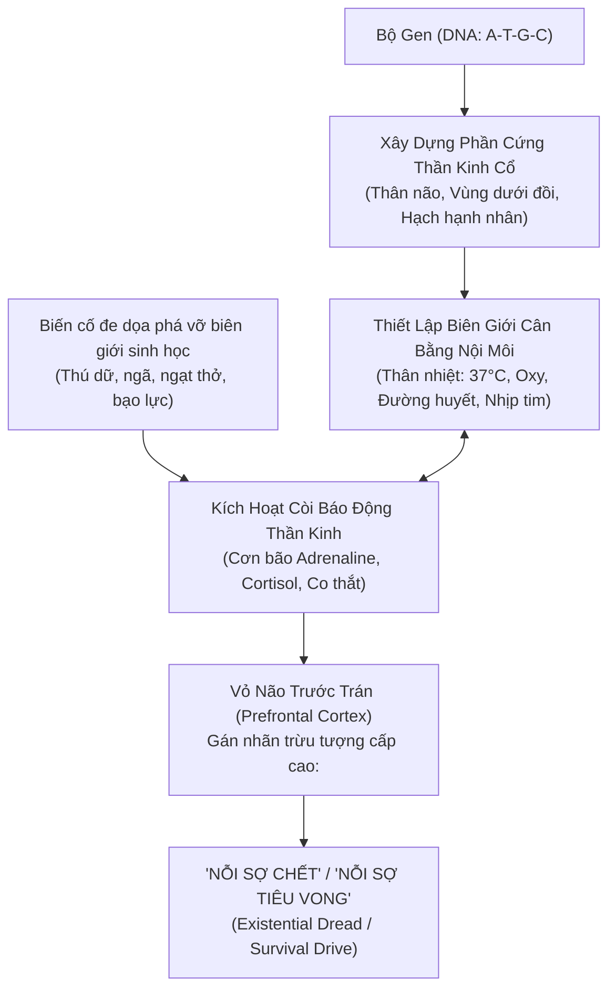
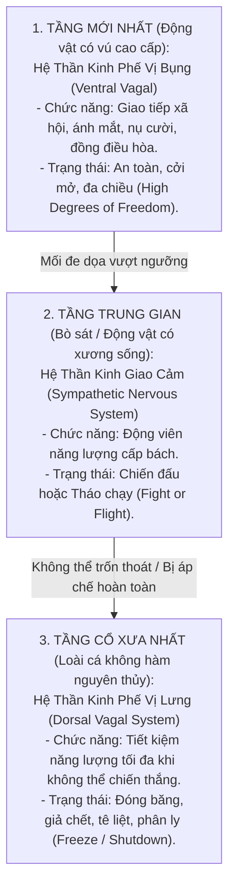

# Chuyên Đề: Sinh Học Tiến Hóa, Cân Bằng Nội Môi Và Nguồn Gốc Của "Nỗi Sợ Chết"
## Cơ Chế Gốc Rễ Khởi Phát Sang Chấn & Sự Sụp Đổ Số Chiều

---

## 1. Bản Chất Nhiệt Động Lực Học Của Sự Sống: Kháng Cự Lại Entropy

Trong cuốn sách kinh điển *"What is Life?" (1944)*, nhà vật lý học lượng tử Erwin Schrödinger đã chỉ ra định nghĩa cốt lõi của sự sống:
> **"Sinh vật sống duy trì sự tồn tại của mình bằng cách liên tục hút 'Entropy âm' (Negative Entropy) từ môi trường."**

Theo Định luật 2 Nhiệt động lực học, mọi hệ cô lập trong vũ trụ đều có xu hướng tự nhiên trôi về trạng thái hỗn loạn cực đại (Entropy cực đại). 
* **Cái chết (Death):** Về mặt vật lý, cái chết không phải là một sự kiện huyền bí; đó là thời điểm **Biên giới của hệ thống sụp đổ**, vật chất bên trong hòa tan vào môi trường, entropy đạt mức tối đa.
* **Sự sống (Life):** Là cuộc chiến không ngừng nghỉ nhằm **duy trì một ốc đảo trật tự cục bộ (Low Entropy)** chống lại sự phân rã của vũ trụ.

---

## 2. Gen Mã Hóa Nỗi Sợ Chết Như Thế Nào?

Một câu hỏi mang tính bản thể luận sâu sắc: *Liệu gen có một đoạn mã riêng mang tên "Sợ Chết" không?*

Câu trả lời từ sinh học tiến hóa là: **Không.** Gen không mã hóa các ý niệm trừu tượng. Gen mã hóa **Cấu Trúc Phần Cứng (Hardware)** và **Các Vòng Lặp Duy Trì Cân Bằng Nội Môi (Homeostatic Feedback Loops)**:

* Trong suốt hàng trăm triệu năm tiến hóa, những cá thể mang biến dị gen làm suy yếu vòng lặp cân bằng nội môi (không phản ứng khi cơ thể bị tổn thương) đều đã chết trước khi kịp sinh sản.
* Những gì còn lại hôm nay là một cỗ máy sinh học được tinh chỉnh đến mức cực đoan: **Bất kỳ tín hiệu nào đe dọa làm rách toạc ranh giới bảo toàn năng lượng đều bị hệ thống trừng phạt bằng cảm giác đau đớn và sợ hãi tột cùng.**

---

## 3. Ranh Giới Markov (Markov Blanket) & Nguyên Lý Năng Lượng Tự Do

Theo nhà khoa học thần kinh Karl Friston, bất kỳ thực thể sống nào muốn phân biệt bản thân với phần còn lại của vũ trụ đều phải sở hữu một **Ranh giới Markov (Markov Blanket)**:

$$\vec{S}_{\text{toàn thể}} = \{\text{Trạng thái bên trong}, \text{Trạng thái ranh giới (Cảm giác & Hành động)}, \text{Trạng thái môi trường bên ngoài}\}$$

* **Bản chất của Sang Chấn (Trauma):** Là sự xâm nhập thô bạo từ môi trường bên ngoài xé toạc ranh giới Markov của chủ thể.
* Để ngăn chặn sự phá vỡ hoàn toàn này, hệ thống buộc phải hy sinh các chức năng cao cấp (suy nghĩ, sáng tạo, thấu cảm) để dồn toàn bộ năng lượng vào ranh giới phòng vệ $\to$ **Dẫn tới Hiện tượng Sụp Đổ Số Chiều (Dimensionality Collapse)**.

---

## 4. Thuyết Đa Thần Kinh Phế Vị (Polyvagal Theory): 3 Tầng Phòng Vệ Tiến Hóa

Tiến sĩ Stephen Porges đã chứng minh rằng hệ thần kinh tự chủ của con người phản ứng với các mối đe dọa sinh tử thông qua 3 tầng tiến hóa kế tiếp nhau theo trật tự thời gian địa chất:

* Khi bị trigger sang chấn, hệ thống thần kinh lập tức **tụt lùi tiến hóa (Evolutionary Regression)**: Rơi từ tầng 1 (Ventral Vagal) thẳng xuống tầng 2 (Chiến/Biến) hoặc tầng 3 (Đóng băng/Tê liệt).

---

## 5. Từ Nỗi Sợ Thể Xác Đến Nỗi Sợ Bản Thể Xã Hội (Social & Cognitive Death)

Ở con người và các loài linh trưởng cấp cao, sự sống sót của một đứa trẻ **phụ thuộc 100% vào sự gắn kết với cha mẹ**:
* Đứa trẻ nhận thức vô thức rằng: **Bị bầy đàn ruồng bỏ đồng nghĩa với cái chết thể xác**.
* Do đó, não bộ tiến hóa một cơ chế đồng hóa: **Tổn thương gắn bó xã hội (Social Rejection) kích hoạt vùng não xử lý đau đớn thể xác (Dorsal Anterior Cingulate Cortex) y hệt như bị gãy xương hay bỏng lửa.**

Đây chính là lời giải cho nghịch lý ở Mục 6 của tài liệu gốc:
> **Tại sao đứa trẻ thà bẻ cong nhận thức bản thân thành "Mình là đứa tồi tệ" (Toxic Shame) chứ không dám chấp nhận "Cha mẹ mình độc hại"?**
> Bởi vì nếu thừa nhận cha mẹ độc hại $\to$ Đứa trẻ mất đi điểm tựa sinh tồn duy nhất $\to$ Hệ thần kinh coi đó là án tử. Việc tự ôm lấy tội lỗi là giải pháp tối ưu hóa năng lượng tự do thấp nhất để duy trì mạng sống.
