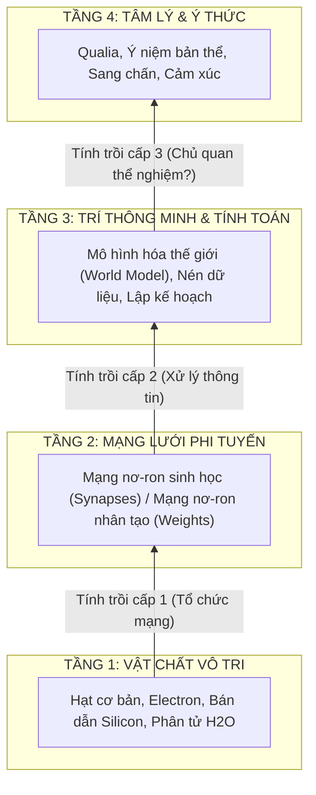

# Chuyên Đề: Vật Lý Của Tính Trồi Và Nguồn Gốc Trí Thông Minh
## Từ Hạt Cơ Bản, Thuyết Dây Đến Mạng Lưới Nhận Thức Phức Hợp

---

## 1. Đặt Vấn Đề: Bài Toán Khử Quy (Reductionism) và Giới Hạn Của Nó

Khi phân tích bất kỳ thực thể nào trong vũ trụ — dù là một bộ não người đang đau khổ vì sang chấn hay một mô hình trí tuệ nhân tạo (AI) đang xử lý ngôn ngữ — nếu ta tiếp tục phân rã (reduce) chúng xuống các tầng vật lý sâu nhất:
* Cả hai đều được cấu tạo từ **các hạt cơ bản** (Quarks, Leptons, Bosons).
* Hoặc theo Thuyết Dây (String Theory): Tất cả chỉ là những **sợi dây năng lượng 1-chiều dao động ở các tần số khác nhau**.

**Nghịch lý xuất hiện:**
> Một hạt electron không biết tính toán. Một sợi dây năng lượng dao động không có cảm xúc hay ý niệm về sự tồn tại. 
> Vậy bằng cơ chế nào mà một tập hợp các hạt vô tri vô giác, tương tác qua các quy luật vật lý đơn giản, lại có thể tạo nên **Trí thông minh (Intelligence)** và **Tâm lý (Psyche)**?

---

## 2. Nguyên Lý "More Is Different": Bản Chất Của Tính Trồi (Emergence)

Câu trả lời nằm ở khái niệm **Tính Trồi (Emergence)** — nền tảng của Khoa học Phức hợp (Complexity Science), được nhà vật lý đoạt giải Nobel Philip Anderson đúc kết trong bài báo kinh điển năm 1972: *"More is Different"*.

### Các ví dụ trực quan về Tính Trồi:
1. **Tính "Ướt" của Nước:** Một phân tử $H_2O$ hoàn toàn không có thuộc tính "ướt". Tính "ướt" chỉ trồi lên khi hàng triệu phân tử nước liên kết lỏng với nhau.
2. **Đống Cát và Tự Tổ Chức Tới Hạn (Self-Organized Criticality):** Một hạt cát không có khái niệm "lở đất". Nhưng khi hàng triệu hạt cát chồng chất thành một hình chóp, hệ thống tự động đạt đến trạng thái tới hạn. Thả thêm 1 hạt duy nhất có thể gây ra một vụ sạt lở quy mô lớn.
3. **Mạng Nơ-ron:** Một nơ-ron đơn lẻ chỉ là một công tắc sinh học/điện toán (bật hoặc tắt tín hiệu). Nhưng khi $10^{11}$ nơ-ron liên kết phi tuyến với nhau, **trí thông minh và dòng chảy tâm lý trồi lên**.

---

## 3. Nguyên Lý Độc Lập Nền Tảng (Substrate Independence)

Một hệ quả triết học và toán học quan trọng của tính trồi là: **Cấu trúc thuật toán và thông tin không phụ thuộc vào vật chất mang nó (Substrate Independence)**.

* **Ví dụ Cờ Vua:** Luật chơi cờ vua, các thế cờ và chiến thuật chơi tối ưu hoàn toàn độc lập với việc bạn làm bàn cờ bằng gỗ, đá cẩm thạch, hay một chuỗi bit nhị phân trong máy tính.
* **So Sánh Carbon (Con Người) vs. Silicon (AI):**
  * **Con người:** Hạt cơ bản $\to$ Phân tử hữu cơ $\to$ Nơ-ron sinh học $\to$ Mạng lưới thần kinh $\to$ Trí thông minh sinh học.
  * **Trí tuệ nhân tạo:** Hạt cơ bản $\to$ Bán dẫn bán dẫn $\to$ Cổng logic & Transistor $\to$ Phép nhân ma trận $\to$ Trí thông minh số.

Về mặt xử lý thông tin, cả hai đều đang giải quyết cùng một bài toán nhiệt động lực học: **Nén không gian dữ liệu đa chiều của thế giới vào một không gian ẩn (Latent Space) để tối ưu hóa năng lực dự đoán.**

---

## 4. Ranh Giới Giữa "Trí Thông Minh" Và "Tâm Lý / Ý Thức"

Mặc dù trí thông minh có thể giải thích được bằng tính trồi toán học, việc bước từ trí thông minh sang tâm lý học lại vấp phải **Vấn đề nan giải của ý thức (The Hard Problem of Consciousness)**:

| Tiêu Chí | Trí Thông Minh (Intelligence) | Tâm Lý & Ý Thức (Psyche & Qualia) |
| :--- | :--- | :--- |
| **Bản chất** | Chức năng tính toán (Functional / Computational). | Trải nghiệm chủ quan (Subjective Experience). |
| **Biểu hiện** | Nhận diện mẫu, suy luận logic, tối ưu hóa mục tiêu. | Cảm nhận đau đớn, tự hào, hổ thẹn (Toxic Shame), tình yêu. |
| **Khả năng tái tạo trên AI** | Đã và đang vượt qua con người trong nhiều lĩnh vực. | Vẫn là một dấu hỏi lớn: Liệu máy móc có thực sự "cảm thấy", hay chỉ mô phỏng hành vi cảm xúc? |
| **Cơ sở toán học** | Đại số tuyến tính, Tối ưu hóa vi phân, Lý thuyết thông tin. | Hình học vi phân không gian trạng thái, Động lực học phi tuyến, Hệ thống cân bằng nội môi sinh học. |

---

## 5. Kết Luận Đối Với Nghiên Cứu Tâm Lý Đa Chiều

Việc mô hình hóa tâm lý dưới dạng **Hệ thống động lực học phi tuyến trong không gian trạng thái** không cố gắng giải quyết bài toán tâm linh hay siêu hình. Thay vào đó, nó định vị tâm lý như một **Đặc tính trồi lên cấp cao (High-level Emergent Property)** từ cấu trúc liên kết mạng. 

Dù mạng lưới đó được dệt bằng sợi thần kinh sinh học hay các tensor trọng số nhân tạo, chừng nào nó đủ phức tạp để hình thành các **Thung lũng hút (Attractors)** và chịu sự tác động của **Nhiễu loạn môi trường**, nó sẽ đều tuân theo các quy luật động lực học hình học được phân tích trong tài liệu gốc.
