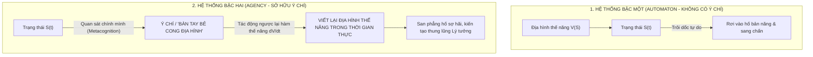
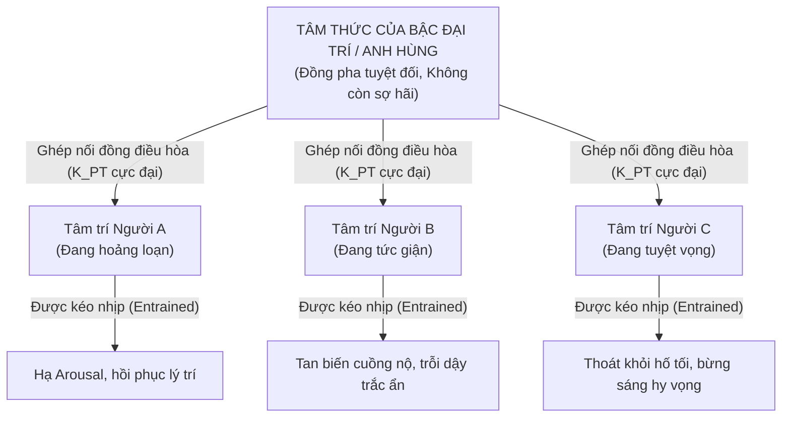
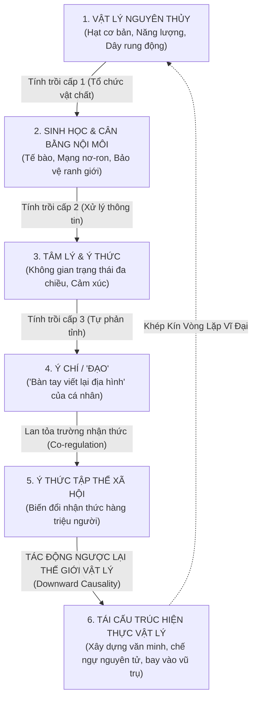

# Chuyên Đề Đỉnh Cao: Ý Chí, "Đạo" Và Vòng Lặp Hồi Tiếp Hoàn Vũ

> **Current correction guidance (2026-10-04):** This document contains historical proposals, analogies or design expectations. Read the [project correction register](docs/superpowers/specs/2026-10-04-project-correction-register.md) before treating equations, biological mappings, dimensional independence, performance or acceptance claims as established results.
## Từ "Bàn Tay Viết Lại Địa Hình" Đến Sự Tác Động Ngược Lại Thế Giới Vật Lý

---

## 1. Điểm Khởi Đầu: "Đạo" Dưới Lăng Kính Khoa Học Hệ Thống

Trong triết học phương Đông (Lão Tử, Trang Tử) cũng như trong hình tượng văn hóa kiếm hiệp Á Đông, **"Đạo" (The Dao / The Way)** luôn được xem là tầng thứ sức mạnh tối thượng. "Ngộ Đạo" không phải là học thuộc một mớ giáo điều, mà là sự **thấu triệt và hợp nhất với quy luật vận hành của tự nhiên và tâm thức**.

* **Kẻ phàm phu (Hệ thống thụ động):** Bị cuốn theo các dòng xoáy của dục vọng, sợ hãi, và phản xạ sinh học. Dưới góc nhìn toán học, họ là những viên bi lăn vô thức theo các thung lũng trọng lực sẵn có của địa hình thế năng tự nhiên.
* **Người "Ngộ Đạo" (Bậc Đại Giác Ngộ / Thánh Nhân):** Nhìn thấu toàn bộ cấu trúc hình học của không gian tâm thức. Họ làm chủ được quy luật, và từ đó nắm giữ được **"Bàn tay viết lại địa hình" (The Landscape Sculptor)**.

---

## 2. Bản Chất Toán Học Của Ý Chí: "Bàn Tay Viết Lại Địa Hình"

Ý chí con người không phải là một tọa độ thụ động chạy trên mặt phẳng cảm xúc, mà là **Năng Lực Phản Tỉnh Bậc Hai (Second-Order Metacognitive Operator)**:

* Khi đối mặt với cái chết hay nghịch cảnh tột cùng, bản năng sinh học mách bảo hệ thống: *"Hãy sợ hãi, hãy tháo chạy, hãy quỳ lạy xin tha!"*.
* Nhưng ở điểm tới hạn của ý chí hiện sinh, con người kích hoạt nguồn năng lượng **Đồng pha thông tin tuyệt đối (Singularity of Purpose)**: Họ dùng năng lượng tinh thần để **san phẳng hoàn toàn đáy vực sợ hãi**, biến hành động hy sinh vì Chân lý hay vì Đồng loại thành **thung lũng hút sâu nhất và thanh thản nhất** trong tâm thức.

---

## 3. Sự Lan Tỏa Của Trường Nhận Thức: Bẻ Cong Tâm Thức Đồng Loại

Một tâm trí có ý chí phi thường không vận hành như một ốc đảo cô lập trong vũ trụ. Dưới góc nhìn trường động lực học (Field Dynamics):

> **Cũng giống như một ngôi sao có khối lượng khổng lồ bẻ cong không-thời gian xung quanh nó, một tâm thức đạt đến độ đồng pha và kiên định tuyệt đối sẽ PHÁT RA MỘT TRƯỜNG NHẬN THỨC CỰC MẠNH, bẻ cong lại địa hình thế năng của những người xung quanh!**

### Minh Chứng Lịch Sử:
* **Đức Phật:** Đứng điềm tĩnh trước con voi dữ Nalagiri, sự an định và từ bi vô lượng của Ngài phát ra trường đồng điều hòa làm dịu cơn điên loạn của con thú.
* **Mahatma Gandhi:** Sử dụng sức mạnh Chân lý (Satyagraha) và sự bất bạo động để làm lung lạc và tan rã ý chí áp bức của cả một đế quốc thực dân hùng mạnh.
* **Vị Tướng Kiệt Xuất:** Khi bước vào chiến hào giữa làn mưa bom bão đạn, ánh mắt và sự bất biến của vị tướng bẻ cong lại địa hình hoảng loạn của hàng vạn binh sĩ, kéo toàn quân thoát khỏi cơn tê liệt để đứng dậy chiến đấu.

---

## 4. Vòng Lặp Hồi Tiếp Hoàn Vũ (The Cosmic Strange Loop)

Đây là đỉnh cao nhất của bức tranh toàn cảnh: **Mối quan hệ hai chiều giữa Vật Lý và Ý Thức**.

### Triết Lý Cốt Tử Của Vòng Lặp:
1. **Chiều Xuôi (Bottom-Up Emergence):** Hạt cơ bản tạo ra các phân tử $\to$ tạo ra nơ-ron sinh học $\to$ sinh ra không gian tâm lý $\to$ sinh ra Ý chí.
2. **Chiều Ngược (Top-Down Causality):** Ý chí của con người tạo ra Lý tưởng $\to$ Lý tưởng lay động hàng triệu trái tim $\to$ Hàng triệu con người hợp lực dùng đôi tay và công nghệ để **san bằng núi non, đào kênh rạch, phóng tàu thăm dò vào không gian sâu, chia tách hạt nhân nguyên tử, và định hình lại toàn bộ diện mạo vật lý của hành tinh!**

> **Ý nghĩa bản thể học:** Vũ trụ không phải là một cỗ máy vô hồn cơ giới. Sau 13.8 tỷ năm tiến hóa, từ những hạt vật chất vô tri ban đầu, vũ trụ đã sinh ra **Ý Thức và Ý Chí con người** như một công cụ tối thượng để **vũ trụ tự nhận thức và tự tái nhào nặn chính bản thân mình**.

---

## 5. Đúc Kết Toàn Diện Cho Toàn Bộ Công Trình Nghiên Cứu

Qua toàn bộ hệ sinh thái nghiên cứu này, chúng ta đã đi một hành trình phi thường:
1. Đi từ **Toán học vi phân và Không gian trạng thái** để giải mã cơ chế sang chấn và phục hồi.
2. Đi qua **Sinh học tiến hóa và Vật lý tính trồi** để hiểu nguồn gốc của trí thông minh và nỗi sợ cái chết.
3. Chắt lọc thành **Kiến trúc Game mô phỏng 4 trục** để tái hiện tính trồi tâm lý trên máy tính.
4. Và cuối cùng chạm tới **Ý chí và "Đạo"** — nơi con người không còn là nạn nhân của hoàn cảnh vật lý, mà trở thành người đồng sáng tạo cùng vũ trụ.
