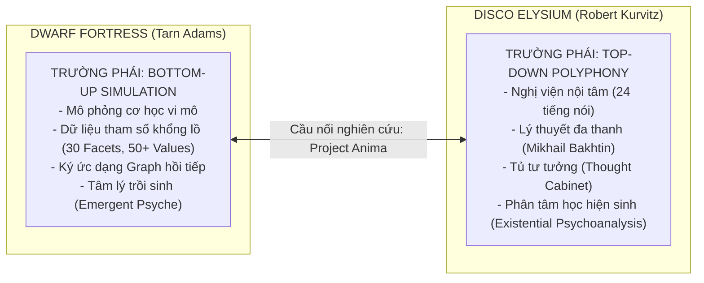
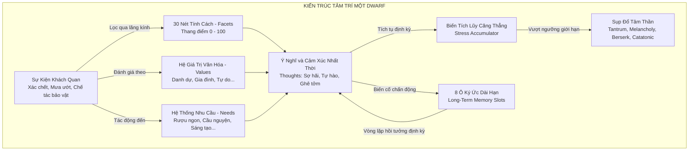
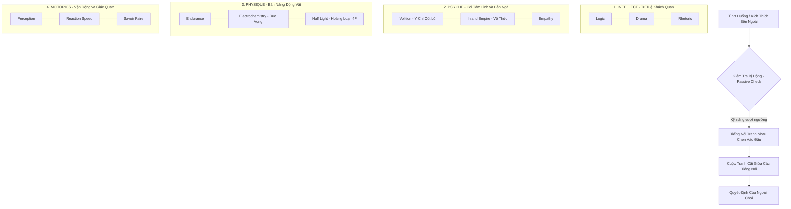
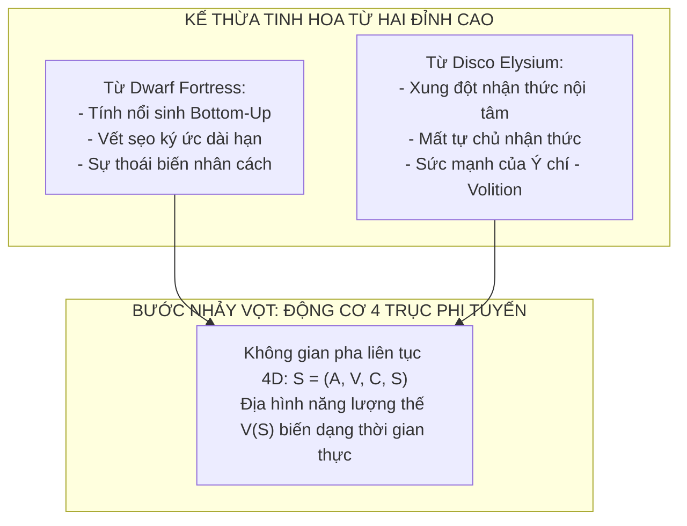

# Phân Tích Chuyên Sâu Hệ Thống Tâm Lý Nhân Vật: Dwarf Fortress & Disco Elysium
### Khảo Sát Tài Liệu Phát Triển, Kiến Trúc Thuật Toán, Mô Hình Nhận Thức & Bài Học Cho Game Nổi Sinh (Project Anima)

---

## 1. Mở Đầu: Hai Đỉnh Cao Của Hai Trường Phái Mô Phỏng Tâm Trí

Trong lịch sử game hiện đại, **Dwarf Fortress** (Bay 12 Games) và **Disco Elysium** (ZA/UM) đại diện cho hai cực đối đỉnh nhưng cùng chung một tham vọng tối thượng: **Tái hiện sự phức tạp, mâu thuẫn và mong manh của tâm trí con người trong thế giới ảo.**

* **Dwarf Fortress:** Tiếp cận từ **dưới lên (Bottom-Up)** thông qua mô phỏng thế giới quan khách quan. Tâm lý của một chú lùn là sản phẩm nổi sinh từ sự va đập giữa tính cách bẩm sinh (30 Facets), hệ giá trị văn hóa (Values), và dòng chảy sự kiện tích lũy trong bộ nhớ ký ức dài hạn.
* **Disco Elysium:** Tiếp cận từ **trên xuống (Top-Down)** thông qua chủ nghĩa đa thanh văn học (*Polyphonic Novel*). Tâm trí nhân vật là một nghị viện hỗn loạn gồm 24 phân mảnh nhận thức độc lập tranh giành quyền kiểm soát thể xác của một thám tử suy đồi.

Tài liệu này tổng hợp các tài liệu phát triển (Devlogs, phỏng vấn GDC, tài liệu thiết kế hệ thống Metric RPG) của cả hai tựa game, giải phẫu cấu trúc dữ liệu, thuật toán tâm lý và đối chiếu với kiến trúc **Động cơ 4 Trục Nổi Sinh** của `Project Anima`.

---

## 2. Dwarf Fortress: Kiến Trúc Tâm Lý Nổi Sinh 30-Facets & Mạng Lưới Ký Ức (Bay 12 Games)

### 2.1. Lịch Sử Phát Triển & Nguồn Gốc Lý Thuyết (Tarn Adams)
Trong các buổi thuyết trình tại GDC (*Procedural Storytelling in Dwarf Fortress*) và các bài phỏng vấn chuyên sâu, nhà sáng tạo **Tarn Adams** đã chia sẻ về hành trình xây dựng hệ thống tâm lý:
1. **Giai đoạn đầu (Trước v0.40):** Bắt đầu từ các mô hình tính cách đơn giản như *Myers-Briggs (MBTI)*, nhưng nhận thấy MBTI quá cứng nhắc và thiếu cơ sở khoa học để mô phỏng sự suy sụp thần kinh.
2. **Chuyển dịch sang Big Five (Five Factor Model - FFM):** Tarn Adams tiếp cận mô hình *NEO-PI-R của Paul Costa & Robert McCrae*. Tuy nhiên, mô hình 5 trục lớn (*Openness, Conscientiousness, Extraversion, Agreeableness, Neuroticism*) vẫn quá khái quát, không đủ độ phân giải để tạo ra các tính cách cực đoan (như lòng căm thù ma thuật, sự thèm khát quyền lực, hay tính bủn xỉn).
3. **Mở rộng thành Hệ Thống 30 Facets & 50+ Values:** Tarn Adams chia nhỏ 5 trục lớn thành **30 khía cạnh tính cách cụ thể (Facets)**, đồng thời bổ sung thêm các sách thần học và triết học cổ đại để lập trình hệ thống **Hệ Giá Trị Văn Hóa (Cultural Values)** và **Nhu Cầu Cá Nhân (Needs)**.

### 2.2. Chi Tiết Các Cấu Trúc Dữ Liệu Cốt Lõi

#### A. 30 Personality Facets (Thang đo 0 – 100)
Mỗi chú lùn sinh ra với 30 biến số nguyên từ `0` đến `100`. Vùng `[40, 60]` là trạng thái bình thường (Neutral). Nếu giá trị rơi ra ngoài vùng này, nó sẽ định hình phản ứng sinh học:

| Nhóm Trục Lớn (Big 5) | Các Facets Cốt Lõi Trong Code | Ý Nghĩa Mô Phỏng Hành Vi & Stress |
| :--- | :--- | :--- |
| **Neuroticism (Bất Ổn Cảm Xúc)** | `ANXIETY` (Lo âu) `DEPRESSION_PROPENSITY` (Xu hướng trầm cảm) `ANGER` (Dễ nổi giận) `STRESS_VULNERABILITY` (Độ nhạy cảm căng thẳng) | **Quyết định tốc độ hấp thụ stress:** Dwarf có `STRESS_VULNERABILITY > 75` sẽ nhận gấp 3 lần stress từ cùng một biến cố so với Dwarf có chỉ số thấp. |
| **Extraversion (Hướng Ngoại)** | `GREGARIOUSNESS` (Thích bầy đàn) `ASSERTIVENESS` (Quyết đoán) `CHEERFULNESS` (Lạc quan) | Quyết định nhu cầu giao tiếp xã hội; nếu bị cô lập lâu trong hầm mỏ sẽ nhanh chóng phát sinh ý nghĩ tiêu cực. |
| **Openness (Mở Rộng Nhận Thức)** | `IMAGINATION` (Trí tưởng tượng) `ARTISTIC_INTEREST` (Khiếu nghệ thuật) `EMOTIONAL_AWARENESS` | Tác động trực tiếp đến khả năng rơi vào trạng thái sáng tạo điên cuồng (**Strange Moods**). |
| **Agreeableness (Hòa Nhã)** | `ALTRUISM` (Vị tha) `SYMPATHY` (Đồng cảm) `TRUST` (Lòng tin cậy) | Dwarf có `TRUST < 25` dễ phát triển triệu chứng hoang tưởng, nghi ngờ người khác đầu độc hoặc phản bội. |
| **Conscientiousness (Tận Tâm)** | `DUTIFULNESS` (Trách nhiệm) `ORDERLINESS` (Ngăn nắp) `PERSEVERANCE` (Kiên trì) | Dwarf ngăn nắp khi nhìn thấy quần áo rách rưới vứt bừa bãi sẽ liên tục bị trừ điểm tâm trạng. |

#### B. 4 Trụ Cột Điều Khiển Động Lực Học Căng Thẳng (The Stress Engine)
Trong mã nguồn của Dwarf Fortress, có 4 Facets trực tiếp điều phối sự tích lũy và giải tỏa năng lượng stress:
1. **Bravery (Dũng cảm):** Điều tiết tốc độ tích tụ stress khi đối mặt với đe dọa sinh tử.
2. **Stress Vulnerability (Độ nhạy cảm):** Xác định dung lượng chịu tải tối đa của bình chứa stress trước khi kích hoạt sụp đổ tâm thần.
3. **Anxiety (Lo âu):** Quyết định tốc độ tiêu tán stress tự nhiên theo thời gian.
4. **Depression Propensity (Khuynh hướng trầm cảm):** Xác định độ dốc và khó khăn trong việc kéo Dwarf thoát khỏi trạng thái buồn rầu mãn tính.

#### C. Kiến Trúc Ký Ức Dài Hạn & Vòng Lặp Sang Chấn (Memory Feedback Loop)
Một trong những đột phá lớn nhất trong bản cập nhật tâm lý của Dwarf Fortress (từ bản v0.44 trở đi) là hệ thống **Bộ Nhớ Ký Ức (Long-Term Memory Slots)**:
* **Hạn mức ô nhớ:** Mỗi Dwarf có tối đa **8 ô nhớ dài hạn**.
* **Cơ chế ghi nhớ:** Khi một cảm xúc ngắn hạn có cường độ quá lớn (chứng kiến thi thể người thân bị phanh thây, thú cưng bị giết), nó sẽ được "thăng hạng" thành Ký Ức Dài Hạn và chiếm một ô nhớ.
* **Vòng lặp hồi tưởng (The Flashback Loop):** Định kỳ trong quá trình sinh hoạt, Dwarf sẽ tự động "lục lọi" lại các ô nhớ này. Khi nhớ lại, cảm xúc tiêu cực nguyên bản sẽ **tái kích hoạt với 100% cường độ**, tiếp tục bơm thêm stress vào biến tích lũy.
* **Hội chứng nghẽn ký ức (Memory Clogging):** Nếu cả 8 ô nhớ đều bị lấp đầy bởi các sang chấn kinh hoàng, Dwarf sẽ rơi vào vòng xoáy sụp đổ không thể cứu vãn (Spurious Attractor Loop), liên tục tự làm mình suy sụp ngay cả khi đang sống trong cung điện bằng vàng.
* **Sự biến đổi nhân cách vĩnh viễn (Personality Drift):** Sau nhiều năm chịu đựng ký ức sang chấn, các giá trị Facets bẩm sinh bắt đầu bị biến đổi vĩnh viễn (ví dụ: Dwarf trở nên chai lỳ cảm xúc, mất hoàn toàn lòng tin, hoặc vĩnh viễn hoang tưởng).

---

## 3. Disco Elysium: Nghị Viện Nội Tâm & Phân Tâm Học Hiện Sinh (ZA/UM)

### 3.1. Nguồn Gốc: Hệ Thống "Metric" & Lý Thuyết Đa Thanh (Robert Kurvitz)
Disco Elysium không sử dụng mô hình tâm lý học hàn lâm thực chứng như Dwarf Fortress, mà được kiến thiết từ nền tảng **Hệ thống Nhập vai Metric** do Robert Kurvitz và nhóm văn sĩ Tallinn phát triển suốt 15 năm:
* **Chịu ảnh hưởng từ Mikhail Bakhtin (Lý thuyết Tiểu thuyết Đa thanh):** Trong tư tưởng của Bakhtin, tâm trí con người không phải là một khối đơn nhất (*Monologic*), mà là một cuộc đối thoại không hồi kết giữa các giọng nói xung đột (*Polyphonic*).
* **Nghị viện của những nhân cách (A Parliament of Personalities):** Thay vì các chỉ số kỹ năng thông thường chỉ đóng vai trò cộng điểm xác suất, 24 kỹ năng trong Disco Elysium được nhân hóa thành **24 nhân vật độc lập**, sở hữu cá tính, giọng điệu, mưu đồ và góc nhìn triết học riêng biệt.

### 3.2. Chi Tiết Cơ Chế Nhận Thức & Thần Kinh Học Disco Elysium

#### A. Cấu Trúc 4 Thuộc Tính & 24 Tiếng Nói Nội Tâm
Mỗi thuộc tính đại diện cho một tầng lớp sinh học - nhận thức:
1. **Intellect (Trí tuệ):** Bán cầu não trái, tư duy phân tích, ngôn ngữ và lý luận.
2. **Psyche (Tâm linh & Bản ngã):** Siêu tôi (Superego) và các cơ chế phòng vệ tâm lý, trực giác biểu tượng và sự đồng cảm.
3. **Physique (Thể chất):** Não bò sát và hệ viền (Limbic system), xung năng sinh tồn nguyên thủy, cơn thịnh nộ và khoái cảm hóa học.
4. **Motorics (Vận động & Giác quan):** Hệ thần kinh cảm giác - vận động, sự chú ý không gian và phản xạ thể lý.

#### B. Cơ Chế Kiểm Tra Bị Động & Sự "Quá Tải" Của Một Tiếng Nói
Một thiết kế thiên tài của Disco Elysium là: **Chỉ số càng cao không có nghĩa là càng tốt.** Khi một kỹ năng đạt điểm số quá cao, nó sẽ trở thành một dạng rối loạn tâm thần cưỡng chế:
* **Encyclopedia (Bách khoa toàn thư) quá cao:** Đầu óc nhân vật bị tràn ngập bởi các thông tin rác vô nghĩa, phân tâm khỏi vụ án.
* **Electrochemistry (Hóa thần kinh) quá cao:** Nhân vật trở thành con nghiện mất kiểm soát, liên tục nhìn mọi người xung quanh qua lăng kính tình dục và thúc ép hít cocaine/uống rượu.
* **Half Light (Nửa Tối / Ánh Sáng Chập Chờn) quá cao:** Tương đương với trạng thái **Arousal cực đại ($A \to +1$)**. Nhân vật luôn trong trạng thái hoang tưởng, sẵn sàng đấm vào mặt người vô tội hoặc co giò bỏ chạy vì một tiếng động nhỏ.

#### C. Volition: Áo Giáp Tâm Thần & Tiếng Nói Của Siêu Thức (Hyper-Sanity)
Trong game, người chơi có 2 thanh sinh tồn:
* **Health (Máu thể xác):** Được bảo vệ bởi thuộc tính *Endurance*.
* **Morale (Tinh thần):** Được bảo vệ bởi thuộc tính **Volition (Ý chí)**.

*Volition* đóng vai trò là "người lớn duy nhất trong căn phòng":
* Khi các tiếng nói khác bị tha hóa, hoảng loạn hoặc bị quyến rũ bởi ảo giác sang chấn, *Volition* là kỹ năng duy nhất lên tiếng cảnh báo người chơi: *"Đừng nghe chúng nó. Chúng nó đang lừa bạn đấy. Tôi là người duy nhất thực sự muốn bạn sống sót."*
* Nếu Morale tụt về 0, nhân vật chính sẽ đầu hàng trước sự trầm cảm, vứt bỏ huy hiệu cảnh sát, ngồi sụp xuống ghế công viên và tuyên bố bỏ cuộc (Game Over).

#### D. Tủ Tư Tưởng (The Thought Cabinet): Cơ Chế Nội Tâm Hóa Thế Giới Quan
`Thought Cabinet` là hiện thân cơ học của quá trình **tiếp thu và biến đổi nhận thức**:
1. **Giai đoạn 1 - Tiếp xúc Ý Niệm (Prompt):** Khi trò chuyện với các nhân vật, một ý niệm triết học/sang chấn xuất hiện (ví dụ: *"Nỗi Nhục Thể Xác"*, *"Chủ Nghĩa Cộng Sản Tuyệt Vọng"*, *"Nữ Thần Xóa Ký Ức"*).
2. **Giai đoạn 2 - Ấp ủ / Nhai Lại (Internalization Period):** Người chơi đưa ý niệm vào ô trống trong đầu. Trong thời gian này (thường mất từ 2 đến 8 giờ chơi thực tế), tâm trí nhân vật bị xáo trộn, gây ra các điểm phạt tạm thời (*Debuff*).
3. **Giai đoạn 3 - Giác Ngộ / Đóng Đinh Nhận Thức (Complete Integration):** Sau khi hoàn tất ấp ủ, ý niệm biến thành một phần bản thể của nhân vật, mở khóa vĩnh viễn các nhánh đối thoại mới, thay đổi trần giới hạn kỹ năng và định hình kết cục số phận.

---

## 4. Bảng So Sánh Đối Đầu Kỹ Thuật: Dwarf Fortress vs Disco Elysium

| Tiêu Chí Kỹ Thuật | Dwarf Fortress (Bay 12 Games) | Disco Elysium (ZA/UM) |
| :--- | :--- | :--- |
| **Kiến trúc mã nguồn** | Thuần C++ hướng thủ tục, mô phỏng mảng dữ liệu cực lớn (*Procedural Simulation*). | C# trên nền Unity, sử dụng hệ thống cơ sở dữ liệu đối thoại phân nhánh (*Articy:Draft / Dialogue System*). |
| **Cơ sở lý thuyết** | Tâm lý học tính cách thực chứng (Big Five / NEO-PI-R) kết hợp mô hình bộ nhớ thần kinh. | Triết học hiện sinh, phân tâm học Freud/Jung, lý thuyết tiểu thuyết đa thanh Bakhtin. |
| **Bản chất của Tâm trí** | Một tập hợp vector tham số tĩnh va chạm với dòng sự kiện thời gian thực. | Một nghị viện gồm 24 tiếng nói nội tâm đối thoại và giằng xé lẫn nhau. |
| **Cách kích hoạt hành vi** | Tích lũy điểm vô thức $\to$ Vượt ngưỡng $\to$ Bùng phát trạng thái (*Tantrum/Melancholy*). | Kiểm tra chỉ số ẩn/hiện $\to$ Tung xúc xắc $2\text{d}6$ $\to$ Kích hoạt đoạn thoại nội tâm. |
| **Cơ chế Ký ức & Sang chấn** | 8 ô nhớ dài hạn; hồi tưởng gây kích hoạt lại cảm xúc; làm trôi lệch tính cách vĩnh viễn. | Tủ tư tưởng (Thought Cabinet); các vết sẹo quá khứ (Dora Ingerlund) được cài cắm thành các nút thắt cốt truyện. |
| **Khả năng tương tác xã hội** | Các Dwarf trò chuyện, tạo mối thâm thù hoặc tình bạn dựa trên khoảng cách giữa các Facets. | Người chơi trực tiếp đối thoại, thuyết phục hoặc thao túng các nhân vật khác qua văn bản. |
| **Tính nổi sinh (Emergence)** | **Cực cao:** Hàng triệu câu chuyện bi kịch độc bản tự sinh ra mà không cần biên kịch viết sẵn. | **Bằng không về mặt cơ học:** Mọi câu chữ đều do biên kịch viết tay xuất sắc, tính nổi sinh nằm ở cảm xúc người chơi. |

---

## 5. Tổng Hợp & Đột Phá Kiến Trúc Cho Project Anima

Cả Dwarf Fortress và Disco Elysium đều đã chạm tới đỉnh cao ở trường phái của riêng mình, nhưng đều để lại những "khoảng trống thiết kế" mà ngành game chưa thể giải quyết:
* **Dwarf Fortress:** Quá nặng về tính toán số học rời rạc, biến nhân vật thành những con số khô khan trên giao diện văn bản, người chơi khó lòng cảm nhận được "sức nặng vật lý" của một cơn hoảng loạn.
* **Disco Elysium:** Đạt đỉnh cao về văn học và biểu đạt tâm lý, nhưng bản chất cơ học vẫn là "tiểu thuyết tương tác có tung xúc xắc". Không có dòng chảy vật lý thời gian thực nào thực sự vận hành phía sau.

### Kiến Trúc Của Project Anima Giải Quyết Hai Khoảng Trống Trên Như Thế Nào?

1. **Từ "30 Biến Số Rời Rạc" của DF $\to$ "Không Gian Pha 4 Chiều Tinh Giản":**
   Thay vì quản lý 30 Facets khó kiểm soát, `Project Anima` nén toàn bộ trạng thái sinh thể - tâm lý vào 4 biến số động học:
   $$\vec{S}(t) = \big(A(t), V(t), C(t), S(t)\big)$$
   Mọi phản xạ hoảng loạn, tê liệt hay gắn kết đều là tọa độ chuyển động của viên bi tâm lý trên mặt cầu 4 chiều, vận hành bởi phương trình vi phân ngẫu nhiên Langevin thời gian thực ($10\text{ Hz}$).

2. **Từ "24 Tiếng Nói Viết Sẵn" của DE $\to$ "Tiếng Nói Trồi Sinh Theo Vùng Tọa Độ":**
   Không cần viết sẵn hàng nghìn nhánh thoại cố định. Tiếng nói nội tâm của nhân vật trong `Project Anima` được sinh ra tự động dựa trên tọa độ không gian pha hiện tại:
   * Khi $A > 0.6, V < 0.2$: Tiếng nói của vùng hoảng loạn giao cảm (*Half Light*) tự động trỗi dậy, chiếm quyền điều khiển phát ngôn và hành vi.
   * Khi $A < -0.6, V < 0.2$: Tiếng nói của vùng tê liệt phế vị lưng (*Dorsal Shutdown*) tự động làm mờ âm thanh, giảm tầm nhìn và làm đờ đẫn cơ thể.

3. **Hiện Thực Hóa "Ký Ức DF" Bằng "Hình Học Hố Năng Lượng (Trauma Basins)":**
   Hệ thống 8 ô nhớ của Dwarf Fortress được toán học hóa thành **sự biến dạng của trường thế năng $V(\vec{S})$**. Ký ức kinh hoàng không chỉ là một dòng chữ trong bộ nhớ, mà nó đào sâu một cái hố hút (*Attractor Basin*) tại không gian pha. Khi gặp kích thích tương đồng, nhân vật bị lực hấp dẫn của hố kéo tụt vào cơn hoảng loạn theo đúng nguyên lý độ trễ Hysteresis.

4. **Nâng Cấp "Volition của DE" Thành "Toán Tử Ý Chí Động Học ($\vec{F}_{\text{will}}$)":**
   Volition không còn là một kỹ năng phòng thủ thụ động để đỡ sát thương tinh thần. Trong `Project Anima`, ý chí là một **vector lực chủ động kháng gradient** $\vec{F}_{\text{will}} = -k_w \nabla V + \vec{P}$, cho phép nhân vật gồng mình, đốt cháy sinh lực để đẩy trạng thái ngược dốc hiểm trở, thực hiện những hành vi anh hùng xả thân cứu đồng đội.

---

> [!NOTE]
> **Tài liệu nghiên cứu liên quan:**
> * Bản thiết kế kiến trúc game đầy đủ: [`Thiet-Ke-Game-Mo-Phong-Tam-Ly-Emergence.md`](file:///g:/Projects/Researchs/Thiet-Ke-Game-Mo-Phong-Tam-Ly-Emergence.md)
> * Phân tích 7 nhóm reference game: [`Phan-Tich-He-Thong-Tam-Ly-Cac-Reference-Game.md`](file:///g:/Projects/Researchs/Phan-Tich-He-Thong-Tam-Ly-Cac-Reference-Game.md)
> * Nền tảng toán học & vật lý động lực: [`memory/theoretical-foundations.md`](file:///g:/Projects/Researchs/memory/theoretical-foundations.md)
