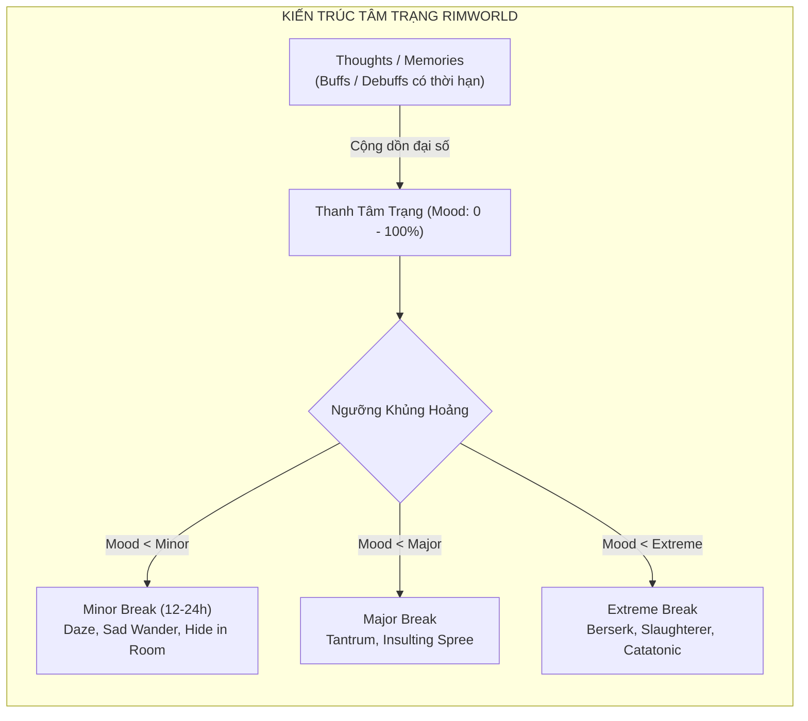
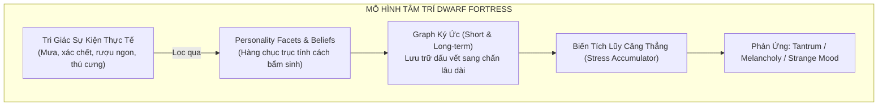
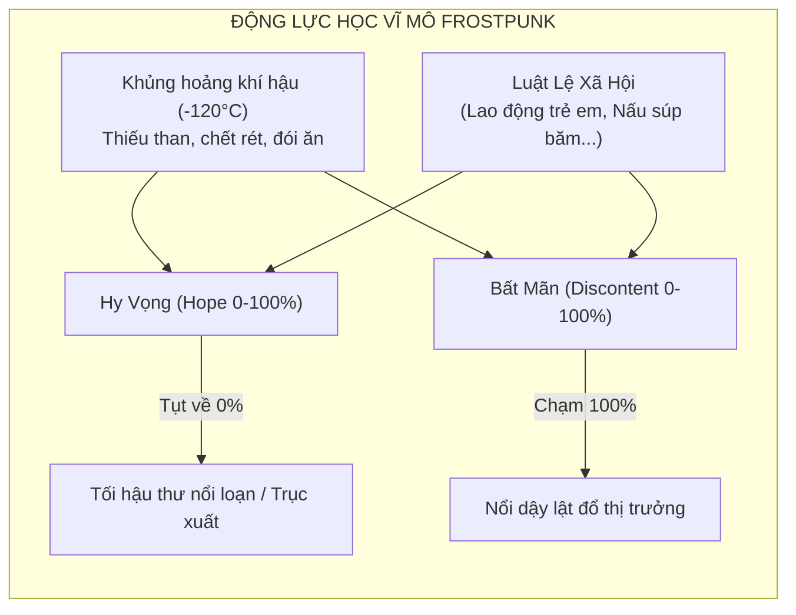
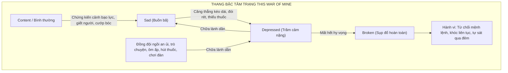
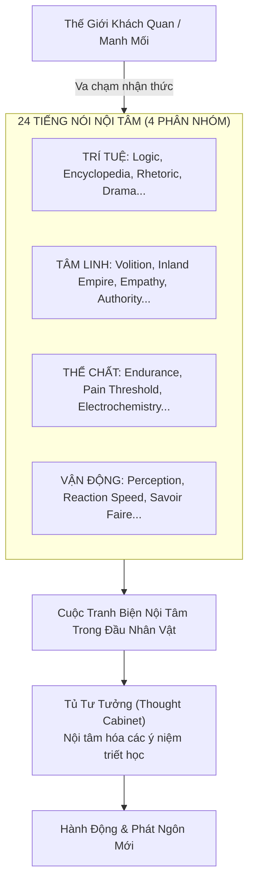
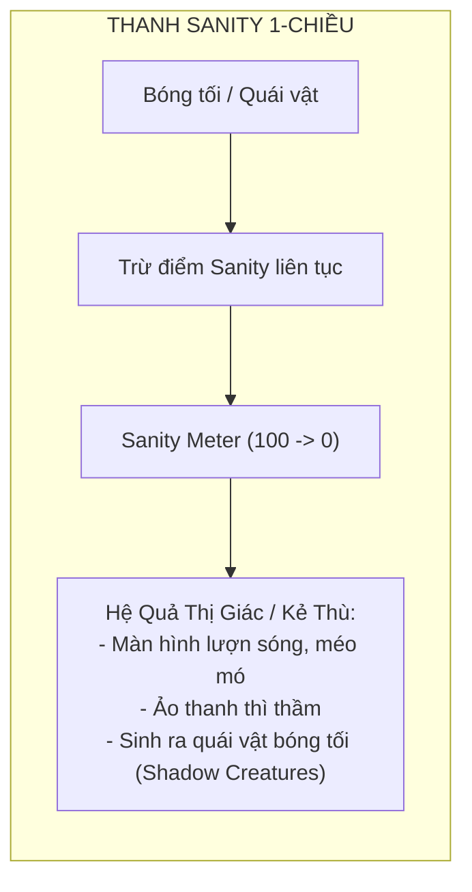
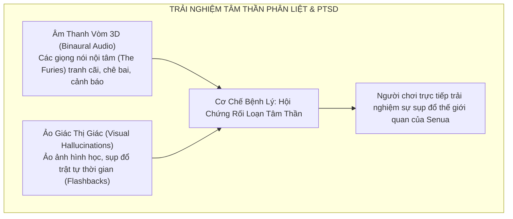

# Phân Tích Hệ Thống Tâm Lý Trong Các Reference Game
### Khảo Sát Thiết Kế Cơ Chế, Mô Hình Hóa Nhận Thức & Đối Chiếu Với Động Cơ Nổi Sinh (Project Anima)

---

## 1. Mở Đầu & Mục Tiêu Nghiên Cứu

Trong lịch sử phát triển của ngành công nghiệp trò chơi điện tử, việc đưa **tâm lý con người, căng thẳng (stress), sang chấn (trauma), và sự mất tự chủ (agency loss)** vào gameplay luôn là một thách thức lớn. Phần lớn các trò chơi thường rơi vào một trong ba cái bẫy thiết kế:
1. **Cái bẫy 1-chiều tuyến tính (Linear Metric):** Rút gọn tâm lý thành một thanh trượt đơn giản (Sanity Bar) vận hành như một "thanh máu thứ hai".
2. **Cái bẫy xúc xắc ngẫu nhiên (Discrete RNG Gate):** Khi căng thẳng vượt ngưỡng, hệ thống kích hoạt ngẫu nhiên một trạng thái điên loạn rời rạc không có quán tính.
3. **Cái bẫy kịch bản hóa (Hardcoded Narrative):** Tạo ra chiều sâu tâm lý vượt trội nhưng đóng khung trong các cây hội thoại phân nhánh cố định, thiếu tính trồi sinh học thời gian thực.

Tài liệu này tiến hành giải phẫu chi tiết hệ thống tâm lý của **7 nhóm Reference Game kinh điển**, phân tích ưu điểm, nhược điểm cơ học, và đối chiếu trực tiếp với kiến trúc **Động cơ 4 Trục Nổi sinh $\vec{S} = (A, V, C, S)$** đang được nghiên cứu tại [`Thiet-Ke-Game-Mo-Phong-Tam-Ly-Emergence.md`](file:///g:/Projects/Researchs/Thiet-Ke-Game-Mo-Phong-Tam-Ly-Emergence.md).

---

## 2. Nhóm 1: Mô Phỏng Sinh Tồn & Quản Lý Xã Hội (Colony & Survival Sims)

### 2.1. RimWorld (Ludeon Studios)



#### A. Cơ chế cốt lõi:
* **Tâm trạng (Mood) & Ý nghĩ (Thoughts):** Nhân vật có chỉ số Mood trượt từ 0% đến 100%, được xác định bằng cách cộng dồn hàng chục biến số có thời hạn (ví dụ: *"Ăn không có bàn -3"*, *"Ngủ trong giá lạnh -4"*, *"Bạn thân qua đời -15"*).
* **Ngưỡng sụp đổ (Break Thresholds):** Có 3 mốc cố định: Minor (thường ~35%), Major (~20%), Extreme (~5%).
* **Quay số ngẫu nhiên (RNG Dice Roll):** Cứ mỗi khoảng thời gian định kỳ (interval), nếu Mood nằm dưới ngưỡng, trò chơi sẽ tung xúc xắc với xác suất nhất định để kích hoạt một loại trạng thái hoảng loạn (*Mental Break*).

#### B. Đánh giá chuyên sâu:
* **Ưu điểm:** Tạo ra những câu chuyện dở khóc dở cười mang tính biểu tượng (vô tình giết chó cưng khiến người quản lý nổi điên đốt kho lương thực). Cơ chế cộng dồn *Thoughts* rất dễ mở rộng (modding-friendly).
* **Nhược điểm nghiêm trọng:**
  * **Thiếu tính liên tục & quán tính trạng thái:** Nhân vật đang điên cuồng đập phá (*Berserk*), nhưng ngay khi hết thời gian đếm ngược hoặc được giải tỏa (Catharsis +40), họ lập tức tỉnh táo và vui vẻ trở lại như chưa từng có chuyện gì xảy ra.
  * **Thiếu tính định hướng phản xạ sinh học:** Một nhân vật bị trầm cảm vì mất người thân lại có thể ngẫu nhiên quay ra cắn xé người khác (*Berserk*) thay vì co rút (*Shutdown*). Việc lựa chọn phản ứng là hoàn toàn ngẫu nhiên (RNG pool) thay vì tuân theo tọa độ sinh học.

---

### 2.2. Dwarf Fortress (Bay 12 Games)



#### A. Cơ chế cốt lõi:
* **Tính cách đa diện (Personality Facets & Values):** Mỗi Dwarf có một hồ sơ tâm lý cực kỳ phức tạp gồm hàng chục chỉ số (như mức độ tò mò, lòng can đảm, tính vị kỷ, nhu cầu giao tiếp xã hội).
* **Graph Ký ức & Sẹo Sang Chấn:** Các sự kiện kinh hoàng (nhìn thấy xác đồng đội rữa nát) không chỉ biến mất sau khi hết giờ. Chúng đi vào trí nhớ ngắn hạn, rồi được củng cố vào trí nhớ dài hạn, vĩnh viễn biến đổi tính cách nhân vật (khiến họ trở nên chai lỳ hoặc vĩnh viễn hoang tưởng).
* **Hành vi Nổi sinh Đỉnh cao:** Căng thẳng tích lũy có thể dẫn đến *Tantrum* (đập phá), *Melancholy* (trầm cảm bỏ ăn cho tới chết), hoặc *Strange Mood* (bị ám ảnh cưỡng chế, khóa cửa xưởng để chế tạo cổ vật thần thánh).

#### B. Đánh giá chuyên sâu:
* **Ưu điểm:** Là chuẩn mực vàng (Gold Standard) về tính nổi sinh trong thế giới game. Các câu chuyện bi kịch gia đình, sự biến đổi nhân cách qua nhiều năm tháng hoàn toàn do hệ thống tự sinh ra.
* **Nhược điểm nghiêm trọng:**
  * **Quá tải biến số rời rạc (Discrete Over-parameterization):** Việc sử dụng hàng trăm biến số khiến hệ thống trở thành một "hộp đen" quá cồng kềnh, người chơi thông thường không thể dự đoán hay cảm nhận được mối quan hệ nhân quả.
  * **Giao diện thuần văn bản (Textual Disconnect):** Tâm lý được mô tả qua các đoạn văn chép sử dài dằng dặc, thiếu sự phản hồi trực quan về mặt vật lý, không gian và cơ học chuyển động.

---

### 2.3. Frostpunk (11 bit studios)



#### A. Cơ chế cốt lõi:
* **Hai trục vĩ mô đối trọng:** Hy vọng (*Hope*) và Bất mãn (*Discontent*).
* **Mối đe dọa sinh tồn khắc nghiệt:** Thời tiết giảm sâu kéo theo các ca bệnh tật, cắt cụt chi và chết đói. Mỗi cái chết làm sụt giảm Hy vọng và thổi bùng Bất mãn.
* **Đánh đổi đạo đức qua Luật pháp (Book of Laws):** Ký sắc lệnh lao động trẻ em, đưa mùn cưa vào thức ăn giúp giải quyết tài nguyên nhưng vĩnh viễn làm tổn thương tinh thần xã hội; mở ra các nhánh cực đoan như *Tôn giáo Độc đoán (Faith)* hoặc *Trật tự Quân phiệt (Order)*.

#### B. Đánh giá chuyên sâu:
* **Ưu điểm:** Tạo sức ép nghẹt thở về mặt đạo đức lãnh đạo; buộc người chơi phải cân nhắc giữa việc giữ mạng sống sinh học hay bảo tồn phẩm giá con người.
* **Nhược điểm nghiêm trọng:**
  * **Thước đo tổng gộp tuyến tính (Macro Top-Down):** Không có tâm lý cá nhân. Cả thành phố được xem như một khối đồng nhất. Bạn không thấy được sự sụp đổ hay cứu chuộc của từng con người cụ thể.
  * **Cơ chế chuyển đổi nhị phân (Binary Switches):** Luật lệ được bật/tắt như các nút công tắc cây công nghệ (tech tree), thiếu hoàn toàn sự co-regulation tự nhiên giữa người dân trong cùng một khu nhà.

---

### 2.4. This War of Mine (11 bit studios)



#### A. Cơ chế cốt lõi:
* **Thang bậc tâm lý hữu hạn:** *Content $\to$ Sad $\to$ Depressed $\to$ Broken*.
* **Tác động đạo đức sâu sắc (Moral Weight):** Ăn cắp thuốc của một cặp vợ chồng già để cứu bạn mình có thể khiến nhân vật rơi thẳng từ *Content* xuống *Depressed* vì cảm giác tội lỗi cắn rứt.
* **Mất quyền kiểm soát & Cơ chế Chữa lành Xã hội:**
  * Khi ở trạng thái *Broken*, nhân vật hoàn toàn vô hiệu hóa sự điều khiển của người chơi. Họ ngồi sụp xuống sàn, ôm đầu khóc, từ chối ăn uống và có thể tự kết liễu đời mình vào ban đêm.
  * Để cứu họ, người chơi buộc phải điều động một nhân vật khác đến ngồi cạnh, an ủi, tâm sự suốt nhiều giờ (mô phỏng sự đồng điều hòa giữa người với người).

#### B. Đánh giá chuyên sâu:
* **Ưu điểm:** Thể hiện sự tàn khốc của chiến tranh lên tâm hồn con người sâu sắc nhất trong lịch sử game; cơ chế can thiệp đồng đội là hình bóng sơ khai của *Polyvagal Co-regulation*.
* **Nhược điểm:**
  * Thang trạng thái còn **phân bậc thô (coarse-grained steps)**, thiếu tính chuyển pha mềm mại.
  * Chưa có mô hình **Hysteresis toán học**: việc phục hồi chỉ là cộng dồn các hành động tương tác cho đủ điểm ngưỡng để nhảy bậc.

---

## 3. Nhóm 2: Nhập Vai & Chiều Sâu Nhận Thức (RPG & Cognitive Systems)

### 3.1. Disco Elysium (ZA/UM)



#### A. Cơ chế cốt lõi:
* **Nhân hóa nhận thức (Personified Cognitive Functions):** 24 kỹ năng không phải là các thanh chỉ số thụ động mà là **24 tiếng nói nội tâm độc lập**, liên tục tranh cãi, thì thầm vào tai nhân vật chính.
  * *Volition (Ý chí):* Giữ cho tâm trí tỉnh táo, ngăn chặn tự sát, đóng vai trò là "la bàn đạo đức lành mạnh".
  * *Inland Empire (Cõi Nội Tâm):* Trực giác vô thức, trò chuyện với đồ vật vô tri (chiếc cà vạt, thi thể), hiện thân của tư duy biểu tượng và sang chấn chưa giải quyết.
  * *Electrochemistry (Hóa Thần Kinh):* Bản năng động vật nguyên thủy, liên tục xúi giục nhân vật uống rượu, hút thuốc, dùng chất kích thích để quên đi nỗi đau.
* **Tủ tư tưởng (Thought Cabinet):** Cho phép nhân vật "ấp ủ" một ý niệm triết học/chính trị trong nhiều giờ chơi, tạm thời chịu phạt chỉ số trước khi giác ngộ một góc nhìn mới vĩnh viễn.

#### B. Đánh giá chuyên sâu:
* **Ưu điểm:** Đỉnh cao văn học và phân tâm học trong game; khắc họa hoàn hảo sự giằng xé nội tâm của một người đàn ông nghiện ngập đang trốn chạy nỗi đau chia tay và sang chấn quá khứ.
* **Nhược điểm cơ học:**
  * **Toàn bộ là kịch bản tĩnh (Hardcoded Narrative Trees):** Mọi cuộc tranh luận nội tâm đều được viết sẵn bởi các nhà biên kịch.
  * **Thiếu mô phỏng thời gian thực:** Không có một động cơ vật lý hay toán học nào thực sự chạy ngầm phía dưới; nếu người chơi chọn cùng một nhánh thoại, kết quả sẽ luôn giống nhau.

---

### 3.2. Darkest Dungeon (Red Hook Studios)

```mermaid
graph TD
    subgraph DD_STRESS["HỆ THỐNG CĂNG THẲNG DARKEST DUNGEON"]
        Dungeon["Bóng tối, bẫy rập, đòn chí mạng, quái vật gớm ghiếc"] --> StressMeter["Stress Bar (0 - 200)"]
        
        StressMeter -->|Đạt 100 Stress| ResolveCheck{"Thử Thách Phẩm Chất (Resolve Check)"}
        
        ResolveCheck -->|Xác suất cao (~75%)| Affliction["ÁM ẢNH (Affliction)<br/>Paranoid, Masochistic, Irrational, Abusive, Fearful"]
        ResolveCheck -->|Xác suất thấp (~25%)| Virtue["ĐỨC HẠNH (Virtue)<br/>Courageous, Vigorous, Stalwart, Focused"]
        
        Affliction --> LossOfControl["Mất Quyền Kiểm Soát:<br/>Bỏ lượt, tự đánh mình, từ chối buff, đổi vị trí"]
        Affliction --> Contagion["Stress Contagion:<br/>Lăng mạ đồng đội, tăng stress cả nhóm"]
        
        StressMeter -->|Đạt 200 Stress| HeartAttack["Đột Quỵ (Heart Attack)<br/>Tụt máu về Death's Door hoặc Chết Ngay"]
    end
```

#### A. Cơ chế cốt lõi:
* **Hai nấc căng thẳng (0 $\to$ 100 $\to$ 200):** Căng thẳng tích tụ từ bóng tối, đòn đánh hiểm hóc và sự ghê rợn của Hầm ngục.
* **Resolve Check (Nấc 100):** Khi chạm mốc 100, nhân vật đối mặt với ngã rẽ nhân cách:
  * **Affliction (Bệnh tâm lý):** *Paranoid* (từ chối được hồi máu vì sợ bị đầu độc), *Masochistic* (bước lên phía trước để chịu đòn), *Abusive* (sỉ nhục khiến đồng đội tăng stress).
  * **Virtue (Phẩm hạnh thăng hoa):** Vực dậy tinh thần, hồi máu và giảm stress cho cả nhóm.
* **Heart Attack (Nấc 200):** Sự quá tải của tim mạch do sợ hãi tột cùng, đẩy nhân vật tới bờ vực cái chết.

#### B. Đánh giá chuyên sâu:
* **Ưu điểm:**
  * Khắc họa xuất sắc **sự mất quyền tự chủ (Agency Loss):** Người chơi không còn là "thượng đế" điều khiển quân cờ; quân cờ có thể từ chối lệnh, tự hại hoặc phá hoại đội hình.
  * **Lây lan cảm xúc (Emotional Contagion):** Một thành viên phát điên sẽ nhanh chóng kéo cả tổ đội sụp đổ theo hiệu ứng domino.
* **Nhược điểm:** Vận hành trên một **máy trạng thái rời rạc (Finite State Machine)**. Việc vượt qua hay gục ngã tại mốc 100 vẫn là một phép thử xác suất cố định, thiếu địa hình liên tục của một không gian pha tâm lý.

---

## 4. Nhóm 3: Kinh Dị, Ảo Giác & Sang Chấn Sinh Thể (Horror & Trauma)

### 4.1. Amnesia: The Dark Descent & Don't Starve



#### A. Cơ chế cốt lõi:
* Cung cấp một thanh chỉ số Sanity (0 - 100).
* Đứng trong bóng tối, nhìn vào quái vật sẽ làm thanh này tụt nhanh.
* Khi Sanity tụt thấp: màn hình bị biến dạng (lồi lõm, mờ nhòe), xuất hiện tiếng thở gấp, tiếng thì thầm, và quái vật ảo ảnh bắt đầu tấn công người chơi bằng sát thương vật lý thực tế.

#### B. Phê phán thiết kế (The Design Flaw):
* **Bản chất là "Thanh máu thứ hai":** Đây là cách mô phỏng tâm lý cơ học và nông cạn nhất. Tâm lý không vận hành như một bình chứa nước bị rò rỉ.
* **Thiếu hoàn toàn cấu trúc thần kinh:** Không phân biệt được giữa trạng thái **kích thích giao cảm cực hạn** (tim đập 180bpm, sẵn sàng đấm nhau - *Fight*) với trạng thái **đóng băng phế vị** (tụt huyết áp, đờ đẫn, ngất xỉu - *Freeze*). Mọi thứ đều bị gộp chung vào một chữ "Mất trí".

---

### 4.2. Hellblade: Senua's Sacrifice (Ninja Theory)



#### A. Cơ chế cốt lõi:
* Được phát triển với sự cố vấn của các nhà khoa học thần kinh và những người thực sự mắc chứng rối loạn tâm thần (*Psychosis*).
* **Binaural Audio (Âm thanh 3D):** Sử dụng các giọng nói nội tâm lồng tiếng trực tiếp vào hai tai người chơi—có giọng nói xúi giục cô bỏ cuộc, có giọng giễu cợt, có giọng cảnh báo nguy hiểm phía sau lưng.
* **Sự sụp đổ ranh giới không gian - thời gian:** Quá khứ bị bạo hành và hiện thực đan cài vào nhau, khiến nhân vật (và người chơi) không thể phân biệt được đâu là ký ức sang chấn, đâu là thử thách vật lý thực tế.

#### B. Đánh giá chuyên sâu:
* **Ưu điểm:** Khắc họa sự đồng cảm sâu sắc nhất về nỗi đau tâm thần trong lịch sử game; tái hiện chính xác cảm giác sụp đổ khoảng cách không-thời gian của PTSD ($d(\vec{S}_{\text{past}}, \vec{S}_{\text{present}}) \to 0$).
* **Nhược điểm:** Đây là một tác phẩm **tuyến tính đóng khung (linear cinematic narrative)**. Không có hệ thống mô phỏng tham số tự do, người chơi chỉ là người thưởng thức câu chuyện chứ không thể tạo ra những hệ quả nổi sinh mới.

---

## 5. Bảng Ma Trận So Sánh Tổng Hợp Các Hệ Thống

Bảng dưới đây đối chiếu toàn bộ các Reference Game kinh điển với **Động cơ 4 Trục Nổi Sinh của Project Anima**:

| Tiêu Chí So Sánh | Nhóm Sanity 1D (Amnesia, Don't Starve) | RimWorld | Darkest Dungeon | Disco Elysium | Dwarf Fortress | **Project Anima (Động Cơ 4 Trục)** |
| :--- | :--- | :--- | :--- | :--- | :--- | :--- |
| **Không gian biểu diễn (State Space)** | $1\text{D}$ Tuyến tính (Scalar) | $1\text{D}$ (Mood) + Danh sách Tags | Rời rạc 2 nấc (0 - 100 - 200) | 24 Kỹ năng (RPG Stats) | Hàng trăm biến rời rạc & Memory Graph | **Vector 4D liên tục:** $\vec{S} = (A, V, C, S) \in \mathbb{R}^4$ |
| **Bản chất động lực học** | Trừ điểm theo thời gian | Cộng dồn thời hạn + Quay số RNG | Tích lũy điểm + Phép thử xác suất | Phân nhánh kịch bản cố định (Scripted) | Hệ thống biến cố tích lũy phức tạp | **Phương trình vi phân ngẫu nhiên (Langevin SDE)** |
| **Mất quyền tự chủ (Agency Loss)** | Không có (chỉ méo hình/quái cắn) | Đột ngột gãy vỡ (Break) ngẫu nhiên | Mất lượt/tự hành động theo danh mục | Lựa chọn thoại theo chỉ số | Tantrum/Bỏ ăn/Điên loạn | **Hàm suy giảm liên tục:** $C(t) = C_0 \cdot \max(0, 1 - (A/A_{\text{th}})^2) \cdot V(t)$ |
| **Phản xạ sinh học cấp tính** | Không phân biệt | Không có (chỉ có break chung) | Affliction chung chung | Không áp dụng | Khá chi tiết nhưng rời rạc | **Phản xạ 4F theo góc pha:** Fight, Flight, Freeze, Fawn |
| **Cơ chế Ký ức & Sang chấn** | Hồi lại đầy khi ăn/ngủ/ra sáng | Catharsis (+40) xóa sạch dấu vết | Điều trị ở Nhà thờ/Quán rượu (xóa stress) | Thought Cabinet (cộng/trừ stat vĩnh viễn) | Sẹo ký ức trong Memory Graph (Rất sâu) | **Hố sâu năng lượng (Trauma Basin) & Độ trễ (Hysteresis)** |
| **Tương tác xã hội & Lây lan** | Đơn độc | Một vài debuff lây qua nhìn thấy | Stress Contagion (lăng mạ đồng đội) | Đối thoại văn bản | Mạng xã hội lùn phức tạp | **Ghép nối Dao động tử (Coupled Oscillators / Co-regulation)** |
| **Toán tử Ý chí (Willpower)** | Không có | Không có | Virtue (quay số ra buff may mắn) | Volition (kỹ năng đối thoại nội tâm) | Ý chí là chỉ số phòng vệ tĩnh | **Toán tử Kháng cự Phi Thể Lý:** $\vec{F}_{\text{will}} = -k_w \nabla V + \vec{P}$ |

---

## 6. Bài Học Thiết Kế Cốt Lõi Áp Dụng Cho Project Anima

Từ việc mổ xẻ các hệ thống trên, kiến trúc của `Project Anima` đã đúc kết và thực hiện **4 bước nhảy vọt về mặt thiết kế game**:

### 1. Thay thế "Quay số ngẫu nhiên" bằng "Hình học không gian pha liên tục"
* *Học từ sai lầm của RimWorld & Darkest Dungeon:* Không biến sự sụp đổ tâm lý thành một cú tung xúc xắc may rủi.
* *Cách giải quyết:* Tâm lý là một viên bi lăn trên một địa hình năng lượng thế phi tuyến $V(\vec{S})$. Khi Arousal tăng vọt và Valence tụt dốc, viên bi tự động lăn vào lòng chảo phản xạ sinh học 4F một cách trơn tru, có gia tốc và có quán tính.

### 2. Đưa "Độ trễ Hysteresis" vào mô phỏng sang chấn
* *Học từ sự thiếu hụt của This War of Mine & RimWorld:* Việc rơi vào khủng hoảng rất nhanh (tiếng súng nổ chỉ mất $0.5\text{s}$), nhưng quá trình hồi phục đòi hỏi năng lượng kích hoạt rất lớn ($\Delta E_{\text{escape}} \gg \Delta E_{\text{fall}}$).
* *Cách giải quyết:* Ký ức kinh hoàng làm biến dạng vĩnh viễn địa hình thế năng, tạo ra một **Hố sâu Sang chấn (Trauma Basin)**. Nhân vật có thể bình thường trong cuộc sống thường nhật, nhưng chỉ cần một kích thích nhỏ trùng tần số là viên bi sẽ lập tức trượt trở lại đáy hố hoảng loạn.

### 3. Hiện thực hóa "Đồng điều hòa thần kinh (Polyvagal Co-regulation)" bằng Ghép nối Trường
* *Học từ chiều sâu của This War of Mine:* Một nhân vật đang hoảng loạn không thể tự chữa lành bằng cách "nghĩ tích cực".
* *Cách giải quyết:* Dùng toán học ghép nối dao động tử $K_{ij} S_i (A_j - A_i)$. Sự hiện diện tĩnh tại của một người bạn đồng hành bình tĩnh ($A \approx 0, V \approx 1$) sẽ tự động kéo trục kích thích của người đang hoảng loạn hạ nhiệt mà không cần bất kỳ câu lệnh ma thuật hay bấm nút dùng chiêu thức nào.

### 4. Đưa "Ý chí Vượt Ngưỡng (Willpower Override)" thành Cơ chế Gameplay Đỉnh cao
* *Học từ Volition của Disco Elysium nhưng đưa vào cơ học vận động:* Ý chí con người không chỉ là một dòng hội thoại hay một buff may mắn như Darkest Dungeon.
* *Cách giải quyết:* Cung cấp một toán tử ý chí $\vec{F}_{\text{will}}$ cho phép nhân vật **đốt cháy năng lượng thể lý/tuổi thọ sinh học** để đẩy viên bi tâm lý ngược dốc năng lượng thế, thực hiện các hành động xả thân, bảo vệ đồng đội bất chấp bản năng sinh tồn đang gào thét đòi bỏ chạy.

---

> [!NOTE]
> **Tài liệu tham khảo liên quan:**
> * Bản thiết kế kiến trúc game chi tiết: [`Thiet-Ke-Game-Mo-Phong-Tam-Ly-Emergence.md`](file:///g:/Projects/Researchs/Thiet-Ke-Game-Mo-Phong-Tam-Ly-Emergence.md)
> * Nền tảng toán học & phương trình động lực: [`memory/theoretical-foundations.md`](file:///g:/Projects/Researchs/memory/theoretical-foundations.md)
> * Tổng hợp lý luận nhận thức & triết học: [`memory/conversation-summary.md`](file:///g:/Projects/Researchs/memory/conversation-summary.md)
