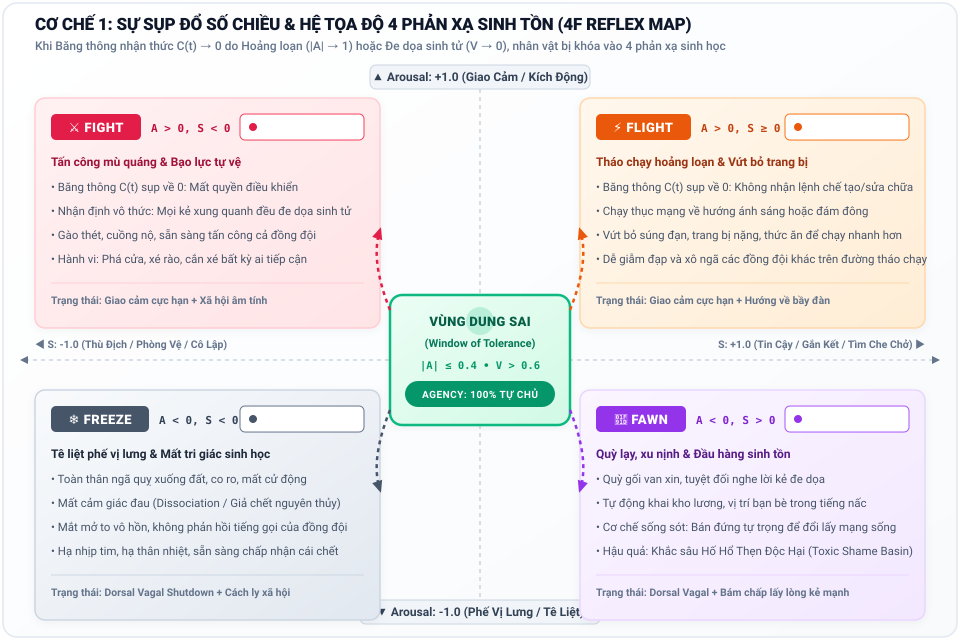
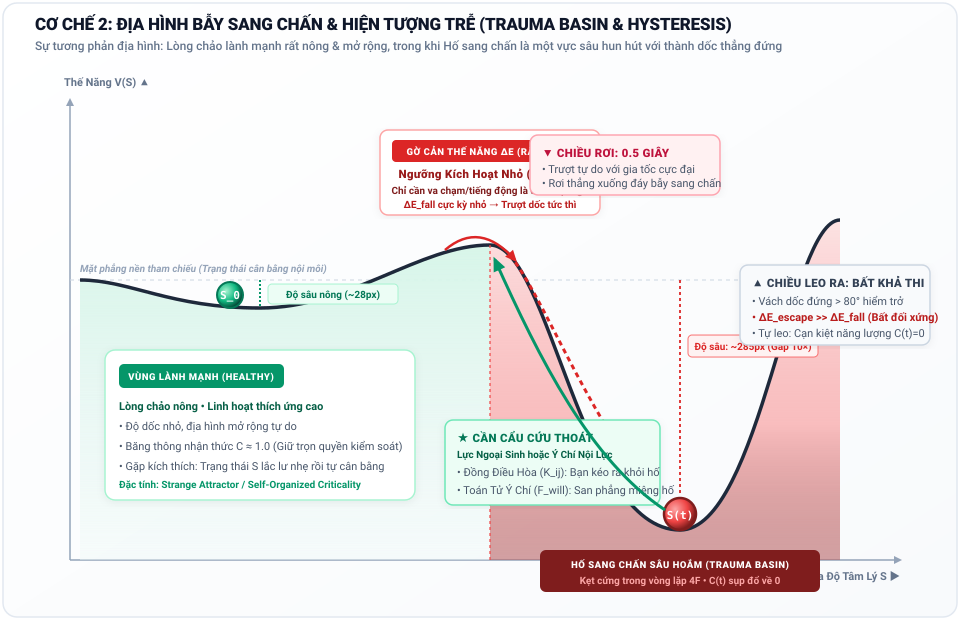
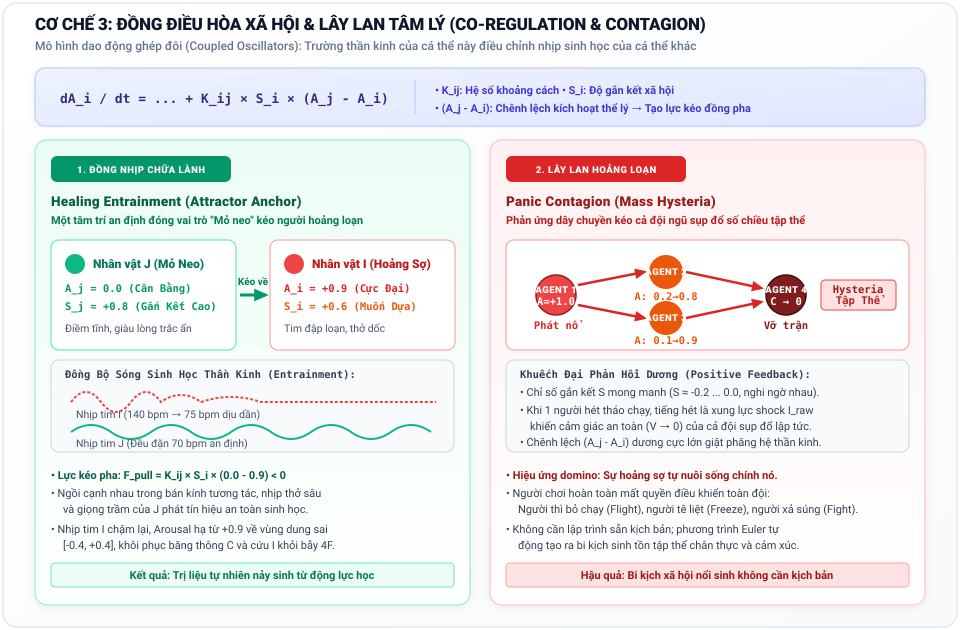
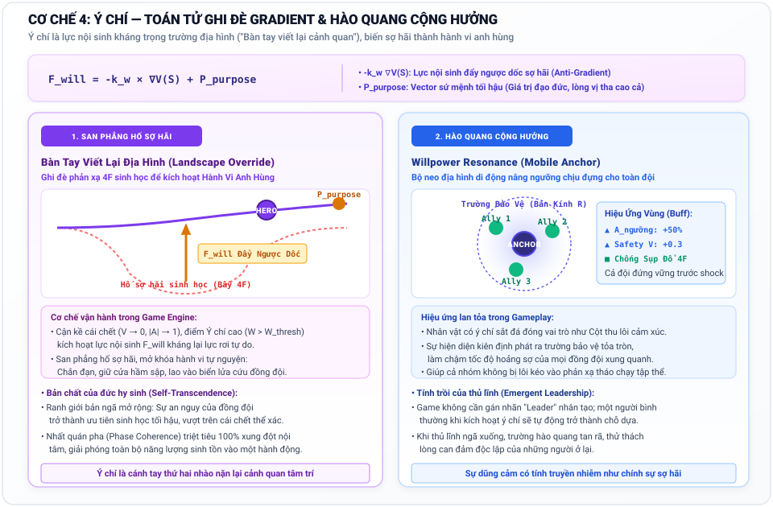
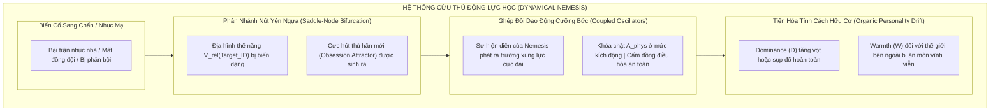
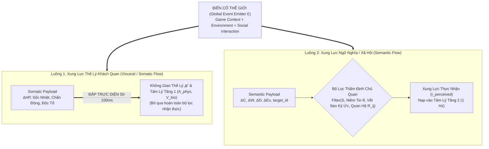
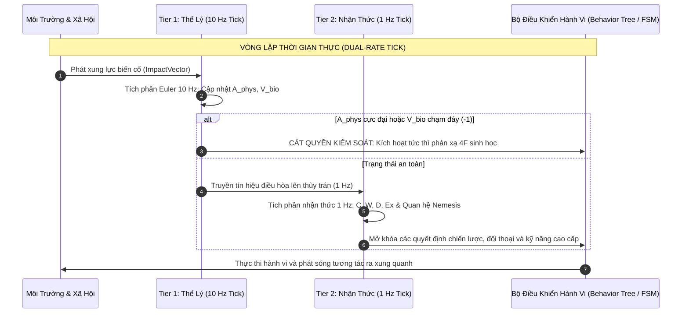

# Tài Liệu Ý Tưởng Thiết Kế: Trò Chơi Mô Phỏng Tâm Lý Nổi Sinh (Psychological Emergence Game)

> **Current correction guidance (2026-10-04):** This document contains historical proposals, analogies or design expectations. Read the [project correction register](docs/superpowers/specs/2026-10-04-project-correction-register.md) before treating equations, biological mappings, dimensional independence, performance or acceptance claims as established results.

---

## 1. Tầm Nhìn & Định Vị Trò Chơi (Game Vision)

* **Tên mã dự án (Codename):** *Project Anima / Phức Hợp Tâm Lý (Psyche Complex)*
* **Thể loại:** Mô phỏng sinh tồn tâm lý / Nhập vai quản lý xã hội (Psychological Survival & Social Emergence Simulation).
* **Cảm hứng & Định vị:**
  * *RimWorld & Frostpunk:* Nơi con người phải chống chọi với nghịch cảnh khắc nghiệt, nhưng trọng tâm không nằm ở quản lý tài nguyên vật chất mà ở **động lực học nội tâm con người**.
  * *Disco Elysium:* Chiều sâu nhận thức và các giọng nói nội tâm, nhưng thay vì các đoạn hội thoại rẽ nhánh định sẵn (hardcoded trees), hành vi và tâm trí nhân vật được **sinh ra liên tục từ một hệ thống động lực học phi tuyến thời gian thực**.
  * *Middle-earth: Shadow of Mordor (Nemesis System):* Mối quan hệ thù hận, ân oán và sự biến đổi của kẻ thù không còn dựa trên các cờ boolean cứng nhắc (hardcoded flags), mà được vận hành bằng **sự phân nhánh nút yên ngựa (saddle-node bifurcation)** và **tiến hóa tính cách hữu cơ (organic personality drift)**.
* **Tuyên ngôn thiết kế:** **Nói không với "Thanh Sanity" 1-chiều ngô nghê.** Trong trò chơi này, tâm lý nhân vật không bao giờ "hóa điên ngẫu nhiên" do tung xúc xắc, mà vận động như một dòng chảy tự nhiên, có quán tính, có vết sẹo ký ức, và tự động sản sinh ra những bi kịch cũng như sự chữa lành cảm động thông qua **Tính Trồi (Emergence)**.

---

---

## 2. Kiến Trúc Tổng Thể: Hệ Thống 6 Không Gian Logic Hợp Nhất (The Master 6-Space Architecture)

Theo Nghị quyết phê chuẩn chính thức của **Giám đốc Dự án** (Biên bản Hội đồng Khoa học ngày 28/09/2026), *Project Anima* nâng cấp toàn diện từ mô hình động lực học cá nhân thành **Hệ Thống 6 Không Gian Logic Hợp Nhất**. Hệ thống phân định rạch ròi giữa Thực tại Ngoại cảnh, Phần cứng Sinh học, Động lực học Tâm lý, Định hướng Giá trị, Liên mạng Xã hội và Quyền năng Ý chí Siêu việt:

```mermaid
graph TD
    subgraph S1_GLOBAL["1. KHÔNG GIAN SỰ KIỆN TOÀN CỤC (Event Space Ɛ - Ngoại cảnh Khách quan)"]
        EV_PHYS["Xung lực Thể lý Khách quan (Bom đạn, Khí hậu, Va đập, Độc tố)"]
        EV_SEMA["Xung lực Ngữ nghĩa / Xã hội (Lời nói, Bối cảnh, Mất mát, Quy tắc)"]
    end

    subgraph S0_META["0. CHIỀU Ý CHÍ SIÊU CẤP (Meta-Volitional Dimension 𝒲 - Siêu Nhận thức)"]
        WILL["Ý Chí Tự Vượt Ngưỡng & Ý Nghĩa Hiện Sinh (Will to Meaning / Agency)<br/>TOÁN TỬ BIẾN DẠNG ĐA TÔ-PÔ CẤP 2 (Reality Distortion Operator)"]
    end

    subgraph S2_SOMATIC["2. KHÔNG GIAN THỂ LÝ NỘI MÔI (Somatic Space ℋ - Phần cứng Sinh học)"]
        SOM_VARS["Glucose, Nước, Thân nhiệt, Độ nát mô (HP), Độc tố, Mệt mỏi<br/>(Nhiệt động lực học & Trao đổi chất bên trong Màng chắn Markov)"]
    end

    subgraph S3_PSYCH["3. ĐA TẠP KHÔNG GIAN TÂM LÝ HAI TẦNG (Psychological Space ℳ - Phần mềm Điều phối)"]
        T1["Tầng 1 (10 Hz): Thụ cảm Bản năng & Tự chủ (A_phys, V_bio)"]
        T2["Tầng 2 (1 Hz): Nhận thức & Khí chất Xã hội (C, W, D, Ex)"]
        T1 <--> T2
    end

    subgraph S4_BELIEF["4. KHÔNG GIAN GIÁ TRỊ & NIỀM TIN (Belief Space ℘ - La bàn Hiện sinh)"]
        BELIEF_VARS["Tiền nghiệm Đạo đức (Haidt), Ý thức hệ, Đức tin, Lẽ sống<br/>(Tham số cảnh quan θ định hình hàm thế năng V(S; θ))"]
    end

    subgraph S5_RELATION["5. KHÔNG GIAN QUAN HỆ ĐỒ THỊ (Relational Space ℛ - Cấu trúc Xã hội)"]
        REL_GRAPH["Ma trận Cặp Đôi (Affinity, Trust, Power, Debt, Nemesis)<br/>(Cấu trúc tô-pô ghép cặp giữa các agent - O(N^2))"]
    end

    %% Dòng chảy tác động ngoại cảnh
    EV_PHYS ==>|Tác động vật lý phá hủy trực tiếp| S2_SOMATIC
    EV_PHYS -.->|Xung kích tức thì 50-100ms| T1
    EV_SEMA ==>|Lọc qua Bộ lọc Thẩm định| T2

    %% Thụ cảm thể lý lên tâm lý
    S2_SOMATIC ==>|Tín hiệu Thần kinh Nội thụ (Interoception)| T1

    %% La bàn niềm tin uốn nắn tâm lý
    S4_BELIEF ==>|Định hình Độ dốc Địa hình & Hố Hút| T2

    %% Quan hệ xã hội ghép cặp
    S5_RELATION <==>|Ghép nối dao động cảm xúc liên cá nhân| T2

    %% QUYỀN NĂNG BÓP MÉO TỐI CAO CỦA Ý CHÍ (META-WARPING)
    WILL ==>|BÓP MÉO: San phẳng hố sợ hãi/trauma| S3_PSYCH
    WILL ==>|BÓP MÉO: Khóa van thụ cảm đau & Vắt kiệt cơ thể| S2_SOMATIC
    WILL ==>|BÓP MÉO: Đập vỡ định kiến & Tái sinh nhân cách| S4_BELIEF
    WILL ==>|BÓP MÉO: Chuyển hóa tử thù thành đồng minh| S5_RELATION
```

### Bảng Quy Chuẩn 6 Không Gian Logic của Project Anima:

| Thứ tự | Tên Không Gian | Cương Vị Bản Thể Học | Cấu Trúc / Tọa Độ Cốt Lõi | Chu Kỳ Cập Nhật ($\Delta t$) | Vai Trò Trong Game Loop |
| :---: | :--- | :--- | :--- | :--- | :--- |
| **0** | **Ý Chí Siêu Cấp ($\mathcal{W}$)** | **Toán tử Biến dạng Cấp 2** (Meta-Operator) | Biên độ $\mathcal{W} \in [0, 1]$ + Vector ý hướng $\vec{\Phi}_{\text{intent}}$ | Bộc phát theo sự kiện | Ghi đè thực tại, san phẳng hố sợ hãi/trauma, đè bẹp cơn đau và thù hận vì đại nghĩa. |
| **1** | **Sự Kiện Toàn Cục ($\mathcal{E}$)** | **Động lực Ngoại sinh** (Exogenous World) | $\vec{I}_{\text{visceral}} \oplus \vec{I}_{\text{semantic}} \oplus \text{Rules}$ | Theo diễn biến game | Phát xung lực hai luồng: đập trực diện Tầng 1/Somatic và lọc qua Tầng 2. |
| **2** | **Thể Lý Nội Môi ($\mathcal{H}$)** | **Phần cứng Sinh học** (Biological Hardware) | $\vec{H} = (\text{Energy}, \text{Hydration}, \text{HP}, \text{Temp} \dots)$ | Nhanh ($10\text{ Hz}$) | Duy trì cân bằng sinh hóa, phát tín hiệu nội thụ (interoception) lên tâm lý. |
| **3** | **Đa Tạp Tâm Lý ($\mathcal{M}$)** | **Không gian Pha Sinh-Tâm lý** (Psychological Phase Space) | $\vec{S} = (A_{\text{phys}}, V_{\text{bio}} \mid C, W, D, E_x)$ | Phân tầng ($10\text{ Hz}$ và $1\text{ Hz}$) | Trung tâm điều hòa cảm xúc, quyết định hành vi sinh tồn tức thời (4F) và kế hoạch. |
| **4** | **Giá Trị & Niềm Tin ($\mathcal{P}$)** | **Tham số Cảnh quan** (Landscape Parameters) | $\vec{\theta} = (\text{Care}, \text{Hierarchy}, \text{Loyalty} \dots)$ | Cực chậm ($\tau \sim \text{tháng/năm}$) | Uốn nắn bề mặt thế năng $V(\vec{S}; \boldsymbol{\theta})$, quyết định ý nghĩa cuộc sống và hố hút mục đích. |
| **5** | **Quan Hệ Đồ Thị ($\mathcal{R}$)** | **Tô-pô Liên Mạng Xã Hội** (Distributed Social Graph) | $\mathbf{R}_{ij} = (\text{Affinity}, \text{Trust}, \text{Power}, \text{Nemesis})$ | Theo nhịp tương tác ($O(N^2)$) | Ràng buộc liên cá nhân, vận hành cừu thù (Nemesis) và đồng điều hòa bầy đàn. |

---

### 2.1. Chi Tiết Đa Tạp Không Gian Tâm Lý Hai Tầng (Psychological State Space $\mathcal{M}$)

Cốt lõi điều phối cảm xúc của tác tử vận hành trên **Đa Tạp Phân Thớ Hai Tầng (Fiber Bundle $\mathcal{E} \xrightarrow{\pi} \mathcal{B}$)**, tách biệt hai thang thời gian để tối ưu hiệu năng:

$$\vec{S}(t) = \Big( \underbrace{A_{\text{phys}}, V_{\text{bio}}}_{\text{Tier 1: Base Space } \mathcal{B} \text{ (10 Hz)}} \;\Big|\; \underbrace{C, W, D, E_x}_{\text{Tier 2: Fiber Space } \mathcal{F} \text{ (1 Hz)}} \Big)$$

#### Tầng 1: Lõi Thể Lý & Thần Kinh Tự Chủ (Tier 1 - Base Space $\mathcal{B}$, Tần số nhanh $10\text{ Hz}$)
1. **$A_{\text{phys}}$ - Physiological Arousal ($[0.0, 1.0]$):** 
   * Mức năng lượng và độ kích hoạt thần kinh tự chủ (nhịp tim, huyết áp, adrenaline).
   * $\approx 0.0$: Tê liệt/ngủ say/suy sụp; $\approx 0.5$: Trạng thái sẵn sàng cân bằng; $\approx 1.0$: Kích động cực đại.
2. **$V_{\text{bio}}$ - Neuroception / Biological Valence ($[-1.0, +1.0]$):**
   * Đánh giá an toàn vô thức của hệ thần kinh (Porges Polyvagal Theory).
   * $+1.0$: Che chở, an toàn tuyệt đối; $-1.0$: Mối đe dọa sinh tử cận kề, báo động đỏ.

#### Tầng 2: Không Gian Nhận Thức & Tương Tác Xã Hội (Tier 2 - Fiber Space $\mathcal{F}$, Tần số chậm $1\text{ Hz}$)
3. **$C$ - Cognitive Clarity & Frontal Bandwidth ($[0.0, 1.0]$):**
   * Dung lượng bộ nhớ làm việc của vỏ não trước trán (DLPFC). Quyết định năng lực kiềm chế xung động, tư duy chiến lược và thực thi kế hoạch dài hạn.
4. **$W$ - Social Warmth / Affiliation ($[-1.0, +1.0]$):**
   * Trục Ngang của Vòng tròn Tương tác Xã hội (Interpersonal Circumplex).
   * $+1.0$: Đồng cảm, vị tha, gắn kết bầy đàn; $-1.0$: Lạnh lùng, thù địch, Machiavellian.
5. **$D$ - Interpersonal Dominance / Agency ($[-1.0, +1.0]$):**
   * Trục Dọc của Vòng tròn Tương tác Xã hội.
   * $+1.0$: Thống trị, chỉ huy, quyết đoán, kiểm soát; $-1.0$: Phục tùng, co cụm, nhún nhường, phụ thuộc.
6. **$E_x$ - Epistemic Drive / Exploration ($[0.0, 1.0]$):**
   * Động lực tò mò nhận thức và săn tìm phần thưởng mới (Dopaminergic Seeking System). Thúc đẩy nghiên cứu, khám phá và sáng tạo.

---

### 2.2. Chi Tiết 5 Không Gian Vệ Tinh & Siêu Cấp

1. **Chiều Ý Chí Siêu Cấp ($\mathcal{W}$):** 
   * Không phải tài nguyên thụ động của trục $C$, mà là **Toán tử Biến dạng Cấp 2** ($\hat{\mathcal{W}}$).
   * Được hỗ trợ bởi trung tâm tính bất khuất của não bộ (aMCC - anterior Mid-Cingulate Cortex). Có khả năng can thiệp trực tiếp bóp méo thế năng tâm lý $V_{\text{warped}} = V(\vec{S}) - \mathcal{W} \cdot \vec{\Phi}_{\text{intent}}$, san phẳng hố sợ hãi/trauma và khóa van cảm giác đau thể lý để hoàn thành mục đích tối thượng.
2. **Không Gian Sự Kiện Toàn Cục ($\mathcal{E}$):**
   * Bao trùm toàn bộ thế giới game (Context + Rules + Environment).
   * Phát sinh hai luồng dữ liệu độc lập: **Luồng Thể lý Khách quan** (sát thương, nhiệt độ, chấn động $\to$ đập thẳng vào Thể lý $\mathcal{H}$ và Tâm lý Tầng 1) và **Luồng Ngữ nghĩa** (đối thoại, đạo đức, phe phái $\to$ lọc qua Thẩm định chủ quan vào Tâm lý Tầng 2).
3. **Không Gian Thể Lý Nội Môi ($\mathcal{H}$):**
   * Phần cứng cơ sinh học bên trong Màng chắn Markov của nhân vật: $\vec{H} = (\text{Energy}, \text{Hydration}, \text{Temp}, \text{TissueIntegrity/HP}, \text{Toxin}, \text{Fatigue})$.
   * Hoạt động theo quy luật chuyển hóa nhiệt động lực học; độc lập với nhận thức chủ quan và liên tục truyền tín hiệu thần kinh nội thụ (interoception) lên Tầng 1.
4. **Không Gian Giá Trị & Niềm Tin ($\mathcal{P}$):**
   * Vector tiền nghiệm đạo đức và nhân sinh quan $\vec{\theta}$ (dựa trên Thuyết Nền tảng Đạo đức của Jonathan Haidt & Thought Cabinet của Disco Elysium).
   * Đóng vai trò là **Không gian Tham số Cảnh quan**, định hình vị trí các hố hút mục đích sống trên bề mặt thế năng $V(\vec{S}; \boldsymbol{\theta})$.
5. **Không Gian Quan Hệ Đồ Thị Liên Cá Nhân ($\mathcal{R}$):**
   * Đồ thị có hướng đa tác tử mang vector thuộc tính cạnh $\mathbf{R}_{ij} = (\text{Affinity}, \text{Trust}, \text{PowerDynamic}, \text{Debt}, \text{NemesisAttractor})$.
   * Điều hòa sự gắn kết xã hội, hiệu ứng bầy đàn và chi phối toàn bộ cơ chế Cừu Thù Động Lực Học (Dynamical Nemesis).

---

### 2.3. Ánh Xạ Toàn Diện Mô Hình 5 Nhóm Tính Cách Big Five (OCEAN Mapping)

Không cần tạo thêm 5 thanh thuộc tính tĩnh, tính cách Big Five tự nhiên **trồi sinh** từ các tham số cấu trúc của Đa tạp Tâm lý và Cảnh quan Niềm tin:

| Chiều Tính Cách (Big Five) | Ánh Xạ Vào Kiến Trúc (*Project Anima*) | Cơ Chế Động Lực Học Trong Game |
| :--- | :--- | :--- |
| **Neuroticism (N - Tâm lý bất ổn)** | Độ nhạy cảm và độ dốc của Tầng 1 ($A_{\text{phys}}, V_{\text{bio}}$) | Điểm cân bằng $V_{\text{bio}}$ thấp; ngưỡng hoảng loạn nhỏ; hệ số khuếch đại xung lực tiêu cực cao. |
| **Extraversion (E - Hướng ngoại)** | Tổ hợp Dominance ($D$), Exploration ($E_x$) và Warmth ($W$) | $D > 0, E_x > 0$: Chủ động kết nối, nói to, ưa thích đám đông và săn tìm kích thích môi trường. |
| **Openness to Experience (O - Cởi mở)** | Trục Exploration ($E_x$) tại Tầng 2 + Hệ số Niềm tin $\theta$ | $E_x$ kháng suy giảm; ưu tiên các hành động học hỏi, sáng tạo, giải mã công nghệ lạ. |
| **Agreeableness (A - Dễ chịu / Hòa đồng)** | Trục Social Warmth ($W$) khi $V_{\text{bio}} > 0$ + Trọng số $\mathbf{R}_{ij}$ | $W \to +1$: Dễ tha thứ, sẵn sàng chia sẻ thức ăn, nhường quyền kiểm soát ($D \approx 0$). |
| **Conscientiousness (C - Tận tâm)** | Trục Clarity ($C$) + Cường độ Ý chí $\mathcal{W}$ | Duy trì $C$ bền bỉ trước mệt mỏi; khả năng huy động $\mathcal{W}$ cao; kỷ luật và kiên định mục tiêu. |

---

## 3. Các Quy Luật Động Lực Học Tạo Nên "Tính Trồi" (Gameplay Mechanics)

### 3.1. Cơ Chế 1: Sự Sụp Đổ Số Chiều Cấp Bậc (Hierarchical Dimensionality Collapse)
* **Quy luật chi phối hình học:** Tầng 1 là nền móng của Tầng 2. Khi hệ thần kinh đối mặt nguy cơ sinh tử, não bộ tự động tắt các tiến trình nhận thức bậc cao tốn năng lượng để ưu tiên phản xạ sinh tồn nguyên thủy:
  $$C(t) = C_{\text{base}} \times \max\left(0, 1 - \left(\frac{A_{\text{phys}}(t)}{A_{\text{threshold}}}\right)^2\right) \times \left(\frac{V_{\text{bio}}(t) + 1}{2}\right)$$
* **Tác động trực tiếp lên Gameplay:**
  * Khi hoảng loạn cực độ ($A_{\text{phys}} \to 1$) hoặc cảm giác cận kề cái chết ($V_{\text{bio}} \to -1$), băng thông thùy trán $C(t) \to 0$.
  * Toàn bộ không gian 4 chiều của Tầng 2 **sụp đổ hình học**. Người chơi mất quyền kiểm soát nhân vật (Loss of Player Agency). Mọi menu lệnh phức tạp (chế tạo, ngoại giao, nghiên cứu) biến mất.
  * Nhân vật bị khóa chặt vào **Hệ Tọa Độ 4 Phản Xạ Sinh Tồn Nguyên Thủy (4F System)** được định vị bởi tọa độ bản năng:
    * **Fight ($A_{\text{phys}} \to 1, V_{\text{bio}} \to -1, D > 0$):** Tấn công điên cuồng bất kỳ sinh vật nào trong tầm mắt, bất chấp chênh lệch lực lượng.
    * **Flight ($A_{\text{phys}} \to 1, V_{\text{bio}} \to -1, D < 0, W \le 0$):** Bỏ chạy bạt mạng, vứt bỏ vũ khí, giẫm đạp lên đồng đội để thoát thân.
    * **Freeze ($A_{\text{phys}} \to 0, V_{\text{bio}} \to -1, D < 0$):** Tê liệt thần kinh phế vị lưng, ngồi bệt co ro, mất tri giác với ngoại cảnh.
    * **Fawn ($A_{\text{phys}} \to 1, V_{\text{bio}} \to -1, D \to -1, W > 0$):** Hạ mình van lạy, lấy lòng kẻ địch hoặc kẻ cầm đầu để cầu xin sự sống.


*Hình 1: Mô hình sụp đổ không gian trạng thái từ Hai Tầng về 4 góc phản xạ sinh tồn (Fight, Flight, Freeze, Fawn) khi băng thông nhận thức $C(t) \to 0$.*

---

### 3.2. Cơ Chế 2: Bẫy Sang Chấn & Vết Sẹo Ký Ức (Trauma Basins & Hysteresis)
* Khi một nhân vật trải qua biến cố cực đoan ($V_{\text{bio}} \approx -1$ và $A_{\text{phys}} \approx 1$ kéo dài), địa hình thế năng tâm lý của nhân vật bị **biến dạng dẻo vĩnh viễn**: Một **Hố Sang Chấn (Trauma Basin)** được khắc sâu, gắn liền với một nhãn kích hoạt (`Trigger_Tag`, ví dụ: *Darkness, Fire, Betrayal, Sound_Explosion*).
* **Hiện tượng Trễ Bất Đối Xứng (Asymmetric Hysteresis):**
  * Trong điều kiện bình thường, nhân vật vẫn có thể sinh hoạt và giao tiếp ở trạng thái giả lập ổn định.
  * Nhưng khi xuất hiện kích thích mang nhãn chấn thương, hệ thần kinh trượt rơi tự do xuống đáy hố sang chấn ở chu kỳ siêu tốc ($10\text{ Hz}$, chỉ sau $0.2 - 0.5\text{s}$).
  * Khi mối đe dọa biến mất, nhân vật **không thể tự leo ra khỏi hố** vì rào cản thế năng thoát hố $\Delta E_{\text{escape}} \gg \Delta E_{\text{fall}}$. Họ sẽ rơi vào vòng lặp ám ảnh cưỡng bức hoặc tê liệt kéo dài nếu không có sự can thiệp từ bên ngoài.


*Hình 2: Mặt cắt địa hình thế năng mô tả sự bất đối xứng Hysteresis: trượt dốc vào hố sang chấn tức thì ($\Delta E_{\text{fall}}$), nhưng leo thoát ra ngoài đòi hỏi năng lượng vượt rào $\Delta E_{\text{escape}} \gg \Delta E_{\text{fall}}$.*

---

### 3.3. Cơ Chế 3: Đồng Điều Hòa Xã Hội & Lây Lan Hoảng Loạn (Social Co-Regulation & Contagion)
* Con người là sinh vật xã hội có hệ thần kinh mở. Khi hai nhân vật $i$ và $j$ ở gần nhau trong không gian tương tác:
  $$\frac{dA_{\text{phys}, i}}{dt} = \dots + K_{ij} \cdot W_i \cdot W_j \cdot (A_{\text{phys}, j} - A_{\text{phys}, i})$$
* **Hai mặt của tính trồi xã hội:**
  * **Đồng nhịp Chữa Lành (Healing Entrainment):** Một nhân vật đang kích động ($A_{\text{phys}, i} = 0.9$) nếu được ở cạnh một nhân vật kiên định, ấm áp ($A_{\text{phys}, j} = 0.2, W_j = +0.8$) sẽ dần được kéo nhịp thở và nhịp tim về vùng cân bằng.
  * **Lây Lan Hoảng Loạn (Panic Contagion):** Nếu một nhóm sinh tồn có chỉ số $W$ yếu ớt và thiếu nhân vật có $D > 0$ dẫn dắt, phản xạ Flight của một thành viên sẽ trở thành lực kích động ngoại vi, kéo sụp đổ cả đội hình theo hiệu ứng domino (Mass Hysteria).


*Hình 3: Động lực học ghép đôi dao động thần kinh xã hội: So sánh giữa Đồng nhịp chữa lành (Healing Entrainment) và Phản ứng dây chuyền lây lan hoảng loạn (Panic Contagion).*

---

### 3.4. Cơ Chế 4: Ý Chí — "Bàn Tay Viết Lại Địa Hình" & Toán Tử Biến Dạng Đa Không Gian (Reality Distortion Operator $\hat{\mathcal{W}}$)

Ý chí trong *Project Anima* không phải là một thanh mana thụ động hay tài nguyên sinh lý học tầm thường gắn với trục $C$. Ý chí chính thức được định danh là **Toán Tử Biến Dạng Đa Không Gian Cấp 2 (Second-Order Meta-Deformation Operator $\hat{\mathcal{W}}$)** — hiện thân cho "Bàn tay viết lại địa hình":

* **Công thức Biến dạng Thế năng Tâm lý:**
  Khi một nhân vật bộc phát Ý chí vì Mục Đích Hiện Sinh Tối Thượng ($\vec{\Phi}_{\text{intent}}$ thuộc Không gian Niềm tin $\mathcal{P}$):
  $$V_{\text{warped}}(\vec{S}) = V(\vec{S}) - \mathcal{W} \cdot \vec{\Phi}_{\text{intent}}$$
* **Quyền Năng Bóp Méo Đa Không Gian (Cross-Space Warping):**
  1. **San phẳng Hố Sợ hãi / Trauma trên Đa tạp Tâm lý ($\mathcal{M}$):**
     * Độ dốc của hố hoảng loạn sinh học tại $V_{\text{bio}} \to -1$ bị triệt tiêu hoàn toàn ($\Delta E_{\text{fear}} \to 0$).
     * Nhân vật bước qua lửa đạn, lao vào cứu đồng đội hoặc đối mặt với tử địch từng gây PTSD mà không bị rơi vào trạng thái sụp đổ số chiều 4F.
  2. **Khóa Van Thụ Cảm Đau trên Không gian Thể lý ($\mathcal{H}$):**
     * Trung tâm ý chí sống não bộ (aMCC) bắn xung ức chế GABAergic bịt miệng hạch hạnh nhân và khóa cảm giác đau đớn (nociception gating).
     * Cơ thể được cưỡng bức giải phóng năng lượng trao đổi chất dự trữ cuối cùng từ mô sâu ngay cả khi gan đã cạn kiệt glycogen.
  3. **Đập tan Thù hận Cá nhân trên Không gian Quan hệ ($\mathcal{R}$):**
     * Nhân vật tạm thời phong tỏa cực hút thù địch $\text{NemesisAttractor}$ để hợp tác với kẻ thù truyền kiếp vì lý tưởng chung tối thượng (Sự tha thứ siêu việt).
  4. **Tái Cấu Trúc Định Kiến trên Không gian Niềm tin ($\mathcal{P}$):**
     * Tự phản tỉnh siêu nhận thức, đập vỡ giáo điều cố hữu để đón nhận chân lý mới (Tự vượt ngưỡng bản thân - Self-Overcoming).
* **Cơ Chế Gameplay Signature (Willpower Awakening):**
  * Khi $\mathcal{W} > \theta_{\text{transcendent}}$, trò chơi kích hoạt hiệu ứng đặc trưng: Thế giới xung quanh chuyển sang chế độ cô đọng thời gian (bullet time), tạp âm lắng xuống chỉ còn tiếng đập của tâm thức, màn hình chuyển sang vệt sáng đơn sắc hướng thẳng về mục tiêu.
  * Sau khi hoàn thành hành động phi thường, nhân vật rơi vào trạng thái **Kiệt Quệ Siêu Nhận Thức (Metacognitive Crash)**, đòi hỏi thời gian nghỉ ngơi và đồng điều hòa xã hội sâu sắc để phục hồi.


*Hình 4: Toán tử Ý chí bóp méo địa hình thế năng sinh học ($\hat{\mathcal{W}}$), san phẳng các hố sợ hãi và lan tỏa trường ổn định nâng đỡ đồng đội xung quanh.*

---

### 3.5. Cơ Chế 5: Hệ Thống Cừu Thù Động Lực Học (Dynamical Nemesis System)

Khác biệt hoàn toàn với hệ thống Nemesis bằng bảng cờ trạng thái (state flags) của *Shadow of Mordor*, *Project Anima* mô phỏng mối quan hệ thù hận bằng **Động Lực Học Phi Tuyến & Lý Thuyết Phân Nhánh (Bifurcation Theory)**:



1. **Phân Nhánh Nút Yên Ngựa (Saddle-Node Bifurcation Sinh Cực Hút Cừu Thù):**
   * Khi NPC hoặc người chơi gây ra một tổn thương vượt ngưỡng chịu đựng cho đối phương ($V_{\text{bio}} \to -1, \text{Loss} > \theta$), hàm thế năng quan hệ $U(\vec{S}_{\text{rel}})$ trải qua một bước phân nhánh cấu trúc.
   * Một giếng thế năng mới xuất hiện: **Cực hút Ám ảnh Thù hận (Nemesis Attractor)**. Kẻ gây họa trở thành tâm điểm của mọi suy nghĩ và động cơ của nạn nhân.
2. **Ghép Đôi Dao Động Cưỡng Bức (Resonant Hostility Coupling):**
   * Khi đối mặt với Nemesis của mình, hệ thần kinh của nhân vật không thể rơi vào trạng thái an toàn ($V_{\text{bio}}$ bị khóa cứng ở mức cảnh giác cao độ).
   * Khoảng cách vật lý với Nemesis hoạt động như một máy phát dao động cưỡng bức, đẩy $A_{\text{phys}}$ lên đỉnh điểm ngay khi nghe thấy giọng nói hoặc nhìn thấy cờ hiệu của đối thủ.
3. **Tiến Hóa Tính Cách Hữu Cơ (Organic Personality Drift):**
   * Mối quan hệ thù địch kéo dài sẽ tái cấu trúc dần dần bộ thông số Big Five của nhân vật:
     * Trục Dominance ($D$) phân hóa mạnh: hoặc trở nên tàn bạo, hiếu chiến ($D \to +1$) để phục thù; hoặc gãy vụn lòng tự tôn ($D \to -1$) biến thành nô lệ sợ hãi.
     * Trục Warmth ($W$) suy giảm trầm trọng, khiến nhân vật trở nên hoài nghi và cay nghiệt với tất cả những người xung quanh.

---

## 4. Tầng Giao Tiếp Thế Giới: Không Gian Sự Kiện Toàn Cục & Hai Luồng Xung Lực (Event Pipeline)

Không Gian Sự Kiện Toàn Cục ($\mathcal{E}$) bao trùm toàn bộ thế giới game (Context + Rules), chuyển hóa các tương tác vật lý và xã hội thành hai luồng xung lực chuyên biệt:



### 4.1. Cấu Trúc Xung Lực Sự Kiện Toàn Cục (`EventPayload`)

```python
from dataclasses import dataclass
from typing import Optional

@dataclass
class SomaticPayload:
    """Luồng thể lý: Đập thẳng vào Somatic Space H và Tâm lý Tầng 1 (10 Hz)"""
    delta_tissue_damage: float = 0.0  # Tổn thương mô cơ học (mất máu, rách da, gãy xương) [-1.0, 0.0]
    delta_temperature: float = 0.0    # Sốc nhiệt (lửa thiêu, đóng băng)
    delta_toxin: float = 0.0          # Nhiễm độc, ngạt khói [0.0, 1.0]
    delta_A_shock: float = 0.0        # Xung kích động adrenaline trực tiếp [0.0, 1.0]

@dataclass
class SemanticPayload:
    """Luồng nhận thức: Lọc qua Subjective Appraisal Filter vào Tầng 2 (1 Hz)"""
    delta_C: float = 0.0              # Tác động băng thông nhận thức [-1.0, +1.0]
    delta_W: float = 0.0              # Biến động gắn kết xã hội [-1.0, +1.0]
    delta_D: float = 0.0              # Khẳng định vs hạ thấp vị thế quyền lực [-1.0, +1.0]
    delta_Ex: float = 0.0             # Kích thích tò mò vs gây nản chí [-1.0, +1.0]
    target_id: Optional[str] = None   # Đối tượng phát sinh tương tác (Nemesis/Đồng minh)
```

#### Một số ví dụ xung lực thực tế:
* **Sự cố công trình sập đè chết đồng đội:**
  * $\vec{I}_{\text{raw}} = (\Delta A_{\text{phys}} = +0.8, \Delta V_{\text{bio}} = -0.9 \;\big|\; \Delta C = -0.5, \Delta W = +0.2, \Delta D = -0.6, \Delta E_x = -0.7)$
* **Lời nói xoa dịu từ người thủ lĩnh uy tín:**
  * $\vec{I}_{\text{raw}} = (\Delta A_{\text{phys}} = -0.4, \Delta V_{\text{bio}} = +0.6 \;\big|\; \Delta C = +0.3, \Delta W = +0.5, \Delta D = +0.2, \Delta E_x = +0.1)$
* **Lời lăng mạ làm nhục trước đám đông của kẻ thù:**
  * $\vec{I}_{\text{raw}} = (\Delta A_{\text{phys}} = +0.5, \Delta V_{\text{bio}} = -0.4 \;\big|\; \Delta C = -0.3, \Delta W = -0.6, \Delta D = -0.8, \Delta E_x = 0.0)$

### 4.2. Bộ Lọc Nhận Thức Chủ Quan (Subjective Appraisal Filter)

Cùng một sự kiện, mỗi cá nhân sẽ tiếp nhận với một cường độ hoàn toàn khác nhau tùy thuộc vào tọa độ hiện tại và vết sẹo quá khứ:

$$\vec{I}_{\text{perceived}} = \mathbf{M}_{\text{filter}}(\vec{S}, \text{Trauma\_Scars}, \text{Nemesis\_Weights}) \times \vec{I}_{\text{raw}}$$

* **Nếu câu nói chạm đúng Hố Sang Chấn:** Bộ lọc khuếch đại xung lực lên $300\% - 500\%$, đẩy hệ thần kinh rơi thẳng vào cơn hoảng loạn.
* **Nếu nhân vật có Tâm lý Ổn định cao ($N$ thấp, $C$ cao):** Bộ lọc đóng vai trò giảm chấn (damper), triệt tiêu tới $80\%$ chấn động từ các lời lăng mạ thông thường.

---

## 5. Vòng Lặp Trò Chơi Đa Tần Số (Dual-Rate Core Game Loop)

Hệ thống mô phỏng vận hành ở **hai tần số lấy mẫu đồng bộ (Dual-Rate Simulation Tick)** để tối ưu hóa hiệu năng tính toán mà vẫn đảm bảo độ phản ứng chân thực của hệ thần kinh:



---

## 6. Những Câu Chuyện Nổi Sinh Điển Hình (Emergent Scenarios)

### Kịch bản 1: "Sự Biến Đổi Của Kẻ Thù Truyền Kiếp (The Nemesis Awakening)"
* **Bối cảnh:** Trong một trận càn quét tài nguyên, chỉ huy mỏ đá Goran bị nhóm của người chơi đánh bại và thiêu cháy nửa gương mặt, nhưng may mắn trốn thoát trong đường hầm.
* **Động lực học:** Biến cố cực đoan tạo nên một phân nhánh nút yên ngựa trên địa hình thế năng của Goran với mục tiêu nhắm thẳng vào người chơi (`Target_ID = Player`).
* **Tính trồi:** Goran không biến mất như NPC thông thường. Trục Dominance của hắn trượt vọt lên mức hung tàn ($D \to +0.95$), Warmth sụp đổ vĩnh viễn ($W \to -0.9$). Sau 10 chu kỳ ngày đêm, Goran tự động chiêu mộ một băng cướp tàn bạo, xuất hiện phục kích ngay tại tuyến vận chuyển của người chơi với những chiếc bẫy lửa được thiết kế để gây đúng nỗi sợ hãi mà hắn từng gánh chịu.

### Kịch bản 2: "Sự Tan Băng Của Trái Tim Bị Phản Bội"
* Nhân vật Elena từng trải qua bi kịch bị bạn thân đâm sau lưng trong hầm ngầm, mang vết sẹo sang chấn sâu đậm khiến trục Warmth của cô bị khóa cứng ở mức phòng vệ thù địch ($W = -0.8, D = +0.5$).
* Khi một thành viên mới trong trại là Lucas liên tục chia sẻ thức ăn và chăm sóc y tế cho Elena trong nhiều ngày mà không đòi hỏi bất kỳ sự báo đáp nào:
  * Mỗi hành động tử tế gửi đến vector có $\Delta W > 0, \Delta V_{\text{bio}} > 0$.
  * Ban đầu, bộ lọc nhận thức của Elena nghi ngờ đây là cạm bẫy (khuếch đại cảnh giác).
  * Nhưng qua thời gian, sự đồng điệu nhịp thở và nhịp tim ổn định của Lucas ($A_{\text{phys}} = 0.2$) thông qua cơ chế đồng điều hòa xã hội đã làm mềm địa hình thế năng, từ từ lấp đầy hố nghi ngờ và mở khóa trở lại liên kết gắn bó chân thành.

---

## 7. Lộ Trình Hiện Thực Hóa Kỹ Thuật (Technical Roadmap)

1. **Giai đoạn 1: Engine Toán Học Hai Tầng (Standalone Core):**
   * Xây dựng module Python/C# mô phỏng hệ phương trình vi phân ngẫu nhiên (Langevin SDE) 6 biến với cơ chế lấy mẫu kép ($10\text{ Hz}$ cho Tier 1, $1\text{ Hz}$ cho Tier 2).
   * Kiểm thử tự động tính năng sụp đổ số chiều cấp bậc, hiện tượng trễ Hysteresis và phân nhánh tạo cực hút Nemesis.
2. **Giai đoạn 2: Prototype Sa Bàn 2D (Sandbox AI):**
   * Thiết kế môi trường mô phỏng 5 - 10 đặc vụ (agents) tương tác tự do trong căn cứ sinh tồn.
   * Tích hợp bảng ánh xạ Big Five và bộ lọc `SubjectiveAppraisalFilter`.
   * Kiểm chứng các hiện tượng xã hội nổi sinh: phân chia quyền lực tự nhiên, lây lan hoảng loạn tập thể và sự hình thành liên minh/cừu thù.
3. **Giai đoạn 3: Tích Hợp Game Engine (Unity / Godot 4):**
   * Đưa thư viện toán vào game engine thông qua C# Native Plugins hoặc GDExtension.
   * Đồng bộ hóa dữ liệu trạng thái tâm lý với hệ thống hoạt ảnh biểu cảm khuôn mặt, âm thanh tiếng thở/nhịp tim và giao diện thị giác động (vignette mờ tối, rung lắc camera khi sụp đổ nhận thức).

---

## 8. Kết Luận

Bằng việc nâng cấp lên **Kiến Trúc Hai Tầng (Two-Tier Emergence Engine)**, *Project Anima* đạt được sự cân bằng hoàn hảo giữa tính chân thực của khoa học thần kinh hiện đại và tính khả thi trong kỹ thuật lập trình game. Hệ thống mở ra một chân trời mới cho thể loại mô phỏng tâm lý: nơi mỗi nhân vật là một thực thể sống động có ký ức, có cá tính độc bản và có số phận được định hình bởi những quy luật tự nhiên sâu sắc.
