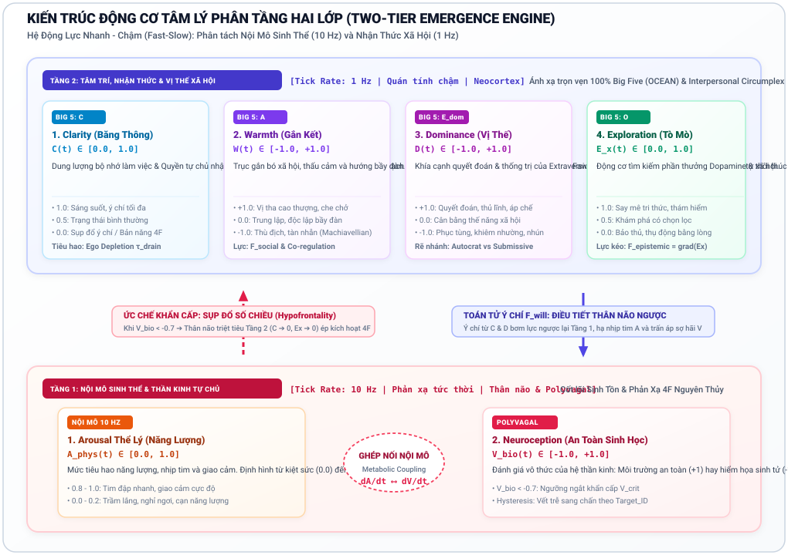
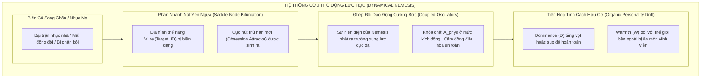
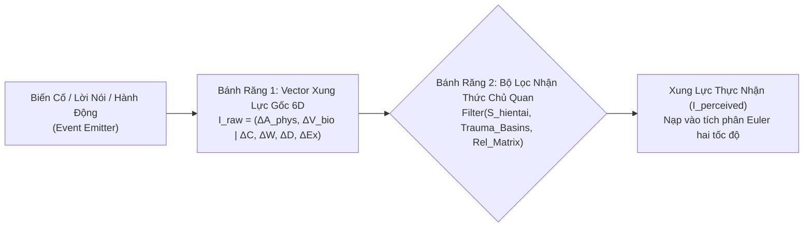
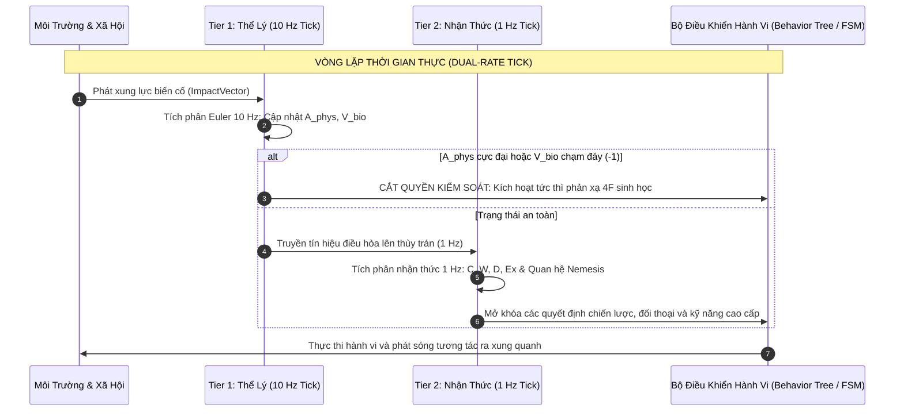

# Tài Liệu Ý Tưởng Thiết Kế: Trò Chơi Mô Phỏng Tâm Lý Nổi Sinh (Psychological Emergence Game)

---

## 1. Tầm Nhìn & Định Vị Trò Chơi (Game Vision)

* **Tên mã dự án (Codename):** *Project Anima / Phức Hợp Tâm Lý (Psyche Complex)*
* **Thể loại:** Mô phỏng sinh tồn tâm lý / Nhập vai quản lý xã hội (Psychological Survival & Social Emergence Simulation).
* **Cảm hứng & Định vị:**
  * *RimWorld & Frostpunk:* Nơi con người phải chống chọi với nghịch cảnh khắc nghiệt, nhưng trọng tâm không nằm ở quản lý tài nguyên vật chất mà ở **động lực học nội tâm con người**.
  * *Disco Elysium:* Chiều sâu nhận thức và các giọng nói nội tâm, nhưng thay vì các đoạn hội thoại rẽ nhánh định sẵn (hardcoded trees), hành vi và tâm trí nhân vật được **sinh ra liên tục từ một hệ thống động lực học phi tuyến thời gian thực**.
  * *Middle-earth: Shadow of Mordor (Nemesis System):* Mối quan hệ thù hận, ân oán và sự biến đổi của kẻ thù không còn dựa trên các cờ boolean cứng nhắc (hardcoded flags), mà được vận hành bằng **sự phân nhánh nút yên ngựa (saddle-node bifurcation)** và **tiến hóa tính cách hữu cơ (organic personality drift)**.
* **Tuyên ngôn thiết kế:** **Nói không với "Thanh Sanity" 1-chiều ngô nghê.** Trong trò chơi này, tâm lý nhân vật không bao giờ "hóa điên ngẫu nhiên" do tung xúc xắc, mà vận động như một dòng chảy tự nhiên, có quán tính, có vết sẹo ký ức, và tự động sản sinh ra những bi kịch cũng như sự chữa lành cảm động thông qua **Tính Trồi (Emergence)**.

---

## 2. Trọng Tâm Kiến Trúc: Động Cơ Hai Tầng Nổi Sinh (The Two-Tier Emergence Engine - Kế Hoạch B)

Khắc phục hạn chế của mô hình 4 trục phẳng cũ (thiếu tính xã hội đa chiều và không biểu đạt được trọn vẹn 5 nhóm tính cách Big Five), *Project Anima* chính thức vận hành trên **Kiến trúc Không gian Trạng thái Hai Tầng (Two-Tier State Space Engine)** theo nguyên lý Hình học Vi phân (Fiber Bundle $\mathcal{E} \xrightarrow{\pi} \mathcal{B}$):

$$\vec{S}(t) = \Big( \underbrace{A_{\text{phys}}, V_{\text{bio}}}_{\text{Tier 1: Base Space } \mathcal{B} \text{ (10 Hz)}} \;\Big|\; \underbrace{C, W, D, E_x}_{\text{Tier 2: Fiber Space } \mathcal{F} \text{ (1 Hz)}} \Big)$$

```mermaid
graph TD
    subgraph TIER1["TẦNG 1: KHÔNG GIAN CƠ SỞ THỂ LÝ & BẢN NĂNG (Base Space ℬ - Fast 10 Hz)"]
        A_phys["1. A_phys: Physiological Arousal [0, 1]<br/>(Kích hoạt thần kinh tự chủ / Nhịp tim / Adrenaline)"]
        V_bio["2. V_bio: Neuroception / Biological Valence [-1, +1]<br/>(Đánh giá vô thức an toàn vs sinh tử)"]
        A_phys <-->|Tương tác thần kinh tự chủ cấp tốc| V_bio
    end

    subgraph TIER2["TẦNG 2: KHÔNG GIAN THỚ NHẬN THỨC & XÃ HỘI (Fiber Space ℱ - Slow 1 Hz)"]
        C["3. Clarity (C) [0, 1]<br/>Băng thông thùy trán & Kìm hãm xung động"]
        W["4. Warmth (W) [-1, +1]<br/>Gắn kết xã hội / Đồng cảm vs Thù địch"]
        D["5. Dominance (D) [-1, +1]<br/>Khẳng định quyền lực vs Quy phục"]
        Ex["6. Exploration (Ex) [0, 1]<br/>Động lực tò mò / Khám phá tri thức"]
    end

    TIER1 ==>|Gốc rễ chi phối & Bóp nghẹt hình học| TIER2
    TIER2 -.->|Lực can thiệp nhận thức & Ý chí (F_will)| TIER1
```


*Hình 0: Sơ đồ kiến trúc động cơ tâm lý Hai Tầng (Two-Tier Architecture): Tầng 1 Thể lý/Bản năng (10 Hz) làm nền tảng nâng đỡ Tầng 2 Nhận thức/Xã hội (1 Hz), biểu đạt trọn vẹn 5 nhân tố Big Five (OCEAN) và Vòng tròn Tương tác Xã hội.*

### 2.1. Chi tiết các trục trạng thái:

#### Tầng 1: Lõi Thể Lý & Thần Kinh Tự Chủ (Tier 1 - Base Space $\mathcal{B}$, Tần số nhanh $10\text{ Hz}$)
1. **$A_{\text{phys}}$ - Physiological Arousal ($[0.0, 1.0]$):** 
   * Mức năng lượng và độ kích hoạt sinh học (nhịp tim, huyết áp, trương lực cơ).
   * $\approx 0.0$: Tê liệt/ngủ say/suy sụp năng lượng; $\approx 0.5$: Vùng sẵn sàng cân bằng; $\approx 1.0$: Kích động thể lý tột đỉnh.
2. **$V_{\text{bio}}$ - Neuroception / Biological Valence ($[-1.0, +1.0]$):**
   * Đánh giá an toàn vô thức của hệ thần kinh (Porges Polyvagal Theory).
   * $+1.0$: Môi trường che chở, an toàn tuyệt đối; $-1.0$: Mối đe dọa sinh tử cận kề, kích hoạt chuông báo động đỏ.

#### Tầng 2: Không Gian Nhận Thức & Tương Tác Xã Hội (Tier 2 - Fiber Space $\mathcal{F}$, Tần số chậm $1\text{ Hz}$)
3. **$C$ - Cognitive Clarity & Frontal Bandwidth ($[0.0, 1.0]$):**
   * Dung lượng bộ nhớ làm việc của vỏ não trước trán (DLPFC). Quyết định năng lực kiềm chế xung động, phân tích logic và thực thi kế hoạch dài hạn.
4. **$W$ - Social Warmth / Affiliation ($[-1.0, +1.0]$):**
   * Trục Ngang của Vòng tròn Tương tác Xã hội (Interpersonal Circumplex).
   * $+1.0$: Đồng cảm, vị tha, gắn kết bầy đàn; $-1.0$: Lạnh lùng, thù địch, Machiavellian.
5. **$D$ - Interpersonal Dominance / Agency ($[-1.0, +1.0]$):**
   * Trục Dọc của Vòng tròn Tương tác Xã hội.
   * $+1.0$: Thống trị, chỉ huy, quyết đoán, kiểm soát; $-1.0$: Phục tùng, co cụm, nhún nhường, phụ thuộc.
6. **$E_x$ - Epistemic Drive / Exploration ($[0.0, 1.0]$):**
   * Trục tò mò nhận thức và săn tìm phần thưởng mới (Dopaminergic Seeking System của Jaak Panksepp).
   * Động lực thúc đẩy nhân vật nghiên cứu khoa học, khám phá vùng đất mới hoặc thử nghiệm ý tưởng mạo hiểm.

---

### 2.2. Ánh Xạ Toàn Diện Mô Hình 5 Nhóm Tính Cách Big Five (OCEAN Mapping)

Không cần tạo thêm 5 thanh thuộc tính tĩnh, tính cách Big Five tự nhiên **trồi sinh** từ các tham số cấu trúc của động cơ Hai Tầng:

| Chiều Tính Cách (Big Five) | Ánh Xạ Vào Động Cơ Hai Tầng (*Project Anima*) | Cơ Chế Động Lực Học Trong Game |
| :--- | :--- | :--- |
| **Neuroticism (N - Tâm lý bất ổn)** | Độ nhạy cảm và độ dốc của Tầng 1 ($A_{\text{phys}}, V_{\text{bio}}$) | Điểm cân bằng $V_{\text{bio}}$ thấp; ngưỡng hoảng loạn nhỏ; hệ số khuếch đại xung lực tiêu cực cao. |
| **Extraversion (E - Hướng ngoại)** | Tổ hợp Dominance ($D$), Exploration ($E_x$) và Warmth ($W$) | $D > 0, E_x > 0$: Chủ động kết nối, nói to, ưa thích đám đông và săn tìm kích thích môi trường. |
| **Openness to Experience (O - Cởi mở)** | Trục Exploration ($E_x$) tại Tầng 2 | $E_x$ kháng suy giảm; ưu tiên các hành động học hỏi, sáng tạo, giải mã công nghệ lạ. |
| **Agreeableness (A - Dễ chịu / Hòa đồng)** | Trục Social Warmth ($W$) khi $V_{\text{bio}} > 0$ | $W \to +1$: Dễ tha thứ, sẵn sàng chia sẻ thức ăn, nhường quyền kiểm soát ($D \approx 0$). |
| **Conscientiousness (C - Tận tâm)** | Trục Clarity ($C$) + Trọng số Ý chí $\vec{F}_{\text{will}}$ | Duy trì $C$ bền bỉ trước mệt mỏi; tốc độ xả trôi ý chí $\tau_{\text{drain}}$ cực chậm; kỷ luật cao. |

---

## 3. Các Quy Luật Động Lực Học Tạo Nên "Tính Trồi" (Gameplay Mechanics)

### 3.1. Cơ Chế 1: Sự Sụp Đổ Số Chiều Cấp Bậc (Hierarchical Dimensionality Collapse)
* **Quy luật chi phối hình học:** Tầng 1 là nền móng của Tầng 2. Khi hệ thần kinh đối mặt nguy cơ sinh tử, não bộ tự động tắt các tiến trình nhận thức bậc cao tốn năng lượng để ưu tiên phản xạ sinh tồn nguyên thủy:
  $$C(t) = C_{\text{base}} \times \max\left(0, 1 - \left(\frac{A_{\text{phys}}(t)}{A_{\text{threshold}}}\right)^2\right) \times \left(\frac{V_{\text{bio}}(t) + 1}{2}\right)$$
* **Tác động trực tiếp lên Gameplay:**
  * Khi hoảng loạn cực độ ($A_{\text{phys}} \to 1$) hoặc cảm giác cận kề cái chết ($V_{\text{bio}} \to -1$), băng thông thùy trán $C(t) \to 0$.
  * Toàn bộ không gian 4 chiều của Tầng 2 **sụp đổ hình học**. Người chơi mất quyền kiểm soát nhân vật (Loss of Player Agency). Mọi menu lệnh phức tạp (chế tạo, ngoại giao, nghiên cứu) biến mất.
  * Nhân vật bị khóa chặt vào **Hệ Tọa Độ 4 Phản Xạ Sinh Tồn Nguyên Thủy (4F System)** được định vị bởi tọa độ bản năng:
    * **Fight ($A_{\text{phys}} \to 1, V_{\text{bio}} \to -1, D > 0$):** Tấn công điên cuồng bất kỳ sinh vật nào trong tầm mắt, bất chấp chênh lệch lực lượng.
    * **Flight ($A_{\text{phys}} \to 1, V_{\text{bio}} \to -1, D < 0, W \le 0$):** Bỏ chạy bạt mạng, vứt bỏ vũ khí, giẫm đạp lên đồng đội để thoát thân.
    * **Freeze ($A_{\text{phys}} \to 0, V_{\text{bio}} \to -1, D < 0$):** Tê liệt thần kinh phế vị lưng, ngồi bệt co ro, mất tri giác với ngoại cảnh.
    * **Fawn ($A_{\text{phys}} \to 1, V_{\text{bio}} \to -1, D \to -1, W > 0$):** Hạ mình van lạy, lấy lòng kẻ địch hoặc kẻ cầm đầu để cầu xin sự sống.


*Hình 1: Mô hình sụp đổ không gian trạng thái từ Hai Tầng về 4 góc phản xạ sinh tồn (Fight, Flight, Freeze, Fawn) khi băng thông nhận thức $C(t) \to 0$.*

---

### 3.2. Cơ Chế 2: Bẫy Sang Chấn & Vết Sẹo Ký Ức (Trauma Basins & Hysteresis)
* Khi một nhân vật trải qua biến cố cực đoan ($V_{\text{bio}} \approx -1$ và $A_{\text{phys}} \approx 1$ kéo dài), địa hình thế năng tâm lý của nhân vật bị **biến dạng dẻo vĩnh viễn**: Một **Hố Sang Chấn (Trauma Basin)** được khắc sâu, gắn liền với một nhãn kích hoạt (`Trigger_Tag`, ví dụ: *Darkness, Fire, Betrayal, Sound_Explosion*).
* **Hiện tượng Trễ Bất Đối Xứng (Asymmetric Hysteresis):**
  * Trong điều kiện bình thường, nhân vật vẫn có thể sinh hoạt và giao tiếp ở trạng thái giả lập ổn định.
  * Nhưng khi xuất hiện kích thích mang nhãn chấn thương, hệ thần kinh trượt rơi tự do xuống đáy hố sang chấn ở chu kỳ siêu tốc ($10\text{ Hz}$, chỉ sau $0.2 - 0.5\text{s}$).
  * Khi mối đe dọa biến mất, nhân vật **không thể tự leo ra khỏi hố** vì rào cản thế năng thoát hố $\Delta E_{\text{escape}} \gg \Delta E_{\text{fall}}$. Họ sẽ rơi vào vòng lặp ám ảnh cưỡng bức hoặc tê liệt kéo dài nếu không có sự can thiệp từ bên ngoài.


*Hình 2: Mặt cắt địa hình thế năng mô tả sự bất đối xứng Hysteresis: trượt dốc vào hố sang chấn tức thì ($\Delta E_{\text{fall}}$), nhưng leo thoát ra ngoài đòi hỏi năng lượng vượt rào $\Delta E_{\text{escape}} \gg \Delta E_{\text{fall}}$.*

---

### 3.3. Cơ Chế 3: Đồng Điều Hòa Xã Hội & Lây Lan Hoảng Loạn (Social Co-Regulation & Contagion)
* Con người là sinh vật xã hội có hệ thần kinh mở. Khi hai nhân vật $i$ và $j$ ở gần nhau trong không gian tương tác:
  $$\frac{dA_{\text{phys}, i}}{dt} = \dots + K_{ij} \cdot W_i \cdot W_j \cdot (A_{\text{phys}, j} - A_{\text{phys}, i})$$
* **Hai mặt của tính trồi xã hội:**
  * **Đồng nhịp Chữa Lành (Healing Entrainment):** Một nhân vật đang kích động ($A_{\text{phys}, i} = 0.9$) nếu được ở cạnh một nhân vật kiên định, ấm áp ($A_{\text{phys}, j} = 0.2, W_j = +0.8$) sẽ dần được kéo nhịp thở và nhịp tim về vùng cân bằng.
  * **Lây Lan Hoảng Loạn (Panic Contagion):** Nếu một nhóm sinh tồn có chỉ số $W$ yếu ớt và thiếu nhân vật có $D > 0$ dẫn dắt, phản xạ Flight của một thành viên sẽ trở thành lực kích động ngoại vi, kéo sụp đổ cả đội hình theo hiệu ứng domino (Mass Hysteria).


*Hình 3: Động lực học ghép đôi dao động thần kinh xã hội: So sánh giữa Đồng nhịp chữa lành (Healing Entrainment) và Phản ứng dây chuyền lây lan hoảng loạn (Panic Contagion).*

---

### 3.4. Cơ Chế 4: Ý Chí — "Bàn Tay Viết Lại Địa Hình" & Hành Vi Anh Hùng Nổi Sinh (Willpower Override)
Ý chí trong game là một **Toán Tử Ghi Đè Gradient Động Lực Học (Gradient Override Operator)** được tiếp sức bởi thùy trán ($C$):
* **Ghi đè phản xạ sinh học:** Khi rơi vào tình huống nguy tử ($V_{\text{bio}} \to -1$), nhân vật sở hữu Ý chí mạnh mẽ ($C > 0.6$ và có Mục Đích Tối Thượng $\vec{P}_{\text{purpose}}$) có thể kích hoạt lực nội sinh:
  $$\vec{F}_{\text{will}} = -k_w \cdot \nabla V(\vec{S}) + \vec{P}_{\text{purpose}}$$
* **Hao mòn Bản ngã (Ego Depletion):** Việc duy trì $\vec{F}_{\text{will}}$ tiêu hao dự trữ năng lượng nhận thức theo hàm mũ. Nếu hành động kéo dài vượt quá sức chịu đựng, nhân vật sẽ rơi vào tình trạng kiệt quệ thần kinh sau chiến tích.
* **Hào quang Lan tỏa Ý chí (Willpower Resonance):** Nhân vật hành động anh hùng đóng vai trò như một nguồn trường ổn định, nâng ngưỡng sụp đổ nhận thức cho toàn bộ đồng đội xung quanh, thắp sáng hy vọng giữa hoàn cảnh ngặt nghèo nhất.


*Hình 4: Toán tử Ý chí ghi đè dốc địa hình sinh học ($\vec{F}_{\text{will}}$) hướng về mục đích cao thượng ($\vec{P}_{\text{purpose}}$) và Hào quang lan tỏa nâng đỡ đồng đội xung quanh.*

---

### 3.5. Cơ Chế 5: Hệ Thống Cừu Thù Động Lực Học (Dynamical Nemesis System)

Khác biệt hoàn toàn với hệ thống Nemesis bằng bảng cờ trạng thái (state flags) của *Shadow of Mordor*, *Project Anima* mô phỏng mối quan hệ thù hận bằng **Động Lực Học Phi Tuyến & Lý Thuyết Phân Nhánh (Bifurcation Theory)**:



1. **Phân Nhánh Nút Yên Ngựa (Saddle-Node Bifurcation Sinh Cực Hút Cừu Thù):**
   * Khi NPC hoặc người chơi gây ra một tổn thương vượt ngưỡng chịu đựng cho đối phương ($V_{\text{bio}} \to -1, \text{Loss} > \theta$), hàm thế năng quan hệ $U(\vec{S}_{\text{rel}})$ trải qua một bước phân nhánh cấu trúc.
   * Một giếng thế năng mới xuất hiện: **Cực hút Ám ảnh Thù hận (Nemesis Attractor)**. Kẻ gây họa trở thành tâm điểm của mọi suy nghĩ và động cơ của nạn nhân.
2. **Ghép Đôi Dao Động Cưỡng Bức (Resonant Hostility Coupling):**
   * Khi đối mặt với Nemesis của mình, hệ thần kinh của nhân vật không thể rơi vào trạng thái an toàn ($V_{\text{bio}}$ bị khóa cứng ở mức cảnh giác cao độ).
   * Khoảng cách vật lý với Nemesis hoạt động như một máy phát dao động cưỡng bức, đẩy $A_{\text{phys}}$ lên đỉnh điểm ngay khi nghe thấy giọng nói hoặc nhìn thấy cờ hiệu của đối thủ.
3. **Tiến Hóa Tính Cách Hữu Cơ (Organic Personality Drift):**
   * Mối quan hệ thù địch kéo dài sẽ tái cấu trúc dần dần bộ thông số Big Five của nhân vật:
     * Trục Dominance ($D$) phân hóa mạnh: hoặc trở nên tàn bạo, hiếu chiến ($D \to +1$) để phục thù; hoặc gãy vụn lòng tự tôn ($D \to -1$) biến thành nô lệ sợ hãi.
     * Trục Warmth ($W$) suy giảm trầm trọng, khiến nhân vật trở nên hoài nghi và cay nghiệt với tất cả những người xung quanh.

---

## 4. Tầng Giao Tiếp Thế Giới: Biến Cố & Lời Nói Thành Xung Lực 6 Chiều (Event-to-Force Abstraction)

Trò chơi sử dụng kiến trúc trừu tượng hóa hai bánh răng để chuyển hóa thế giới thành động lực học toán học siêu nhẹ ($< 0.05 \text{ ms}$ trên CPU):



### 4.1. Cấu Trúc Xung Lực Sự Kiện 6 Chiều (`ImpactVector`)

```python
from dataclasses import dataclass

@dataclass
class ImpactVector:
    # --- Tier 1: Tác động Thể lý & Bản năng (Fast 10 Hz) ---
    delta_A_phys: float   # Kích hoạt nhịp tim, giật mình, adrenaline [-1.0, +1.0]
    delta_V_bio: float    # Đánh giá đe dọa sinh tử vs che chở an toàn [-1.0, +1.0]

    # --- Tier 2: Tác động Nhận thức & Xã hội (Slow 1 Hz) ---
    delta_C: float        # Tổn hao hoặc phục hồi băng thông nhận thức [-1.0, +1.0]
    delta_W: float        # Gia tăng gắn kết yêu thương vs thù ghét lạnh lùng [-1.0, +1.0]
    delta_D: float        # Khẳng định quyền lực vs nhục mạ hạ thấp vị thế [-1.0, +1.0]
    delta_Ex: float       # Kích thích trí tò mò vs gây chán nản suy kiệt [-1.0, +1.0]
    
    # --- Metadata định vị quan hệ ---
    target_id: str = None # ID đối tượng phát sinh tương tác (dùng cho Nemesis System)
```

#### Một số ví dụ xung lực thực tế:
* **Sự cố công trình sập đè chết đồng đội:**
  * $\vec{I}_{\text{raw}} = (\Delta A_{\text{phys}} = +0.8, \Delta V_{\text{bio}} = -0.9 \;\big|\; \Delta C = -0.5, \Delta W = +0.2, \Delta D = -0.6, \Delta E_x = -0.7)$
* **Lời nói xoa dịu từ người thủ lĩnh uy tín:**
  * $\vec{I}_{\text{raw}} = (\Delta A_{\text{phys}} = -0.4, \Delta V_{\text{bio}} = +0.6 \;\big|\; \Delta C = +0.3, \Delta W = +0.5, \Delta D = +0.2, \Delta E_x = +0.1)$
* **Lời lăng mạ làm nhục trước đám đông của kẻ thù:**
  * $\vec{I}_{\text{raw}} = (\Delta A_{\text{phys}} = +0.5, \Delta V_{\text{bio}} = -0.4 \;\big|\; \Delta C = -0.3, \Delta W = -0.6, \Delta D = -0.8, \Delta E_x = 0.0)$

### 4.2. Bộ Lọc Nhận Thức Chủ Quan (Subjective Appraisal Filter)

Cùng một sự kiện, mỗi cá nhân sẽ tiếp nhận với một cường độ hoàn toàn khác nhau tùy thuộc vào tọa độ hiện tại và vết sẹo quá khứ:

$$\vec{I}_{\text{perceived}} = \mathbf{M}_{\text{filter}}(\vec{S}, \text{Trauma\_Scars}, \text{Nemesis\_Weights}) \times \vec{I}_{\text{raw}}$$

* **Nếu câu nói chạm đúng Hố Sang Chấn:** Bộ lọc khuếch đại xung lực lên $300\% - 500\%$, đẩy hệ thần kinh rơi thẳng vào cơn hoảng loạn.
* **Nếu nhân vật có Tâm lý Ổn định cao ($N$ thấp, $C$ cao):** Bộ lọc đóng vai trò giảm chấn (damper), triệt tiêu tới $80\%$ chấn động từ các lời lăng mạ thông thường.

---

## 5. Vòng Lặp Trò Chơi Đa Tần Số (Dual-Rate Core Game Loop)

Hệ thống mô phỏng vận hành ở **hai tần số lấy mẫu đồng bộ (Dual-Rate Simulation Tick)** để tối ưu hóa hiệu năng tính toán mà vẫn đảm bảo độ phản ứng chân thực của hệ thần kinh:



---

## 6. Những Câu Chuyện Nổi Sinh Điển Hình (Emergent Scenarios)

### Kịch bản 1: "Sự Biến Đổi Của Kẻ Thù Truyền Kiếp (The Nemesis Awakening)"
* **Bối cảnh:** Trong một trận càn quét tài nguyên, chỉ huy mỏ đá Goran bị nhóm của người chơi đánh bại và thiêu cháy nửa gương mặt, nhưng may mắn trốn thoát trong đường hầm.
* **Động lực học:** Biến cố cực đoan tạo nên một phân nhánh nút yên ngựa trên địa hình thế năng của Goran với mục tiêu nhắm thẳng vào người chơi (`Target_ID = Player`).
* **Tính trồi:** Goran không biến mất như NPC thông thường. Trục Dominance của hắn trượt vọt lên mức hung tàn ($D \to +0.95$), Warmth sụp đổ vĩnh viễn ($W \to -0.9$). Sau 10 chu kỳ ngày đêm, Goran tự động chiêu mộ một băng cướp tàn bạo, xuất hiện phục kích ngay tại tuyến vận chuyển của người chơi với những chiếc bẫy lửa được thiết kế để gây đúng nỗi sợ hãi mà hắn từng gánh chịu.

### Kịch bản 2: "Sự Tan Băng Của Trái Tim Bị Phản Bội"
* Nhân vật Elena từng trải qua bi kịch bị bạn thân đâm sau lưng trong hầm ngầm, mang vết sẹo sang chấn sâu đậm khiến trục Warmth của cô bị khóa cứng ở mức phòng vệ thù địch ($W = -0.8, D = +0.5$).
* Khi một thành viên mới trong trại là Lucas liên tục chia sẻ thức ăn và chăm sóc y tế cho Elena trong nhiều ngày mà không đòi hỏi bất kỳ sự báo đáp nào:
  * Mỗi hành động tử tế gửi đến vector có $\Delta W > 0, \Delta V_{\text{bio}} > 0$.
  * Ban đầu, bộ lọc nhận thức của Elena nghi ngờ đây là cạm bẫy (khuếch đại cảnh giác).
  * Nhưng qua thời gian, sự đồng điệu nhịp thở và nhịp tim ổn định của Lucas ($A_{\text{phys}} = 0.2$) thông qua cơ chế đồng điều hòa xã hội đã làm mềm địa hình thế năng, từ từ lấp đầy hố nghi ngờ và mở khóa trở lại liên kết gắn bó chân thành.

---

## 7. Lộ Trình Hiện Thực Hóa Kỹ Thuật (Technical Roadmap)

1. **Giai đoạn 1: Engine Toán Học Hai Tầng (Standalone Core):**
   * Xây dựng module Python/C# mô phỏng hệ phương trình vi phân ngẫu nhiên (Langevin SDE) 6 biến với cơ chế lấy mẫu kép ($10\text{ Hz}$ cho Tier 1, $1\text{ Hz}$ cho Tier 2).
   * Kiểm thử tự động tính năng sụp đổ số chiều cấp bậc, hiện tượng trễ Hysteresis và phân nhánh tạo cực hút Nemesis.
2. **Giai đoạn 2: Prototype Sa Bàn 2D (Sandbox AI):**
   * Thiết kế môi trường mô phỏng 5 - 10 đặc vụ (agents) tương tác tự do trong căn cứ sinh tồn.
   * Tích hợp bảng ánh xạ Big Five và bộ lọc `SubjectiveAppraisalFilter`.
   * Kiểm chứng các hiện tượng xã hội nổi sinh: phân chia quyền lực tự nhiên, lây lan hoảng loạn tập thể và sự hình thành liên minh/cừu thù.
3. **Giai đoạn 3: Tích Hợp Game Engine (Unity / Godot 4):**
   * Đưa thư viện toán vào game engine thông qua C# Native Plugins hoặc GDExtension.
   * Đồng bộ hóa dữ liệu trạng thái tâm lý với hệ thống hoạt ảnh biểu cảm khuôn mặt, âm thanh tiếng thở/nhịp tim và giao diện thị giác động (vignette mờ tối, rung lắc camera khi sụp đổ nhận thức).

---

## 8. Kết Luận

Bằng việc nâng cấp lên **Kiến Trúc Hai Tầng (Two-Tier Emergence Engine)**, *Project Anima* đạt được sự cân bằng hoàn hảo giữa tính chân thực của khoa học thần kinh hiện đại và tính khả thi trong kỹ thuật lập trình game. Hệ thống mở ra một chân trời mới cho thể loại mô phỏng tâm lý: nơi mỗi nhân vật là một thực thể sống động có ký ức, có cá tính độc bản và có số phận được định hình bởi những quy luật tự nhiên sâu sắc.
