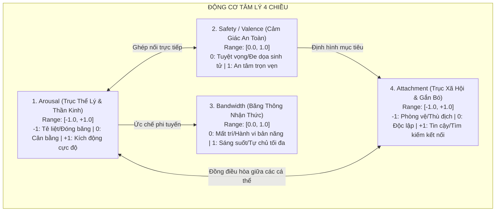
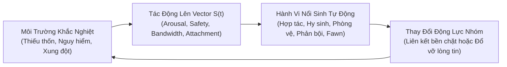

# Tài Liệu Ý Tưởng Thiết Kế: Trò Chơi Mô Phỏng Tâm Lý Nổi Sinh (Psychological Emergence Game)

---

## 1. Tầm Nhìn & Định Vị Trò Chơi (Game Vision)

* **Tên mã dự án (Codename):** *Project Anima / Phức Hợp Tâm Lý (Psyche Complex)*
* **Thể loại:** Mô phỏng sinh tồn tâm lý / Nhập vai quản lý xã hội (Psychological Survival & Social Emergence Simulation).
* **Cảm hứng & Định vị:**
  * *RimWorld & Frostpunk:* Nơi con người phải chống chọi với nghịch cảnh khắc nghiệt, nhưng trọng tâm không nằm ở quản lý tài nguyên vật chất mà ở **động lực học nội tâm con người**.
  * *Disco Elysium:* Chiều sâu nhận thức và các giọng nói nội tâm, nhưng thay vì các đoạn hội thoại rẽ nhánh định sẵn (hardcoded trees), hành vi và tâm trí nhân vật được **sinh ra liên tục từ một hệ thống động lực học phi tuyến thời gian thực**.
* **Tuyên ngôn thiết kế:** **Nói không với "Thanh Sanity" 1-chiều ngô nghê.** Trong trò chơi này, tâm lý nhân vật không bao giờ "hóa điên ngẫu nhiên" do tung xúc xắc, mà vận động như một dòng chảy tự nhiên, có quán tính, có vết sẹo ký ức, và tự động sản sinh ra những bi kịch cũng như sự chữa lành cảm động thông qua **Tính Trồi (Emergence)**.

---

## 2. Trọng Tâm Kiến Trúc: Động Cơ 4 Trục Nổi Sinh (The 4-Axis Emergence Engine)

Thay vì hàng chục chỉ số phức tạp gây quá tải cho gameplay, tâm lý của mỗi nhân vật được định vị bởi một vector trạng thái 4 chiều $\vec{S} = (A, V, C, S)$:

### Chi tiết các trục trạng thái:
1. **$A$ - Arousal (Mức kích hoạt thần kinh tự chủ):**
   * $[-0.4, +0.4]$: Vùng Dung Sai (Window of Tolerance). Nhân vật bình tĩnh, sáng suốt.
   * $> +0.4$: Phản ứng Thần kinh giao cảm (Sympathetic). Tim đập nhanh, thở gấp, bồn chồn.
   * $< -0.4$: Phản ứng Thần kinh phế vị lưng (Dorsal Vagal Shutdown). Tê liệt, đờ đẫn, mất cảm giác đau.
2. **$V$ - Safety / Affective Valence (Cảm nhận an toàn sinh học):**
   * Đánh giá vô thức của hệ thần kinh (Neuroception): Môi trường xung quanh đang bảo bọc hay đang săn đuổi mình?
3. **$C$ - Bandwidth / Agency (Băng thông nhận thức & Quyền tự chủ):**
   * Thể hiện dung lượng bộ nhớ làm việc của thùy trán. Khi $C$ cao, nhân vật có thể lập kế hoạch dài hạn, nhẫn nhịn, hy sinh vì người khác.
4. **$S$ - Attachment / Social Affinity (Gắn kết xã hội):**
   * Xu hướng đối với đồng loại: Tìm kiếm sự chở che ($+1$), nghi ngờ xa lánh ($0$), hay xem mọi người là kẻ thù đe dọa sinh tồn ($-1$).

---

## 3. Các Quy Luật Động Lực Học Tạo Nên "Tính Trồi" (Gameplay Mechanics)

### 3.1. Cơ Chế 1: Sự Sụp Đổ Số Chiều (Dimensionality Collapse)
* **Toán học hóa trong game:**
  $$C(t) = C_{\text{base}} \times \max\left(0, 1 - \left(\frac{A(t)}{A_{\text{ngưỡng}}}\right)^2\right) \times V(t)$$
* **Tác động trực tiếp lên Gameplay:**
  * Khi nhân vật bị hoảng loạn ($|A| \to 1$) hoặc cảm thấy cận kề cái chết ($V \to 0$), băng thông nhận thức $C$ **sụp đổ về 0**.
  * **Mất quyền kiểm soát của người chơi (Loss of Player Agency):** 
    * Người chơi không thể ra lệnh cho nhân vật làm các việc phức tạp (sửa máy, đàm phán, băng bó vết thương).
    * Bảng lựa chọn hội thoại biến mất, thay vào đó nhân vật bị khóa chặt vào **4 phản xạ sinh tồn nguyên thủy (4F System)** tùy theo tọa độ:
      * **Fight ($A > 0, S < 0$):** Tấn công mù quáng bất kỳ ai trước mặt.
      * **Flight ($A > 0, S \ge 0$):** Bỏ chạy thục mạng, vứt bỏ toàn bộ trang bị.
      * **Freeze ($A < 0, S < 0$):** Ngồi bệt xuống đất, co ro, mất khả năng di chuyển.
      * **Fawn ($A < 0, S > 0$):** Quỳ lạy, van xin, chấp nhận làm theo mọi yêu cầu của kẻ đe dọa để được sống sót.

### 3.2. Cơ Chế 2: Bẫy Sang Chấn & Vết Sẹo Ký Ức (Trauma Basins & Hysteresis)
* Khi một nhân vật trải qua biến cố cực đoan ($V \approx 0$ và $|A| \approx 1$ kéo dài), địa hình tâm lý của nhân vật bị **biến dạng vĩnh viễn**: Một **Hố Sang Chấn (Trauma Basin)** được khắc sâu.
* **Hiện tượng Trễ (Hysteresis):**
  * Trong điều kiện bình thường, nhân vật vẫn có thể sinh hoạt.
  * Nhưng chỉ cần một kích thích rất nhỏ mang nhãn tương tự (tiếng gầm, bóng tối, tiếng kim loại va chạm), nhân vật lập tức rơi tự do vào đáy hố sang chấn chỉ sau $0.5$ giây.
  * Sau khi mối đe dọa biến mất, nhân vật **không thể tự thoát khỏi hố**. Họ sẽ khóc nức nở, co giật hoặc nghi ngờ đồng đội trong nhiều giờ liền nếu không có ai giúp đỡ.

### 3.3. Cơ Chế 3: Đồng Điều Hòa Xã Hội (Social Co-Regulation & Contagion)
* Con người là sinh vật bầy đàn. Khi hai nhân vật $i$ và $j$ ở gần nhau trong bán kính tương tác:
  $$\frac{dA_i}{dt} = \dots + K_{ij} \cdot S_i \cdot (A_j - A_i)$$
* **Hai mặt của tính trồi xã hội:**
  * **Chữa lành (Healing Entrainment):** Một nhân vật hoảng loạn ($A_i = +0.9$) nếu được ngồi cạnh một nhân vật kiên định, giàu lòng trắc ẩn ($A_j = 0.0, S_j = +0.8$) sẽ dần được kéo nhịp tim và nhịp thở về mức cân bằng.
  * **Lây lan hoảng loạn (Panic Contagion):** Nếu một nhóm sinh tồn gồm 4 người đều có chỉ số $S$ mong manh, một tiếng súng nổ khiến một người hoảng loạn bỏ chạy sẽ tạo ra phản ứng dây chuyền, kéo cả đội sụp đổ tập thể (Mass Hysteria).

---

## 4. Vòng Lặp Trò Chơi (Core Game Loop)

---

## 5. Ví Dụ Về Những Câu Chuyện Nổi Sinh Chưa Từng Có (Emergent Stories)

Nhờ động cơ phi tuyến, game không cần kịch bản viết sẵn mà câu chuyện tự nảy mầm từ toán học:

### Kịch bản 1: "Sự Phản Bội Không Phải Do Độc Ác Mà Do Sụp Đổ Nhận Thức"
* Nhân vật Eric là một người trung thành, luôn bảo vệ nhóm.
* Sau 3 ngày bị bỏ đói trong hầm tối, chỉ số $Safety$ của Eric chạm đáy $0.05$, $Arousal$ rơi vào vùng $Freeze$ ($-0.85$). Băng thông nhận thức $C$ sụp đổ.
* Khi kẻ địch bắt giữ cả nhóm và yêu cầu chỉ ra kho lương thực, cơ chế **Fawn (Lấy lòng để sinh tồn)** tự động kích hoạt. Eric không hề muốn phản bội bạn bè, nhưng cơ thể anh ta tự động chỉ chỗ giấu lương thực trong tiếng nấc nghẹn ngào. 
* Sau khi được cứu, Eric phải đối mặt với **Hố Hổ Thẹn Độc Hại (Toxic Shame Basin)** vì hành động của chính mình.

### Kịch bản 2: "Cậu Bé Mồ Côi Và Chú Chó Trị Liệu"
* Một đứa trẻ mang phức cảm sang chấn (Complex Trauma) luôn có chỉ số $Attachment = -0.9$ đối với mọi người lớn (tuyệt đối không tin ai).
* Nhưng khi người chơi cho đứa trẻ tiếp xúc với một chú chó cứu hộ (vốn có $Arousal$ ổn định và phát ra tín hiệu an toàn $V = 1.0$), trục $Attachment$ của đứa trẻ bắt đầu từ từ tan băng.
* Nhờ cơ chế ghép đôi đồng điều hòa với chú chó, hệ thần kinh của đứa trẻ lần đầu tiên quay lại Vùng Dung Sai, mở khóa lại các tùy chọn giao tiếp với những người xung quanh.

---

## 6. Lộ Trình Hiện Thực Hóa Kỹ Thuật

1. **Giai đoạn 1 (Engine toán học độc lập):**
   * Viết class `PsychologyAgent` bằng Python/C# mô phỏng hệ phương trình vi phân Euler 4 biến chạy ở tần số $10 \text{ Hz}$.
   * Kiểm thử các hiện tượng: Sụp đổ số chiều, Hysteresis, và Đồng điều hòa 2 agent.
2. **Giai đoạn 2 (Prototype AI hành vi - Text/2D Sandbox):**
   * Xây dựng sa bàn 3-5 nhân vật với các nhu cầu cơ bản (thức ăn, giấc ngủ, an toàn).
   * Quan sát các mẫu hình xã hội nổi sinh khi đưa các sự kiện biến cố vào.
3. **Giai đoạn 3 (Tích hợp Game Engine - Unity / Godot):**
   * Đưa vào engine game với giao diện biểu đạt cảm xúc tinh tế: âm thanh nhịp tim, màn hình mờ tối khi sụp đổ nhận thức, hiệu ứng góc nhìn đường hầm (tunnel vision).

---

## 7. Kết Luận

Ý tưởng trò chơi này biến nghiên cứu lý thuyết trừu tượng về không gian trạng thái thành một **trải nghiệm nghệ thuật và giải trí sâu sắc**. Nó cho phép người chơi không chỉ "chơi game", mà thực sự thấu cảm được sự mong manh, phức tạp và vẻ đẹp kiên cường của tâm lý con người trước nghịch cảnh.
