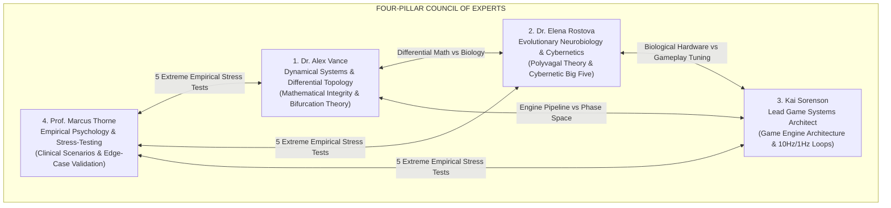

# Council of Expert Agents: Psychological State Space & Emergent Simulation
### (Project Anima Expert Advisory Board)

This directory serves as the centralized registry for the profiles, operational methodologies, and **Isolated Memory Systems (`memory.md`)** of the advisory experts and the independent validation council of *Project Anima*.

## Independent Validation Council

The [validation council](validation-council/README.md) checks claims made in meeting minutes against traceable sources and examines whether the sources actually support the scientific, mathematical, and technical conclusions. Its two members are agent roles, not real credentialed researchers. No meeting has been audited yet.

| Agent | Responsibility | Profile | Memory |
| :--- | :--- | :--- | :--- |
| **Minh Anh Trần** | Source provenance and evidence quality | [AGENT.md](minh-anh-tran/AGENT.md) | [memory.md](minh-anh-tran/memory.md) |
| **Quang Huy Lê** | Scientific reasoning, equations, and inference | [AGENT.md](quang-huy-le/AGENT.md) | [memory.md](quang-huy-le/memory.md) |

Every validation session produces [review minutes](../EvaluationMinutes/README.md) recording the work and verdicts in `EvaluationMinutes/`. On the Chair's request, the council may also produce a source-linked explanatory supplement for an individual meeting. The formats and verdict criteria are in the [council protocol](validation-council/README.md).

---

## 1. The Expert Council Roster

| Expert Agent | Core Specialization | Agent Profile | Dedicated Memory & Meeting Log |
| :--- | :--- | :--- | :--- |
| **Dr. Alex Vance** | Dynamical Systems, Differential Geometry, SDE, Topology, Bifurcations | [`agents/alex-vance/AGENT.md`](file:///g:/Projects/Researchs/agents/alex-vance/AGENT.md) | [`agents/alex-vance/memory.md`](file:///g:/Projects/Researchs/agents/alex-vance/memory.md) |
| **Dr. Elena Rostova** | Autonomic Neurobiology, Polyvagal Theory, CB5T, Neural Metabolism | [`agents/elena-rostova/AGENT.md`](file:///g:/Projects/Researchs/agents/elena-rostova/AGENT.md) | [`agents/elena-rostova/memory.md`](file:///g:/Projects/Researchs/agents/elena-rostova/memory.md) |
| **Kai Sorenson** | Game Engine Architecture, Emergent Simulation, Dynamical Nemesis | [`agents/kai-sorenson/AGENT.md`](file:///g:/Projects/Researchs/agents/kai-sorenson/AGENT.md) | [`agents/kai-sorenson/memory.md`](file:///g:/Projects/Researchs/agents/kai-sorenson/memory.md) |
| **Prof. Marcus Thorne** | Clinical & Empirical Psychology, Stress-Testing, Boundary Auditing | [`agents/marcus-thorne/AGENT.md`](file:///g:/Projects/Researchs/agents/marcus-thorne/AGENT.md) | [`agents/marcus-thorne/memory.md`](file:///g:/Projects/Researchs/agents/marcus-thorne/memory.md) |
| **Prof. Gabriel Brandt** | Neuro-Volition, Agency Cybernetics, Downward Causality & Willpower ($\mathcal{W}$) | [`agents/gabriel-brandt/AGENT.md`](agents/gabriel-brandt/AGENT.md) | [`agents/gabriel-brandt/memory.md`](agents/gabriel-brandt/memory.md) |
| **Prof. Thaddeus Mercer** | Social Cognition, Moral Neuroethics, Epistemic Networks & Beliefs ($\mathcal{P}$) | [`agents/thaddeus-mercer/AGENT.md`](agents/thaddeus-mercer/AGENT.md) | [`agents/thaddeus-mercer/memory.md`](agents/thaddeus-mercer/memory.md) |
| **Prof. Valeria Moreau** | Social Neuroscience, Attachment Topologies & Relational Dynamics ($\mathcal{R}$) | [`agents/valeria-moreau/AGENT.md`](agents/valeria-moreau/AGENT.md) | [`agents/valeria-moreau/memory.md`](agents/valeria-moreau/memory.md) |
| **Prof. Alistair Finch** | Computational Environmental Physics, Perturbation Dynamics & Event Causality ($\mathcal{E}$) | [`agents/alistair-finch/AGENT.md`](agents/alistair-finch/AGENT.md) | [`agents/alistair-finch/memory.md`](agents/alistair-finch/memory.md) |
| **Prof. Viktor Lindqvist** | Adaptive Physiology, Metabolic Allostasis & Bioenergetic Dynamics ($\mathcal{H}$) | [`agents/viktor-lindqvist/AGENT.md`](agents/viktor-lindqvist/AGENT.md) | [`agents/viktor-lindqvist/memory.md`](agents/viktor-lindqvist/memory.md) |

---

## 2. Invocation Protocol & Operational Guidelines

When the Project Director or any subagent needs to consult an expert or adopt their specialized perspective in subsequent sessions:
1. **Read `AGENT.md`:** Familiarize yourself with their persona, epistemological stance, technical vocabulary, and core evaluation criteria.
2. **Read `memory.md`:** Retrieve their full historical context, past debates, accepted compromises, and specific task backlogs.
3. **Maintain Epistemic Rigor:** Avoid performative hand-waving or vague approximations; all claims must be grounded in differential equations, neurobiological pathways, or measurable game performance metrics.

---

## 3. Historic Council Milestones
* **Session 1 (September 27, 2026): Initial 4-Axis Scrutiny & Plan B (Psychological Space)**
  * Meeting Minutes: [`MeetingMinutes/Bien-Ban-Cuoc-Hop-Khao-Sat-Kiem-Dinh-Khong-Gian-Tam-Ly.md`](../MeetingMinutes/Bien-Ban-Cuoc-Hop-Khao-Sat-Kiem-Dinh-Khong-Gian-Tam-Ly.md).
  * Discovered algebraic rank deficiency on cognitive bandwidth ($C$).
  * Formulated and adopted **Plan B (Two-Tier Layered Architecture)** structured as a Fiber Bundle ($\mathcal{E} \xrightarrow{\pi} \mathcal{B}$).
  * Designed the **Dynamical Nemesis System** via Saddle-Node Bifurcations and Resonant Hostility Coupling.
* **Session 2 (September 28, 2026): Ratification of Master 6-Space Architecture**
  * Meeting Minutes: [`MeetingMinutes/Bien-Ban-Cuoc-Hop-Xac-Dinh-Cac-Khong-Gian-Project-Anima.md`](../MeetingMinutes/Bien-Ban-Cuoc-Hop-Xac-Dinh-Cac-Khong-Gian-Project-Anima.md).
  * Formally established the 6 autonomous, non-subsumed spaces: $\mathcal{W}, \mathcal{E}, \mathcal{H}, \mathcal{M}, \mathcal{P}, \mathcal{R}$.
* **Session 3 (September 28, 2026): Deconstruction of Meta-Volitional Space ($\mathcal{W}$)**
  * Meeting Minutes: [`MeetingMinutes/Bien-Ban-Cuoc-Hop-Chuyen-De-Khong-Gian-Y-Chi.md`](../MeetingMinutes/Bien-Ban-Cuoc-Hop-Chuyen-De-Khong-Gian-Y-Chi.md).
  * Appointed **Prof. Gabriel Brandt**; formalized 5 orthogonal dimensions ($\mathcal{W}_{\text{amp}}, \vec{\Phi}_{\text{intent}}, \kappa_{\text{coh}}, \tau_{\text{tenacity}}, \theta_{\text{transcend}}$) and the Deformation Operator $\hat{\mathcal{W}}$.
* **Session 4 (September 28, 2026): Deconstruction of Value & Belief Space ($\mathcal{P}$)**
  * Meeting Minutes: [`MeetingMinutes/Bien-Ban-Cuoc-Hop-Chuyen-De-Khong-Gian-Niem-Tin.md`](../MeetingMinutes/Bien-Ban-Cuoc-Hop-Chuyen-De-Khong-Gian-Niem-Tin.md).
  * Appointed **Prof. Thaddeus Mercer**; formalized 5 orthogonal dimensions ($\vec{\theta}_{\text{moral}}, \delta_{\text{dogma}}, \sigma_{\text{sacred}}, \lambda_{\text{locus}}, \alpha_{\text{tribal}}$) and the Thought Cabinet Lifecycle.
* **Session 5 (September 28, 2026): Deconstruction of Relational Space ($\mathcal{R}$)**
  * Meeting Minutes: [`MeetingMinutes/Bien-Ban-Cuoc-Hop-Chuyen-De-Khong-Gian-Quan-He.md`](../MeetingMinutes/Bien-Ban-Cuoc-Hop-Chuyen-De-Khong-Gian-Quan-He.md).
  * Appointed **Prof. Valeria Moreau**; formalized 5 orthogonal dimensions of directed edge $\vec{R}_{ij}$ ($\alpha_{\text{aff}}, \beta_{\text{dom}}, \gamma_{\text{debt}}, \mu_{\text{tom}}, \tau_{\text{bond}}$), Sparse Multi-Graph architecture, and Dynamic Nemesis/Brotherhood engine hooks.
* **Session 6 (September 28, 2026): Deconstruction of Global Exogenous Event Space ($\mathcal{E}$)**
  * Meeting Minutes: [`MeetingMinutes/Bien-Ban-Cuoc-Hop-Chuyen-De-Khong-Gian-Su-Kien.md`](../MeetingMinutes/Bien-Ban-Cuoc-Hop-Chuyen-De-Khong-Gian-Su-Kien.md).
  * Appointed **Prof. Alistair Finch**; formalized 5 orthogonal dimensions ($\mathcal{I}_{\text{visc}}, \vec{\mathcal{S}}_{\text{sem}}, \mathcal{D}_{\text{decay}}, \mathcal{U}_{\text{ent}}, \vec{\Omega}_{\text{vec}}$), Two-Tier Appraisal Pipeline, Spatial BVH, and Zero-Allocation Circular Event RingBuffer.
* **Session 7 (September 28, 2026): Deconstruction of Somatic Homeostasis Space ($\mathcal{H}$)**
  * Meeting Minutes: [`MeetingMinutes/Bien-Ban-Cuoc-Hop-Chuyen-De-Khong-Gian-Sinh-Hoc-Noi-Moi.md`](../MeetingMinutes/Bien-Ban-Cuoc-Hop-Chuyen-De-Khong-Gian-Sinh-Hoc-Noi-Moi.md).
  * Appointed **Prof. Viktor Lindqvist**; formalized 5 orthogonal dimensions ($E_{\text{glyc}}, P_{\text{pain}}, S_{\text{sleep}}, W_{\text{hydr}}, T_{\text{thermo}}$), Homeostatic SDE, Two-Way Interoceptive/Volitional Coupling, and Dual-Rate (10Hz/0.1Hz) 32-Byte Blittable Engine Architecture.
  * **Historic Milestone:** 100% of the Master 6-Space Architecture is fully deconstructed and mathematically formalized.
