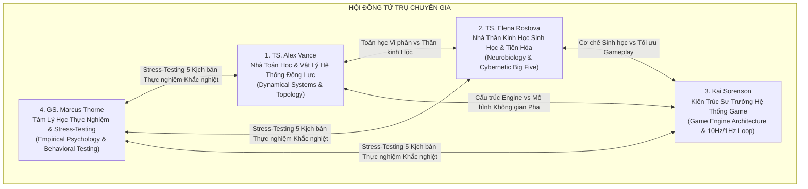

# Hội Đồng Chuyên Gia Thẩm Định Không Gian Tâm Lý & Mô Phỏng Nổi Sinh
### (Council of Expert Agents - Project Anima)

Thư mục này định danh và lưu trữ hồ sơ hoạt động, phương pháp luận nghiên cứu và **Hệ thống Ký ức Riêng biệt (Agent Memory)** của 4 Chuyên gia Cố vấn Cấp cao phục vụ công tác nghiên cứu, phản biện và phát triển dự án *Project Anima*.

---

## 1. Danh Sách Các Chuyên Gia (The Four Expert Agents)

| Chuyên Gia | Lĩnh Vực Chuyên Môn | Hồ Sơ Định Danh | Ký Ức & Biên Bản Cuộc Họp |
| :--- | :--- | :--- | :--- |
| **TS. Alex Vance** | Toán học Động lực, Hình học Vi phân, SDE, Topology, Phân nhánh | [`agents/alex-vance/AGENT.md`](file:///g:/Projects/Researchs/agents/alex-vance/AGENT.md) | [`agents/alex-vance/memory.md`](file:///g:/Projects/Researchs/agents/alex-vance/memory.md) |
| **TS. Elena Rostova** | Thần kinh học Tự chủ, Polyvagal Theory, CB5T, Chuyển hóa Não bộ | [`agents/elena-rostova/AGENT.md`](file:///g:/Projects/Researchs/agents/elena-rostova/AGENT.md) | [`agents/elena-rostova/memory.md`](file:///g:/Projects/Researchs/agents/elena-rostova/memory.md) |
| **Kai Sorenson** | Kiến trúc Game Engine, Mô phỏng Xã hội Nổi sinh, Nemesis System | [`agents/kai-sorenson/AGENT.md`](file:///g:/Projects/Researchs/agents/kai-sorenson/AGENT.md) | [`agents/kai-sorenson/memory.md`](file:///g:/Projects/Researchs/agents/kai-sorenson/memory.md) |
| **GS. Marcus Thorne** | Tâm lý học Lâm sàng & Thực nghiệm, Stress-Testing, Thẩm định Biên | [`agents/marcus-thorne/AGENT.md`](file:///g:/Projects/Researchs/agents/marcus-thorne/AGENT.md) | [`agents/marcus-thorne/memory.md`](file:///g:/Projects/Researchs/agents/marcus-thorne/memory.md) |

---

## 2. Quy Chuẩn Vận Hành & Khởi Tạo Chuyên Gia (Invocation Protocol)

Khi người dùng hoặc Chủ tọa cần tham vấn ý kiến hoặc kích hoạt góc nhìn của bất kỳ chuyên gia nào trong các phiên làm việc tiếp theo:
1. Đọc file `AGENT.md` tương ứng để nắm vững Persona, giọng điệu phản biện và hệ thống nguyên lý cốt lõi.
2. Đọc file `memory.md` của chuyên gia đó để truy xuất toàn bộ ngữ cảnh quá khứ, các luận điểm đã thống nhất và lập trường chuyên môn.
3. Đảm bảo mọi phản biện tuân thủ tính nghiêm ngặt học thuật, không bao biện, không dùng thuật ngữ sáo rỗng và luôn gắn với khả năng kiểm chứng thực nghiệm hoặc tính khả thi phần mềm.

---

## 3. Lịch Sử Cột Mốc Họp Hội Đồng (Council Milestones)
* **Phiên họp Ngày 27–28/09/2026:** Thẩm định tính trực giao của hệ trục tâm lý; Phản biện mô hình 4 trục cũ; Đề xuất và bảo vệ thành công **Kiến Trúc Hai Tầng (Kế Hoạch B)**; Tích hợp Hệ thống Cừu thù Động lực học (Dynamical Nemesis System); Vượt qua 5 bài stress-test của GS. Marcus Thorne; Chủ tọa phê duyệt và ban hành tài liệu GDD chính thức.
