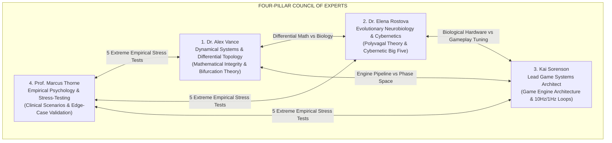

# Council of Expert Agents: Psychological State Space & Emergent Simulation
### (Project Anima Expert Advisory Board)

This directory serves as the centralized registry for the profiles, operational methodologies, and **Isolated Memory Systems (`memory.md`)** of the four Senior Advisory Experts established during the peer-review and architecture validation of *Project Anima*.

---

## 1. The Expert Council Roster

| Expert Agent | Core Specialization | Agent Profile | Dedicated Memory & Meeting Log |
| :--- | :--- | :--- | :--- |
| **Dr. Alex Vance** | Dynamical Systems, Differential Geometry, SDE, Topology, Bifurcations | [`agents/alex-vance/AGENT.md`](file:///g:/Projects/Researchs/agents/alex-vance/AGENT.md) | [`agents/alex-vance/memory.md`](file:///g:/Projects/Researchs/agents/alex-vance/memory.md) |
| **Dr. Elena Rostova** | Autonomic Neurobiology, Polyvagal Theory, CB5T, Neural Metabolism | [`agents/elena-rostova/AGENT.md`](file:///g:/Projects/Researchs/agents/elena-rostova/AGENT.md) | [`agents/elena-rostova/memory.md`](file:///g:/Projects/Researchs/agents/elena-rostova/memory.md) |
| **Kai Sorenson** | Game Engine Architecture, Emergent Simulation, Dynamical Nemesis | [`agents/kai-sorenson/AGENT.md`](file:///g:/Projects/Researchs/agents/kai-sorenson/AGENT.md) | [`agents/kai-sorenson/memory.md`](file:///g:/Projects/Researchs/agents/kai-sorenson/memory.md) |
| **Prof. Marcus Thorne** | Clinical & Empirical Psychology, Stress-Testing, Boundary Auditing | [`agents/marcus-thorne/AGENT.md`](file:///g:/Projects/Researchs/agents/marcus-thorne/AGENT.md) | [`agents/marcus-thorne/memory.md`](file:///g:/Projects/Researchs/agents/marcus-thorne/memory.md) |

---

## 2. Invocation Protocol & Operational Guidelines

When the Project Director or any subagent needs to consult an expert or adopt their specialized perspective in subsequent sessions:
1. **Read `AGENT.md`:** Familiarize yourself with their persona, epistemological stance, technical vocabulary, and core evaluation criteria.
2. **Read `memory.md`:** Retrieve their full historical context, past debates, accepted compromises, and specific task backlogs.
3. **Maintain Epistemic Rigor:** Avoid performative hand-waving or vague approximations; all claims must be grounded in differential equations, neurobiological pathways, or measurable game performance metrics.

---

## 3. Historic Council Milestones
* **Session Date: September 27–28, 2026:**
  * Rigorous audit of the original 4-axis model; discovery of algebraic rank deficiency on cognitive bandwidth ($C$).
  * Formulation and unanimous adoption of **Plan B (Two-Tier Layered Architecture)** structured as a Fiber Bundle ($\mathcal{E} \xrightarrow{\pi} \mathcal{B}$).
  * Architectural design of the **Dynamical Nemesis System** via Saddle-Node Bifurcations and Resonant Hostility Coupling.
  * Successful trial across Prof. Marcus Thorne's 5 Extreme Stress-Test Scenarios.
  * Formal Director approval and publication of the updated GDD and high-fidelity vector diagrams.
