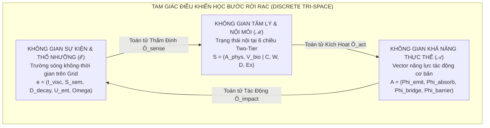

# THIẾT KẾ HỆ SINH THÁI ĐỘNG LỰC HỌC TỰ TRỊ: CỘNG SINH RỪNG & ĐỐI KHÁNG SINH HỌC
### Dự Án: Forest_Bloom (Grid-Based Ecological Dynamics Engine)
**Ngày lập:** 2026-10-01  
**Phiên bản:** 3.1 — Chuyển Đổi Sang Dòng Thời Gian Rời Rạc & Chế Độ Mô Phỏng Tự Trị (Zero-Player Sandbox)  
**Trạng thái:** Thiết kế đề xuất; ví dụ tham chiếu đã hiệu chỉnh 2026-10-04, nghiệm thu Unity bên ngoài chưa xác minh.  
**Tác giả:** Hội đồng Nghiên cứu Động lực học & Antigravity IDE  

---

## 1. NGUYÊN TẮC THIẾT KẾ: ƯU TIÊN MÔ PHỎNG TỰ THÂN (ZERO-PLAYER FIRST)

Để bảo đảm tính trung thực khoa học và tránh cái bẫy "can thiệp người chơi làm méo mó mô phỏng", phiên bản này thiết lập các nguyên tắc nền tảng:
1. **Loại bỏ hoàn toàn cơ chế "3 Actions 1 lượt":** Không gán ép ngân sách hành động của con người vào chu trình sinh thái tự nhiên.
2. **Dòng thời gian bước rời rạc chuẩn mực (Discrete Simulation Steps):** Toàn bộ vũ trụ trên lưới tiến hóa theo từng bước nhảy $k \to k + 1$ tường minh, có thể tua chậm, dừng hình hoặc nhảy từng bước để quan sát.
3. **Vô hiệu hóa tạm thời Input người chơi (Zero-Player Sandbox Mode):** Đưa `Forest_Bloom` về trạng thái một hệ sinh thái tự trị thuần túy (tương tự *Conway's Game of Life* kết hợp *Mô hình Động lực học Quần thể Lotka-Volterra*). Người chơi tạm thời đóng vai trò **Nhà Quan Sát Thực Nghiệm**.
4. **Tiêu chuẩn "Độc lập trước, Can thiệp sau":** Chỉ khi hệ sinh thái tự vận hành cân bằng, có khả năng tự phục hồi (resilience) và trồi sinh các ranh giới tự nhiên thú vị, chúng ta mới xác định các điểm cắm (Hook points) cho người chơi can thiệp.

---

## 2. KIẾN TRÚC TAM GIÁC KHÔNG GIAN KHÉP KÍN (THE TRI-SPACE CYBERNETIC LOOP)

Toàn bộ thế giới `Forest_Bloom` vận hành theo một vòng lặp điều khiển học khép kín gồm 3 không gian lớn và 3 toán tử vi phân kết nối:



---

## 3. DÒNG THỜI GIAN MÔ PHỎNG BƯỚC RỜI RẠC (DISCRETE STEP PIPELINE)

Mỗi chu kỳ mô phỏng (Step $k \to k + 1$) được giải quyết tuần tự qua **4 Pha Tuyệt Đối Không Xung Đột Dữ Liệu**:

```
[BẮT ĐẦU STEP k]
       │
       ▼
┌────────────────────────────────────────────────────────────────────────┐
│ PHA 1: THẨM ĐỊNH MÔI TRƯỜNG (Sensing Phase)                            │
│ - Mỗi ô SCell đọc hồ sơ Thổ nhưỡng (Moisture, Toxicity, Thermal).      │
│ - Thực thể cắm rễ kích hoạt Toán tử Thẩm định:                         │
│       S(k+1) = S(k) + F(S(k)) * e_cell                                 │
└────────────────────────────────────────────────────────────────────────┘
       │
       ▼
┌────────────────────────────────────────────────────────────────────────┐
│ PHA 2: KÍCH HOẠT NĂNG LỰC & CHUYỂN PHA (Actuation & Phase Shift)       │
│ - S(k+1) kích hoạt Vector Năng lực A qua Toán tử Ô_act:                │
│       A(k+1) = A_base * sigma(W_act * S(k+1))                          │
│ - Kiểm tra Chuyển Pha: Homeostatic <--> Stress <--> Wilt               │
│ - Tích lũy Tải trọng Hao mòn H_load; kiểm tra Rẽ Nhánh Đột Biến        │
└────────────────────────────────────────────────────────────────────────┘
       │
       ▼
┌────────────────────────────────────────────────────────────────────────┐
│ PHA 3: MẠNG RỄ ĐỒNG ĐIỀU HÒA & ĐỐI KHÁNG (Coupling & Warfare)          │
│ - Rễ cây kết nối qua 4 hướng lân cận GetCrossAroundCell():             │
│   + Cây lành bơm dịch thể cứu cây yếu (Co-regulation).                 │
│   + Cỏ Quỷ cắn xé rễ, hút cạn Moisture, tiết độc tố BlightToxicity.    │
│ - Giải quyết tranh chấp ô đất tại các ranh giới Frontline.             │
└────────────────────────────────────────────────────────────────────────┘
       │
       ▼
┌────────────────────────────────────────────────────────────────────────┐
│ PHA 4: KHUẾCH TÁN & CẬP NHẬT THỔ NHƯỠNG (World Impact & Diffusion)     │
│ - Áp dụng Toán tử Tác Động Ô_impact: Cập nhật SoilProfile của ô đất:   │
│       Moisture += Phi_emit - Phi_absorb - Bay_Hơi_Tự_Nhiên             │
│       Toxicity += Phi_emit_tox - Phi_purify                            │
│ - Nước và Độc tố khuếch tán nhẹ sang 4 ô lân cận (Cellular Diffusion)  │
└────────────────────────────────────────────────────────────────────────┘
       │
       ▼
[KẾT THÚC STEP k -> SẴN SÀNG CHO STEP k+1]
```

---

## 4. CHI TIẾT 3 KHÔNG GIAN CƠ BẢN

### 4.1. Không Gian Sự Kiện Ngoại Sinh ($\mathcal{E}$) — Trường Sóng Không-Thời Gian
Sự kiện là một nhiễu loạn khách quan di chuyển trên lưới ô, gồm 5 chiều độc lập:
$$\vec{e} = \Big( \mathcal{I}_{\text{visc}},\; \vec{\mathcal{S}}_{\text{sem}},\; \mathcal{D}_{\text{decay}},\; \mathcal{U}_{\text{ent}},\; \vec{\Omega}_{\text{vec}} \Big)$$

1. **$\mathcal{I}_{\text{visc}} \in [0.0, 1.0]$ (Chấn động vật lý thô):** Lực phá hủy cơ học đánh thẳng vào thể xác (Sét đánh, va đập, bứng rễ), ép nhịp trao đổi chất $A_{\text{phys}} \to 1.0$ và tụt an toàn $V_{\text{bio}} \to -1.0$ mà không qua nhận thức.
2. **$\vec{\mathcal{S}}_{\text{sem}} = (\Delta \text{Moist}, \Delta \text{Therm}, \Delta \text{Tox}, \Delta \text{Nutr}) \in [-1, 1]^4$:** Phổ 4 thành phần sinh thái: Thủy phần, Nhiệt lượng, Độc tố Blight, Mùn dinh dưỡng.
3. **$\mathcal{D}_{\text{decay}} = (R_{\text{spread}}, \tau_{\text{life}})$:** Bán kính ảnh hưởng (Ô đơn lẻ, Cụm $2-3$ ô, Toàn map) và thời gian lưu vết (Tức thời 1 step, Kéo dài vài step, Sẹo địa hình vĩnh viễn).
4. **$\mathcal{U}_{\text{ent}} \in [0.0, 1.0]$ (Entropy / Độ bất ngờ):** Phân biệt giữa hiện tượng chu kỳ dự báo được ($\mathcal{U}_{\text{ent}} \le 0.3$) và dị thường thiên tai đột ngột ($\mathcal{U}_{\text{ent}} \ge 0.8$) làm sụp đổ dung lượng ổn định $C \to 0$.
5. **$\vec{\Omega}_{\text{vec}}$ (Phổ chọn lọc mục tiêu):** Tác động đại trà (Omni) vs Đặc hiệu Cây (Flora) vs Đặc hiệu Cỏ (Blight).

---

### 4.2. Không Gian Tâm Lý & Nội Môi ($\mathcal{M}$) — Hai Tầng Động Lực Học
Trạng thái nội tại của mỗi thực thể cắm rễ trên ô:
$$\vec{S} = \Big( \underbrace{A_{\text{phys}}, V_{\text{bio}}}_{\text{Tầng 1: Base Space } \mathcal{B} \text{ (Bản năng Sinh học)}} \;\Big|\; \underbrace{C, W, D, E_x}_{\text{Tầng 2: Fiber Space } \mathcal{F} \text{ (Định hướng Hành vi)}} \Big)$$

* **Tầng 1 (Sinh học phản xạ):**
  * $A_{\text{phys}} \in [0.0, 1.0]$: Kích hoạt chuyển hóa sinh học (nhựa sôi, nhịp trao đổi chất).
  * $V_{\text{bio}} \in [-1.0, 1.0]$: Cảm thức an toàn sinh thái ($-1.0$ hoảng loạn/ngạt thở, $+1.0$ hưng thịnh).
* **Tầng 2 (Nhận thức & Xã hội):**
  * $C \in [0.0, 1.0]$: Dung lượng ổn định nội môi (bảo vệ cây không bị sốc).
  * $W \in [-1.0, 1.0]$: Trục Vị tha / Ấm áp xã hội ($W > 0$ chia sẻ qua rễ; $W < 0$ ích kỷ ký sinh).
  * $D \in [-1.0, 1.0]$: Trục Thống trị / Ưu thế ($D > 0$ đè bẹp ô khác; $D < 0$ nhường nhịn).
  * $E_x \in [0.0, 1.0]$: Động lực tầm soát SEEKING (khát vọng đâm chồi vươn rễ chiếm đất mới).

---

### 4.3. Không Gian Khả Năng Thực Thể ($\mathcal{A}$) — Vector Năng Lực Tác Động
Mọi hành vi của Cây và Cỏ đều được sinh ra từ **4 Năng Lực Primitives**:
$$\vec{A} = \Big( \Phi_{\text{emit}},\; \Phi_{\text{absorb}},\; \Phi_{\text{bridge}},\; \Phi_{\text{barrier}} \Big)$$

1. **$\Phi_{\text{emit}} = (\phi_e^{\text{water}}, \phi_e^{\text{heat}}, \phi_e^{\text{tox}}, \phi_e^{\text{spore}})$ (Năng lực Phóng thích):** Khả năng xả nước làm mát, tỏa nhiệt thiêu đốt, tiết độc tố, hoặc phát tán phấn hoa/bào tử ra môi trường.
2. **$\Phi_{\text{absorb}} = (\phi_a^{\text{water}}, \phi_a^{\text{nutr}}, \phi_a^{\text{tox}})$ (Năng lực Hấp thụ):** Khả năng hút nước từ lòng đất, hút mùn dinh dưỡng, hoặc phân giải độc tố.
3. **$\Phi_{\text{bridge}} \in [0.0, 1.0]$ (Năng lực Mạng Rễ / Cầu Nối):** Khả năng liên kết với các ô lân cận để dẫn truyền dịch thể và thực hiện đồng điều hòa tâm lý (`Co-regulation`).
4. **$\Phi_{\text{barrier}} \in [0.0, 1.0]$ (Năng lực Cấu Trúc / Rào Cản):** Độ cứng của vỏ và mật độ gai nhọn, ngăn chặn cỏ quỷ xâm lấn và phản hồi sát thương cơ học.

---

## 5. HỆ THỐNG ĐẠI SỐ TOÁN TỬ (THE TRI-OPERATOR CALCULUS)

### 5.1. Toán Tử Thẩm Định ($\hat{\mathcal{O}}_{\text{sense}}: \mathcal{E} \times \mathcal{M} \to \Delta \mathcal{M}$)
Chuyển hóa kích thích khách quan của sự kiện $\vec{e}$ thành biến thiên trạng thái nội tại $\Delta \vec{S}$:
$$\Delta \vec{S} = \mathbf{F}(\vec{S}) \cdot \vec{e}$$
* Nếu cây đang thiếu nước kiệt quệ ($V_{\text{bio}} < -0.5$), sự kiện nắng nóng $\Delta \text{Thermal} = +0.8$ bị khuếch đại thành chấn thương thiêu đốt: $\Delta V_{\text{bio}} = -0.6, \Delta A_{\text{phys}} = +0.8$.
* Nếu cây đang đủ nước và khỏe mạnh ($V_{\text{bio}} > 0.5$), cùng sự kiện đó lại được thẩm định thành năng lượng quang hợp: $\Delta V_{\text{bio}} = +0.2, \Delta A_{\text{phys}} = +0.3$.

### 5.2. Toán Tử Kích Hoạt Năng Lực ($\hat{\mathcal{O}}_{\text{act}}: \mathcal{M} \to \mathcal{A}$)
Trạng thái tâm lý $\vec{S}$ điều biến van đóng/mở của các năng lực thực thể:
$$\vec{A} = \vec{A}_{\text{base}} \odot \sigma\big(\mathbf{W}_{\text{act}} \cdot \vec{S}\big)$$
* **Cơ chế van xả nhiệt:** Khi $A_{\text{phys}} > 0.7$ và $D > 0.5 \implies$ Van $\phi_e^{\text{heat}}$ mở cực đại, cây tỏa nhiệt làm khô và đốt cỏ xung quanh.
* **Cơ chế đóng van ích kỷ:** Khi $V_{\text{bio}} \le -0.4 \implies$ Cây hoảng loạn tự co cụm, van $\Phi_{\text{bridge}}$ lập tức đóng sập về $0$, ngừng chia sẻ nước cho đồng minh để bảo toàn mạng sống.

### 5.3. Toán Tử Tác Động Thế Giới ($\hat{\mathcal{O}}_{\text{impact}}: \mathcal{A} \to \Delta \mathcal{E}$)
Năng lực được kích hoạt bắn ngược trở lại làm biến đổi hồ sơ thổ nhưỡng `SoilProfile` của ô đất `SCell`:
$$\begin{cases}
\Delta \text{Moisture}_{\text{cell}} = \phi_e^{\text{water}} - \phi_a^{\text{water}} \\
\Delta \text{BlightToxicity}_{\text{cell}} = \phi_e^{\text{tox}} - \phi_a^{\text{tox}} \\
\Delta \text{Thermal}_{\text{cell}} = \phi_e^{\text{heat}}
\end{cases}$$

---

## 6. HỆ THỐNG CHUYỂN PHA TRẠNG THÁI & SẸO BIỂU SINH

### 6.1. Ba Pha Động Học Chính:
Mỗi chủng loài giữ nguyên type nhưng đổi nhãn pha theo ngưỡng trạng thái. Đây là finite-state rule; chưa chứng minh ba attractor basins của hệ động lực:
1. **Pha Tĩnh Tại (Homeostatic Phase - $C \ge 0.2$, $V_{\text{bio}} \ge -0.3$):** Quang hợp ổn định, van $\Phi_{\text{bridge}}$ mở tối đa, chia sẻ nước cho đồng minh.
2. **Pha Phòng Vệ Khẩn Cấp (Stress Phase - $C \ge 0.2$, $V_{\text{bio}} < -0.3$):** Cắt bớt chia sẻ nước, tự bọc sáp/gai $\Phi_{\text{barrier}} \uparrow$.
3. **Pha Sụp Đổ / Hoại Tử (Wilt Phase - $C < 0.2$):** Quá tải nhận thức, rụng lá, ngừng hoạt động. Nếu kéo dài quá 4 step mà không được cứu $\implies$ Chết khô.

### 6.2. Tiến Hóa Kiểu Hình Qua Tải Trọng Hao Mòn Biểu Sinh ($\mathcal{H}_{\text{load}}$):
$$\Delta \mathcal{H}_{\text{load}} = \max\big(0, -V_{\text{bio}}\big) \times A_{\text{phys}} - \gamma_{\text{heal}} \cdot C$$
Khi $\mathcal{H}_{\text{load}} \ge \theta_{\text{bifurcation}}$:
* Chịu hạn kiệt nước kéo dài $\implies$ Rẽ nhánh sang **Biến thể Mọng Nước Chịu Hạn (Xeric Succulent)**.
* Chịu Cỏ Quỷ cào xé liên tục $\implies$ Rẽ nhánh sang **Biến thể Gai Bọc Thép (Thorn-Armored)**.
* Liên tục truyền nước cứu chữa đồng minh $\implies$ Rẽ nhánh sang **Biến thể Đại Thụ Hiến Sinh (Altruistic Sacred Trunk)**.

---

## 7. MÔ HÌNH CỎ QUỶ KÝ SINH (BLIGHT HIVE DYNAMICS)

Phe Địch vận hành bằng chính bộ 3 không gian $(\mathcal{E}, \mathcal{M}, \mathcal{A})$ với bộ tham số ký sinh:
* **Tâm lý xâm lăng ($\mathcal{M}_{\text{blight}}$):** $W = -1.0$ (tuyệt đối không vị tha), $D = 1.0$ (ưu thế xâm lấn cực đại), $E_x = 0.9$ (luôn tìm đất mới).
* **Năng lực đặc thù ($\mathcal{A}_{\text{blight}}$):**
  * $\phi_a^{\text{water}}$ cực lớn: Hút cạn độ ẩm ô đất trong tích tắc.
  * $\phi_e^{\text{tox}}$ liên tục: Phóng thích bào tử độc làm ô đất hóa thành Đầm Lầy Độc.
  * $\Phi_{\text{bridge}} = 0$: Không liên kết tương trợ, bành trướng theo cơ chế tế bào tự trị.

---

## 8. BỘ ĐIỀU KHIỂN QUAN SÁT & TIÊU CHUẨN KIỂM ĐỊNH (SANDBOX CONTROLLER)

### 8.1. Bảng Điều Khiển Thực Nghiệm (Experiment Dashboard):
Để nhà phát triển quan sát toàn diện, một Controller UI trên Scene cung cấp:
* **Nút bấm:** `[Step +1]` (chạy 1 bước), `[Play / Pause]` (tự động chạy), `[Reset]` (thiết lập lại trạng thái ban đầu).
* **Tốc độ Step:** Thanh trượt chọn tốc độ tự động ($0.1\text{s} \to 2.0\text{s}$ mỗi bước).
* **Metrics Thời Gian Thực:**
  * Tỷ lệ chiếm đóng: `% Flora` vs `% Blight` vs `% Đất Trống`.
  * Độ ẩm trung bình toàn map (`Avg Moisture`).
  * Chỉ số an toàn trung bình (`Avg V_bio`).
  * Biểu đồ ranh giới mặt trận (Frontline Fluctuation).

### 8.2. Tiêu Chuẩn Nghiệm Thu Cân Bằng (Ecological Smoke Test):
* Thiết lập ngẫu nhiên $7 \times 7$ với 3 Cây và 2 Cỏ.
* Chạy tự động **50 Steps liên tục**.
* **Đạt chuẩn khi:**
  1. Không bên nào tuyệt diệt trong steps 1–39; chạy 10 seed cố định 0–9 và lưu trạng thái đầu, source revision, tham số và log mỗi step.
  2. Tỷ lệ cỏ trên tổng 49 ô ở mỗi step 10–50 nằm trong [20%, 75%]. Steps 0–9 là giai đoạn thiết lập: 2/49 ô cỏ ban đầu chỉ bằng 4.08%.
  3. Log chứng minh ít nhất một lần cỏ sinh sản, cây sinh sản, wilt được phục hồi trước chết và chết mở lại ô. Mọi seed phải đạt. Không có kết quả Unity chứng minh hiện tại; 50 steps không chứng minh ổn định Lyapunov.

---

## 9. ÁNH XẠ KIẾN TRÚC MÃ NGUỒN C# TRONG UNITY

```
Assets/_Game/_Scripts/_Game/
├── Core/
│   ├── DiscreteSimulationEngine.cs    // Điều phối vòng lặp 4 Pha (Sensing -> Actuation -> Warfare -> Diffusion)
│   ├── PsychologicalState.cs          // Struct 24B: S = (A, V | C, W, D, Ex)
│   └── AffordanceVector.cs            // Struct Năng lực: A = (Emit, Absorb, Bridge, Barrier)
├── Environment/
│   ├── SoilProfile.cs                 // Dữ liệu ô đất: Moisture, Fertility, Toxicity, Thermal
│   └── CellularDiffusionEngine.cs     // Bộ mô phỏng khuếch tán nước & độc tố trên SGrid
├── Operators/
│   ├── SenseAppraisalOperator.cs      // O_sense: E x M -> Delta M
│   ├── ActuationOperator.cs           // O_act: M -> A
│   └── WorldImpactOperator.cs         // O_impact: A -> Delta E
├── Units/
│   ├── PlantUnit.cs                   // Gắn kết Core State & Quản lý Chuyển Pha (Phase Transitions)
│   ├── BlightUnit.cs                  // Logic Cỏ Quỷ ký sinh (kế thừa từ GridUnit)
│   └── PhenotypeHysteresisEngine.cs   // Quản lý tích lũy H_load & Đột biến Rẽ Nhánh
├── SandboxUI/
│   └── SimulationDashboard.cs         // UI Controller: Step, Play/Pause, Metrics thời gian thực
└── Grid/
    ├── SCell.cs                       // Quản lý tương tác 4 hướng qua GetCrossAroundCell()
    └── SCellData.cs                   // Chứa SoilProfile & tham chiếu PlantUnit/BlightUnit
```

---
*Tài liệu này xác lập nền móng cho Chế độ Mô Phỏng Tự Trị (Zero-Player Sandbox). Mọi can thiệp của người chơi sẽ chỉ được thảo luận sau khi hệ sinh thái vượt qua bài kiểm định 50 Steps.*

## Hợp đồng hiệu chỉnh 2026-10-04

Mỗi step dùng dt=1 đơn vị mô phỏng; StepInterval chỉ điều khiển thời gian hiển thị. Hai block trạng thái cùng cập nhật mỗi step trong phiên bản này, không phải dual-rate 10Hz/1Hz. Ví dụ tham chiếu chọn năng lực bằng hàm piecewise theo state/type; công thức sigmoid W_act ở phần sơ đồ là đề xuất cũ, không phải công thức đã triển khai. Coupling đọc snapshot, cộng delta rồi commit. Soil impact hoàn tất trước diffusion; mỗi cạnh vô hướng bốn-láng-giềng duy nhất truyền 0.1 lần chênh lệch water/toxin hai chiều, không đọc dữ liệu đã thay đổi. Danh sách láng giềng phải đối xứng, không trùng và degree ≤4; lỗi topology phải bị từ chối khi Initialize.

Wilt C<0.2 ưu tiên hơn Stress; năng lực wilt bằng 0, chết sau 5 step wilt liên tiếp. Van panic đóng sau tất cả modifier type. C hồi phục 0.05(1-C) khi moisture>0.5, toxin≤0.1; cần kiểm tra khả năng cứu wilt trước step thứ 5. Tải hao mòn không âm tăng max(0,-V)A−0.05C; không tự chứng minh mutation/bifurcation. Mutation kiểu hình và biểu đồ frontline chưa triển khai trong ví dụ, chưa được nghiệm thu.

Adapter scene bắt buộc cung cấp spawn/remove/reset, khởi tạo lại state và counter khi dùng pool, và reset phải giữ danh sách SCell ổn định (hoặc gọi Initialize nếu thay topology). Tranh chấp ô trống dùng source-cell index cố định; cây sống không bị thay trực tiếp, wilt/death mới mở ô. Phiên bản tham chiếu chỉ cho GREEN/PURPLE/GRASS sinh sản theo EmitSpore; kết quả cân bằng phải đo, không được khẳng định từ công thức. Không tuyên bố zero allocation khi chưa có profiler. Dashboard theo dõi step, % flora/blight/empty, moisture và safety sau mọi step/reset.
